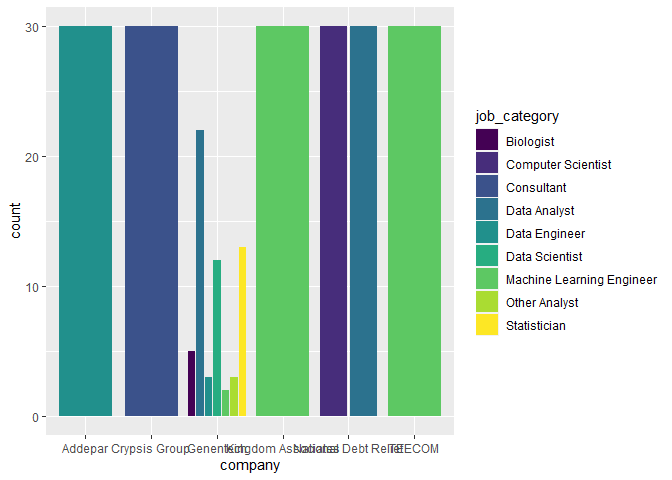
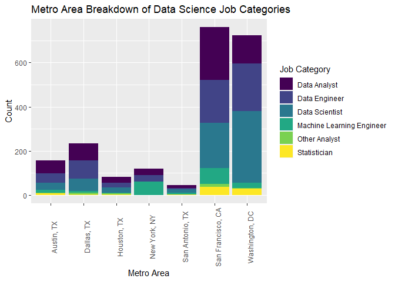

3\_1\_Data Science roles
================

``` r
library(tidyverse)
```

    ## Warning: package 'tibble' was built under R version 4.0.3

``` r
library(ggplot2)
library(viridis)
library(ggalluvial)
library(ggfittext)
```

    ## Warning: package 'ggfittext' was built under R version 4.0.3

Job types :

Viewing the job typs from the data set :

``` r
ds_jobs <- read.csv("../Data Cleaning/ds_jobs.csv")
```

Below are the job types :

  - Contractor
  - Full time
  - Intern
  - Other
  - Part time
  - Temporary

<!-- end list -->

``` r
data_jobs <- ds_jobs %>% 
  group_by(job_category) %>% 
  summarize(count = n()) %>% 
  filter(!job_category %in% c('Biologist', 'Consultant', 'Research Scientist', 'Computer Scientist', NA))

ds_jobs %>% 
  filter(job_category %in% data_jobs$job_category) %>% 
  group_by(job_type, metro_location) %>% 
  summarize(count = n()) %>% 
  mutate(pct = count/sum(count) * 100) %>% 
  ggplot(aes(x = metro_location, y = pct)) + 
  geom_col(aes(fill = job_type), position = 'dodge2') +
  theme(axis.text.x = element_text(angle = 90)) +
  labs(title = 'Location by type of data science jobs available',
       x = 'Location',
       y = 'Count') +
  scale_fill_discrete(name = 'Location')+
  theme_classic() +
  scale_fill_viridis(discrete = TRUE, name = "Job type")+
  theme( axis.text.x = element_text(angle = 45, vjust = 1, hjust=0.95, size = 8))
```

<!-- -->

# Table interpretation of above visualization plots.

From the data set, considering only the full time data science realted
job availabilities, we see that San Francisco and Washington have the
maximum number of jobs available while San Antonio has the least jobs
comparitively.If we also look at the job category by location, we find
similarities. Hence, if a person is looking for a job on data science
field, then based on this data, it is suggested to for jobs in the bay
area and DC.

Viewing the number of job types in each state as a table

``` r
table(ds_jobs$metro_location, ds_jobs$job_type)
```

    ##                    
    ##                     CONTRACTOR FULL_TIME INTERN OTHER PART_TIME TEMPORARY
    ##   Austin, TX                 1       175      1     0         4         0
    ##   Dallas, TX                 3       247      3     5         3         0
    ##   Houston, TX                1       106      1     2         0         0
    ##   New York, NY               0       755      0    25       120         0
    ##   San Antonio, TX            2        51      0     1         3         0
    ##   San Francisco, CA          7       854     12     4        10         1
    ##   Washington, DC             0       855      2     1        32         0

# Top Companies in terms of Overall Job Postings

``` r
companies <- ds_jobs %>%
  #filter out na job categories from all jobs
  filter(is.na(job_category) == F) %>% 
  #group by company
  group_by(company) %>% 
  #get the count of each company
  summarize(count = n()) %>% 
  #sort descending
  arrange(-count) %>% 
  #view the largest ones
  filter(count >= 30)
```

    ## `summarise()` ungrouping output (override with `.groups` argument)

``` r
companies
```

    ## # A tibble: 6 x 2
    ##   company              count
    ##   <chr>                <int>
    ## 1 Genentech               60
    ## 2 National Debt Relief    60
    ## 3 Addepar                 30
    ## 4 Crypsis Group           30
    ## 5 Kingdom Associates      30
    ## 6 TEECOM                  30

``` r
# filter dataset to only include the top companies and job types that are not na, plot bar chart
ds_jobs %>% 
  filter(is.na(job_category) == F,
         company %in% companies$company) %>% 
  group_by(company, job_category) %>% 
  summarize(count = n()) %>% 
  ggplot(aes(x = company, y = count)) + geom_col(aes(fill = job_category), position = 'dodge2') +
  scale_fill_viridis(discrete = TRUE)
```

    ## `summarise()` regrouping output by 'company' (override with `.groups` argument)

<!-- -->

The above plot displays the job category count of the top 6 overall
companies in terms of job postings. From here, we see that we may need
to subset our data to only include data science specific jobs.

# List Counts of Data Science Jobs

``` r
# filter by only data science relevant jobs (as discussed in team meeting), generate table of counts
data_jobs <- ds_jobs %>% 
  group_by(job_category) %>% 
  summarize(count = n()) %>% 
  filter(job_category %in% 
           c('Data Engineer', 'Data Analyst', 'Data Scientist', 
             'Machine Learning Engineer', 'Statistician', 'Other Analyst'))
```

    ## `summarise()` ungrouping output (override with `.groups` argument)

``` r
data_jobs
```

    ## # A tibble: 6 x 2
    ##   job_category              count
    ##   <chr>                     <int>
    ## 1 Data Analyst                569
    ## 2 Data Engineer               592
    ## 3 Data Scientist              660
    ## 4 Machine Learning Engineer   190
    ## 5 Other Analyst                28
    ## 6 Statistician                 80

In our dataset, we see most data science jobs listed under the data
scientist role, followed closely by data engineer and data analyst.
There are also roles of machine learning engineer, statistician and
other analyst - though to a much lesser extent.

# Metro Area Breakdown of Job Categories

``` r
# find the counts of data science job postings within each metro area
ds_jobs %>% 
  filter(job_category %in% data_jobs$job_category) %>% 
  group_by(metro_location) %>% 
  summarize(count = n())
```

    ## `summarise()` ungrouping output (override with `.groups` argument)

    ## # A tibble: 7 x 2
    ##   metro_location    count
    ##   <chr>             <int>
    ## 1 Austin, TX          156
    ## 2 Dallas, TX          233
    ## 3 Houston, TX          81
    ## 4 New York, NY        120
    ## 5 San Antonio, TX      44
    ## 6 San Francisco, CA   760
    ## 7 Washington, DC      725

``` r
#plot the each job category as the proportion of the total amount of jobs in each city (only focusing on ds jobs)
ds_jobs %>% 
  filter(job_category %in% data_jobs$job_category) %>% 
  group_by(metro_location, job_category) %>% 
  summarize(count = n()) %>% 
  mutate(pct = count/sum(count) * 100) %>% 
  ggplot(aes(x = metro_location, y = pct)) + 
  geom_col(aes(fill = job_category), position = 'dodge2') +
  theme(axis.text.x = element_text(angle = 90)) +
  labs(title = 'Metro Area Breakdown of Data Science Job Categories',
       x = 'Metro Area',
       y = 'Percent of Jobs') +
  scale_fill_viridis(discrete = TRUE, name = 'Job Category')
```

    ## `summarise()` regrouping output by 'metro_location' (override with `.groups` argument)

<!-- -->

``` r
# 
ds_jobs %>% 
  filter(job_category %in% data_jobs$job_category) %>% 
  group_by(metro_location, job_category) %>% 
  summarize(count = n()) %>% 
  mutate(pct = count/sum(count) * 100) %>% 
  ggplot(aes(x = metro_location, y = count)) + 
  geom_col(aes(fill = job_category)) +
  theme(axis.text.x = element_text(angle = 90)) +
  labs(title = 'Metro Area Breakdown of Data Science Job Categories',
       x = 'Metro Area',
       y = 'Count') +
  scale_fill_viridis(discrete = TRUE, name = 'Job Category')
```

    ## `summarise()` regrouping output by 'metro_location' (override with `.groups` argument)

<!-- -->

The above two plots display the same information, just in different
ways. San Francisco and Washington DC clearly have the highest amount of
DS job postings. Dallas and Austin surprisingly have a higher amount of
job postings than New York. Data analyst is the most popular DS job in
Austin and San Francisco. Data Engineer is the most popular job posting
in Dallas. Data Scientist is the most popular job posting in both San
Antonio and DC. Machine Learning Engineer makes up exactly half of the
postings in New York, but in terms of DS roles the city offers the least
versatility - only offering Analyst, Engineer, and ML Engineer positions
(perhaps mention people leaving area during covid). Statistician is in
the minority of available jobs at each location aside from New York.
