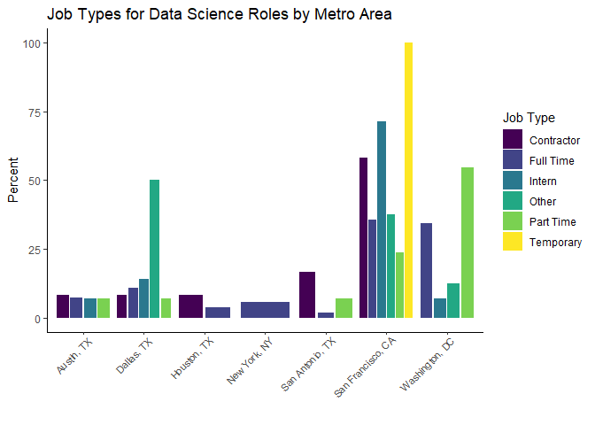

Exploring Data Science Roles
================

In this file we look at job types and Data Science roles and understand
their breakdown by metro area and company.

# Analyizing Job types

Viewing the job types from the data set:

``` r
table(ds_jobs$job_type)
```

    ## 
    ## CONTRACTOR  FULL_TIME     INTERN      OTHER  PART_TIME  TEMPORARY 
    ##         14       3043         19         38        172          1

Below are the job types :

  - Contractor
  - Full time
  - Intern
  - Other
  - Part time
  - Temporary

We would like to see the break down of job types in our data set and
understand what types of jobs can be found in different locations.

``` r
#filter for data required for graph
data_jobs <- ds_jobs %>% 
  group_by(job_category) %>% 
  summarize(count = n()) %>% 
  filter(!job_category %in% 
           c('Biologist', 'Consultant', 'Research Scientist', 
           'Computer Scientist', NA))

ds_jobs %>% 
  filter(job_category %in% data_jobs$job_category) %>% 
  group_by(job_type, metro_location) %>% 
  summarize(count = n()) %>% 
  mutate(pct = count/sum(count) * 100) %>% 
  ggplot(aes(x = metro_location, y = pct)) + 
  geom_col(aes(fill = job_type), position = 'dodge2') +
  theme(axis.text.x = element_text(angle = 90)) +
  labs(title = 'Job Types for Data Science Roles by Metro Area',
       x = '',
       y = 'Percent') +
  scale_fill_discrete()+
  theme_classic() +
  scale_fill_viridis(discrete = TRUE, name = "Job Type",labels = c("Contractor", 
                     "Full Time", "Intern", "Other", "Part Time", "Temporary")) +
  theme( axis.text.x = element_text(angle = 45, vjust = 1, hjust=0.95, size = 8))
```

<!-- -->

## Table of Job Types by Metro Location

From the data set, considering only the full time data science related
job openings, we see that San Francisco and Washington D.C. have the
maximum number of jobs available while San Antonio has the least number
of jobs comparatively.

Viewing the number of job types in each metro area as a table.

``` r
table(ds_jobs$metro_location, ds_jobs$job_type)
```

    ##                    
    ##                     CONTRACTOR FULL_TIME INTERN OTHER PART_TIME TEMPORARY
    ##   Austin, TX                 1       175      1     0         4         0
    ##   Dallas, TX                 3       247      3     5         3         0
    ##   Houston, TX                1       106      1     2         0         0
    ##   New York, NY               0       755      0    25       120         0
    ##   San Antonio, TX            2        51      0     1         3         0
    ##   San Francisco, CA          7       854     12     4        10         1
    ##   Washington, DC             0       855      2     1        32         0

# List Counts of Data Science Jobs

``` r
ds_jobs %>%
  filter(!is.na(job_category)) %>%
  filter(job_category == "Data Analyst" | job_category == "Data Engineer" |
           job_category == "Data Scientist" | 
           job_category == "Machine Learning Engineer" | 
           job_category == "Statistician" | job_category == "Other Analyst") %>%
  rename(`Job Category` = job_category) %>%
  group_by(`Job Category`) %>%
  summarise(Count = n()) %>%
  arrange(desc(Count))
```

    ## # A tibble: 6 x 2
    ##   `Job Category`            Count
    ##   <chr>                     <int>
    ## 1 Data Scientist              660
    ## 2 Data Engineer               592
    ## 3 Data Analyst                569
    ## 4 Machine Learning Engineer   190
    ## 5 Statistician                 80
    ## 6 Other Analyst                28

In our dataset, we see most data science jobs listed under the data
scientist role, followed closely by data engineer and data analyst.
There are also roles of machine learning engineer, statistician and
other analyst - though to a much lesser extent.

# Metro Area Breakdown of Data Science Roles

Next, we wanted to see if different metro areas had different breakdowns
of data science roles and if there is a better location to search for a
job if a candidate is looking for a specific role.

``` r
ds_jobs %>%
  rename(`Metro Location` = metro_location) %>%
  group_by(`Metro Location`) %>%
  summarise(Count = n()) %>%
  arrange(desc(Count))
```

    ## # A tibble: 7 x 2
    ##   `Metro Location`  Count
    ##   <chr>             <int>
    ## 1 New York, NY        900
    ## 2 Washington, DC      890
    ## 3 San Francisco, CA   888
    ## 4 Dallas, TX          261
    ## 5 Austin, TX          181
    ## 6 Houston, TX         110
    ## 7 San Antonio, TX      57

It looks like New York has the most job openings in our data set.
However, many job postings in our data are not actually related to data
science roles. For this analysis we are only looking at the data science
field, therefore we can look at the break down further of only data
science related roles.

``` r
# find the counts of data science job postings within each metro area
ds_jobs %>% 
  filter(job_category %in% data_jobs$job_category) %>% 
  group_by(metro_location) %>% 
  summarize(count = n()) %>% 
  arrange(desc(count))
```

    ## # A tibble: 7 x 2
    ##   metro_location    count
    ##   <chr>             <int>
    ## 1 San Francisco, CA   760
    ## 2 Washington, DC      725
    ## 3 Dallas, TX          233
    ## 4 Austin, TX          156
    ## 5 New York, NY        120
    ## 6 Houston, TX          81
    ## 7 San Antonio, TX      44

Here we can see that when only looking at data science related roles San
Francisco and Washington D.C. have the most roles relevant to our
analysis.

``` r
#plot the each job category as the proportion of the total amount of jobs in each city (only focusing on ds jobs)
ds_jobs %>% 
  filter(job_category %in% data_jobs$job_category) %>% 
  group_by(metro_location, job_category) %>% 
  summarize(count = n()) %>% 
  mutate(pct = count/sum(count) * 100) %>% 
  ggplot(aes(x = metro_location, y = pct)) + 
  geom_col(aes(fill = job_category), position = 'dodge2') +
  theme(axis.text.x = element_text(angle = 90)) +
  labs(title = 'Data Science Roles by Metro Area',
       x = '',
       y = 'Percent of Jobs') +
  scale_fill_viridis(discrete = TRUE, name = 'Data Science Roles') +
  theme_classic() +
  theme(axis.text.x = element_text(angle = 45, vjust = 1, hjust=0.95, size = 8))
```

<!-- -->

``` r
ds_filter <- ds_jobs %>%
  filter(!is.na(job_category)) %>%
  filter(job_category == "Data Analyst" | job_category == "Data Engineer" | 
         job_category == "Data Scientist" | job_category == "Machine Learning Engineer" |
         job_category == "Statistician" | job_category == "Other Analyst")

#another variation of previous graph
ggplot(ds_filter, aes(metro_location, fill = job_category)) +
  geom_bar()+
  scale_fill_viridis(discrete = TRUE) +
  labs(
    title = "Data Science Jobs by Metro Area",
    x = "",
    y = "Count",
    fill = "Data Science Roles")+
  theme_classic() +
  theme(
    axis.text.x = element_text(angle = 45, vjust = 1, hjust=0.95, size = 8),
    axis.text = element_text(size =10),
    legend.text = element_text(size = 8),
    legend.title = element_text(size = 8)) 
```

<!-- -->

The above two plots display the same information, just in different
ways. San Francisco and Washington DC clearly have the highest amount of
DS job postings. Dallas and Austin surprisingly have a higher amount of
job postings than New York. Data analyst is the most popular DS job in
Austin and San Francisco. Data Engineer is the most popular job posting
in Dallas. Data Scientist is the most popular job posting in both San
Antonio and DC. Machine Learning Engineer makes up exactly half of the
postings in New York, but in terms of DS roles the city offers the least
versatility - only offering Analyst, Engineer, and ML Engineer positions
(perhaps mention people leaving area during covid). Statistician is in
the minority of available jobs at each location aside from New York.
Based on this data, a candidate should narrow their focus jobs in the
San Francisco Bay area and Washington D.C. if they are open to
relocating.

# Top Companies in terms of Overall Job Postings

In addition to location, we were curious if different companies had job
openings in only one type of data science role or offered various types
of roles.

``` r
companies <- ds_jobs %>%
  #filter out na job categories from all jobs
  filter(is.na(job_category) == F) %>% 
  #group by company
  group_by(company) %>% 
  #get the count of each company
  summarize(count = n()) %>% 
  #sort descending
  arrange(-count) %>% 
  #view the largest ones
  filter(count >= 30)

companies
```

    ## # A tibble: 6 x 2
    ##   company              count
    ##   <chr>                <int>
    ## 1 Genentech               60
    ## 2 National Debt Relief    60
    ## 3 Addepar                 30
    ## 4 Crypsis Group           30
    ## 5 Kingdom Associates      30
    ## 6 TEECOM                  30

``` r
# filter dataset to only include the top companies and job types that are not na, plot bar chart
ds_jobs %>% 
  filter(is.na(job_category) == F,
         company %in% companies$company) %>% 
  group_by(company, job_category) %>% 
  summarize(count = n()) %>% 
  ggplot(aes(x = company, y = count)) + 
  geom_col(aes(fill = job_category), position = 'dodge2') +
  labs(title = 'Data Science Roles at Top Companies',
       x = '',
       y = 'Count') +
  scale_fill_viridis(discrete = TRUE, name = "Data Science Roles") +
  theme_classic() +
  theme( axis.text.x = element_text(angle = 45, vjust = 1, hjust=0.95, size = 8))
```

<!-- -->

The above plot displays the job category count of the top 6 overall
companies in terms of job postings. From here, we see that we may need
to subset our data to only include data science specific jobs.
