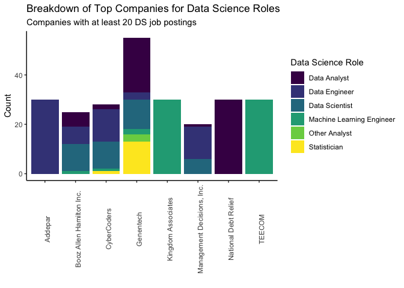
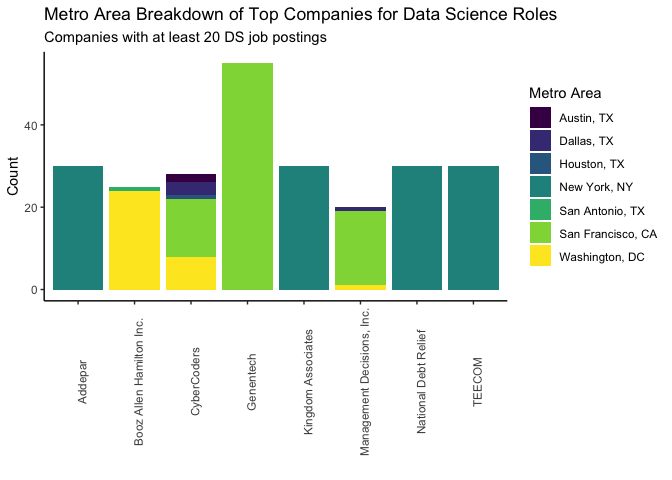
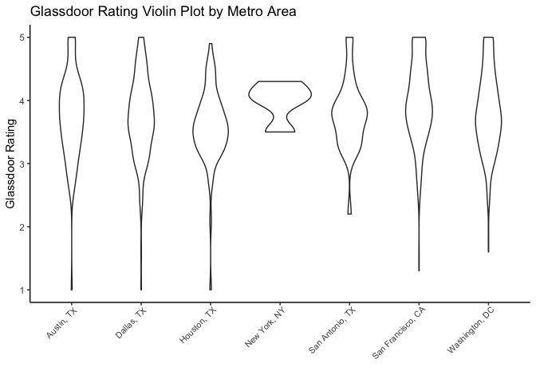
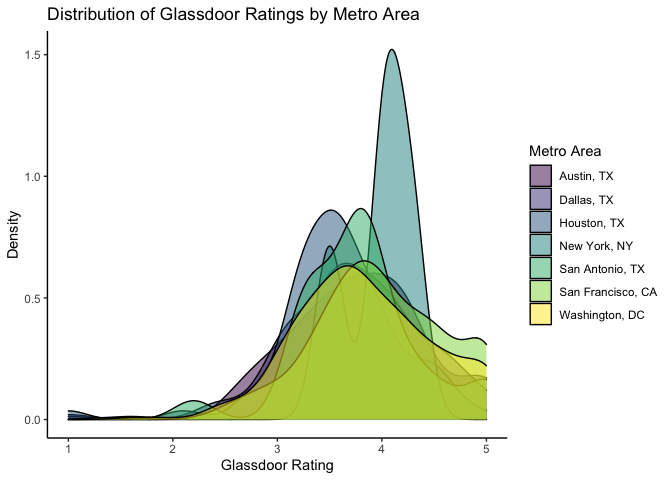
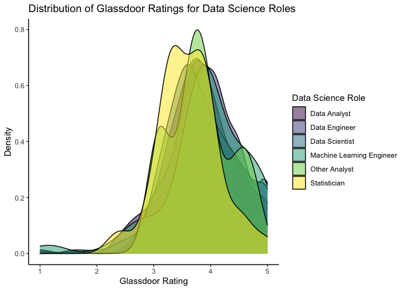
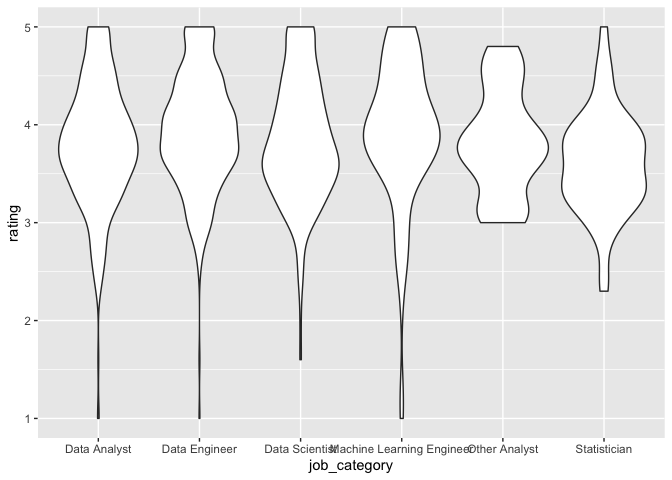
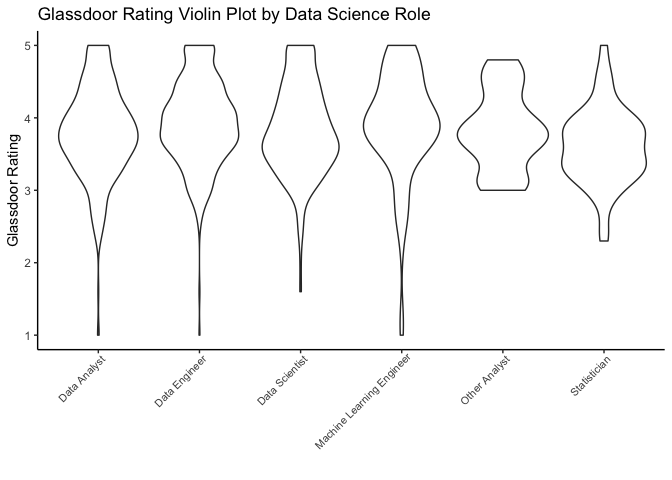
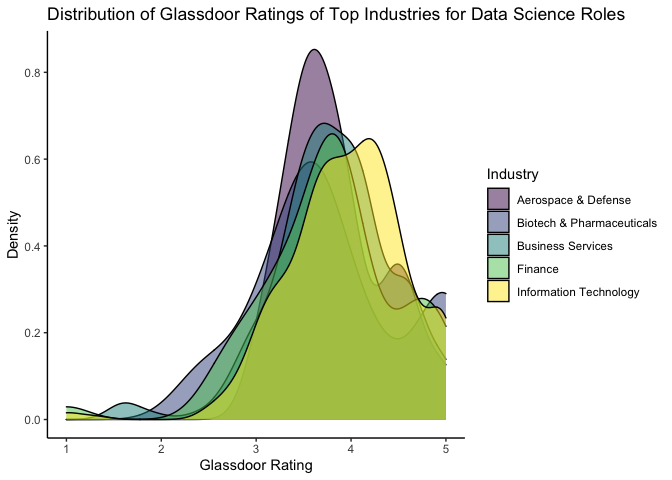
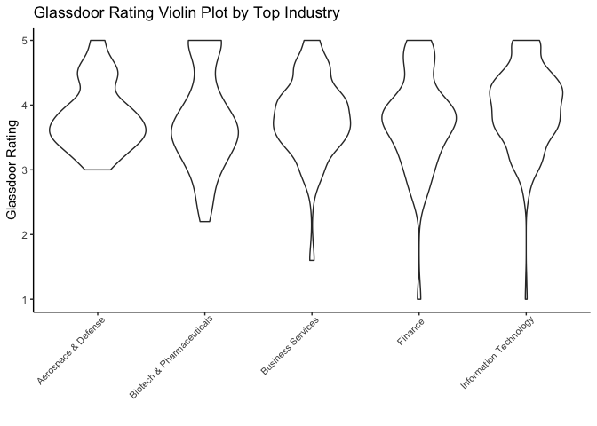

Analyzing Companies & Glassdoor Ratings
================

In this file we look at company Glassdoor Ratings for data science job
postings and analyze what types are job are offered by the companies
with the most job openings.

# Top Companies in Terms of Data Science Job Postings

First, we want to look at the companies with the most job openings for
data science related roles.

``` r
#filter for data required for graph
data_jobs <- ds_jobs %>% 
  group_by(job_category) %>% 
  summarize(count = n()) %>% 
  filter(!job_category %in% 
           c('Biologist', 'Consultant', 'Research Scientist', 
           'Computer Scientist', NA))

# generate counts of data science jobs for each top company (also listing industry and rating)
data_companies <- ds_jobs %>%
  filter(job_category %in% data_jobs$job_category) %>% 
  group_by(company, industry, rating) %>% 
  summarize(count = n()) %>% 
  arrange(-count) %>% 
  filter(count >= 20)

data_companies
```

    ## # A tibble: 8 x 4
    ## # Groups:   company, industry [8]
    ##   company                    industry                           rating count
    ##   <chr>                      <chr>                               <dbl> <int>
    ## 1 Genentech                  Biotech & Pharmaceuticals             3.9    55
    ## 2 Addepar                    Information Technology                4.3    30
    ## 3 Kingdom Associates         Construction, Repair & Maintenance    3.5    30
    ## 4 National Debt Relief       Finance                               4      30
    ## 5 TEECOM                     Telecommunications                    4.1    30
    ## 6 CyberCoders                Business Services                     4.1    28
    ## 7 Booz Allen Hamilton Inc.   Business Services                     3.7    25
    ## 8 Management Decisions, Inc. Business Services                     1.6    20

This tibble displays the top companies, their ratings, and their
associated industry in terms of data science job postings. While there
are various industries represented, Business Services companies appear
three times above the 20 job cutoff.

## Job Category Breakdown of Top Data Science Companies

Next, we wanted to look at what types of data science roles these
companies offered.

``` r
#filter by ds jobs and top companies
#graph the count of each job type displaying the contribution of each to the total amount of jobs posted from company

ds_jobs %>% 
  filter(job_category %in% data_jobs$job_category,
         company %in% data_companies$company) %>% 
  group_by(company, job_category) %>% 
  summarize(count = n()) %>% 
  ggplot(aes(x = company, y = count)) + 
  geom_col(aes(fill = job_category)) +
  theme(axis.text.x = element_text(angle = 90)) +
  labs(title = 'Job Category Breakdown of Top Data Science Companies',
       subtitle = 'Companies with at least 20 DS job postings',
       x = 'Company',
       y = 'Count') +
  scale_fill_viridis(discrete = TRUE, name = 'Job Category')
```

<!-- -->

From this plot we see that certain companies only have postings for one
data science role: Addepar-Data Engineer, Kingdom
Associates/TEECOM-Machine Learning Engineer, National Debt Relief-Data
Analyst. Genetech not only has the most jobs available of the top
companies, but they also have every kind of data science role available.
CyberCoders, Booz Allen Hamilton Inc., and Management Decisions
Inc. also have a variety of roles available.

## Metro Area Breakdown of Top Data Science Companies

We were interested to see if companies had job openings in more than
just one metro area. In this way if a candidate is interested in one
company specifically, it gives them more flexibility in where they can
find those jobs if they are willing to relocate.

``` r
#filter by ds jobs and top companies
#graph the count of each location displaying the contribution of each to the total amount of jobs posted from company
ds_jobs %>% 
  filter(job_category %in% data_jobs$job_category,
         company %in% data_companies$company) %>% 
  group_by(company, metro_location) %>% 
  summarize(count = n()) %>% 
  ggplot(aes(x = company, y = count)) + 
  geom_col(aes(fill = metro_location)) +
  theme(axis.text.x = element_text(angle = 90)) +
  labs(title = 'Metro Area Breakdown of Top Data Science Companies',
       subtitle = 'Companies with at least 20 DS job postings',
       x = 'Company',
       y = 'Count') +
  scale_fill_viridis(discrete = TRUE, name = 'Metro Area')
```

<!-- -->

When examining the location of the job postings for the top data science
companies, we see that most of the job postings for a single company are
located in one area. Addeper, Kingdom Associates, National Debt Relief,
and TEECOM are all located in NYC. Genetech is located exclusively in
San Francisco. Booz Allen and Management Decisions are primarily located
in one area, though they have a single digit number of postings in other
locations. CyberCoders has job postings located in a variety of Metro
Areas, matching their data science role versatility with their location
versatility.

# Glassdoor Ratings

Now that we have learned more about the companies in our data set and
what data science roles they are offering, we want to investigate the
Glassdoor rating and see if any areas or types of companies have better
ratings.

## Rating by Metro Location

``` r
ds_jobs %>% 
  filter(job_category %in% data_jobs$job_category) %>% 
  select(company, metro_location, industry, rating) %>% 
  unique() %>% 
  ggplot(aes(x = metro_location, y = rating)) + 
  geom_violin() +
  labs(title = 'Glassdoor Rating Violin Plot by Metro Area',
       x = 'Metro Area',
       y = 'Rating') +
  theme(axis.text.x = element_text(size = 8.5))
```

    ## Warning: Removed 152 rows containing non-finite values (stat_ydensity).

<!-- -->

The above violin plot shows the distribution of company ratings across
metro area. While most areas look the same, New York has all ratings
concentrated between 3.5 and \~4.25. This may signal that applicants can
be pretty certain about what life at the company is like in New York as
opposed to other metro areas with greater variability in company
ratings.

``` r
ds_jobs %>% 
  filter(job_category %in% data_jobs$job_category) %>% 
  select(company, metro_location, industry, rating) %>% 
  unique() %>% 
  ggplot(aes(x = rating)) + 
  geom_density(aes(fill = metro_location), alpha = .5) +
  labs(title = 'Glassdoor Rating Density Plot by Metro Area',
       x = 'Rating',
       y = 'Density') +
  scale_fill_viridis(discrete = TRUE, name = 'Metro Area')
```

    ## Warning: Removed 152 rows containing non-finite values (stat_density).

<!-- -->

This density plot presents the same information as the above violin
plot. We see a high concentration just above 4 for New York.

## Rating by Job Category

``` r
ds_jobs %>% 
  filter(job_category %in% data_jobs$job_category) %>% 
  select(company, metro_location, industry, job_category, rating) %>% 
  unique() %>% 
  ggplot(aes(x = rating)) + 
  geom_density(aes(fill = job_category), alpha = .5) +
  labs(title = 'Glassdoor Rating Density Plot by Job Category',
       x = 'Rating',
       y = 'Density') +
  scale_fill_viridis(discrete = TRUE, name = 'Job Category')
```

    ## Warning: Removed 173 rows containing non-finite values (stat_density).

<!-- -->

``` r
ds_jobs %>% 
  filter(job_category %in% data_jobs$job_category) %>% 
  select(company, metro_location, industry, job_category, rating) %>% 
  unique() %>% 
  ggplot(aes(x = job_category, y = rating)) + 
  geom_violin()
```

    ## Warning: Removed 173 rows containing non-finite values (stat_ydensity).

<!-- -->

The above density and violin plots display the ratings of each company
across job category. There does not seem to be much difference in
ratings across job categories, however we do see an absence of negative
outliers for the other analyst and statistician positions. This may not
be a reliable approach because companies can appear across various roles
and rating is specific to company.

## Rating by Industry

``` r
#filtering for relevant industries
data_industries <- ds_jobs %>%
  filter(job_category %in% data_jobs$job_category) %>% 
  group_by(industry) %>% 
  summarize(count = n()) %>% 
  filter(!is.na(industry)) %>% 
  arrange(-count) %>% 
  filter(count >= 100)
```

    ## `summarise()` ungrouping output (override with `.groups` argument)

``` r
ds_jobs %>% 
  filter(job_category %in% data_jobs$job_category,
         industry %in% data_industries$industry) %>% 
  select(company, metro_location, industry, rating) %>% 
  unique() %>% 
  ggplot(aes(x = rating)) + 
  geom_density(aes(fill = industry), alpha = .5) +
  labs(title = 'Glassdoor Rating Density Plot of Top Data Science Industries',
       x = 'Rating',
       y = 'Density') +
  scale_fill_viridis(discrete = TRUE, name = 'Industry')
```

    ## Warning: Removed 17 rows containing non-finite values (stat_density).

<!-- -->

``` r
ds_jobs %>% 
  filter(job_category %in% data_jobs$job_category,
         industry %in% data_industries$industry) %>% 
  select(company, metro_location, industry, rating) %>% 
  unique() %>% 
  ggplot(aes(x = industry, y = rating)) + 
  geom_violin()
```

    ## Warning: Removed 17 rows containing non-finite values (stat_ydensity).

<!-- -->

The above density and violin plots show the rating of each company
across industry. The distributions all appear pretty similar with the
exception of a high concentration just above 3.5 for Aerospace and
Defense. Information Technology has the highest rating peak among the
five largest industries, while Biotech and Pharmaceuticals has the
highest number of 5 rated companies.

## Ratings of Top Data Science Companies

``` r
ds_jobs %>% 
  filter(job_category %in% data_jobs$job_category,
         company %in% c('Addepar', 'Booz Allen Hamilton Inc.', 'CyberCoders', 
                        'Genetech', 'Kingdom Associates','Management Decisions, Inc.',
                        'National Debt Relief', 'TEECOM')) %>% 
  select(company, industry, rating) %>% 
  unique() %>% 
  arrange(company) %>% 
  ggplot(aes(x = company, y = rating)) + 
  geom_col() +
  theme(axis.text.x = element_text(angle = 90)) +
  labs(title = 'Glassdoor Ratings of Top Data Science Companies',
       x = 'Company',
       y = 'Rating')
```

<!-- -->

We see that the ratings are all relatively consistent across these
companies with the exception of Management Decisions, Inc., which holds
a much lower rating. For an applicant in search of a Data Engineer or
Data Scientist position, Cybercoders may be a better option.

## Average Ratings of Industries

``` r
ds_jobs %>% 
  filter(job_category %in% data_jobs$job_category,
         !is.na(industry),
         !is.na(rating)) %>% 
  select(company, industry, rating) %>% 
  unique() %>% 
  group_by(industry) %>% 
  summarize(avg_rating = mean(rating),
            count = n()) %>% 
  arrange(-avg_rating)
```

    ## # A tibble: 23 x 3
    ##    industry                         avg_rating count
    ##    <chr>                                 <dbl> <int>
    ##  1 Agriculture & Forestry                 5        1
    ##  2 Real Estate                            4.2      4
    ##  3 Education                              4.06    26
    ##  4 Arts, Entertainment & Recreation       3.95     2
    ##  5 Information Technology                 3.94   340
    ##  6 Consumer Services                      3.94     5
    ##  7 Telecommunications                     3.84     5
    ##  8 Aerospace & Defense                    3.84    44
    ##  9 Business Services                      3.81   165
    ## 10 Government                             3.80    41
    ## # … with 13 more rows

The above table displays the number of job postings in each industry and
the average rating of companies within those industries. Some of the
highest rated industries also have the smallest sample sizes (and
likewise for the lowest).
