Cost of Living and Salary Analysis
================

This file contains the analysis we did in terms of the cost of living
and salaries, scaled and unscaled, based on various other factors in the
data set such as metro area and data science roles.

[Cost of Living Index](https://advisorsmith.com/data/coli/)

The cost of living index (COI) came from AdvisorSmith and is calculated
for 509 metropolitan areas in the United States. This gives us an easier
way to compare cities against one another and scale the salary ranges to
be able to compare across regions. The COI is modeled on national
average household budgets and has weights assigned to the follow 6 major
categories of household expenses (weights as percentages list below):

  - Food: 16.1%
  - Housing: 23.2%
  - Utilities: 10.1%
  - Transportation: 18.6%
  - Healthcare: 9.6%
  - Consumer Discretionary Spending: 22.3%

A COI of 100 is the average cost of living for the United States. If a
city’s COI is above 100, then it has an above average cost of living and
if it has a COI below 100 it has an average cost of living below the
average. For example, a city with a 130 COI has a 30% higher cost of
living than the national average.

This data is from June 5, 2020.

``` r
summary(ds_jobs$coi)
```

    ##    Min. 1st Qu.  Median    Mean 3rd Qu.    Max. 
    ##    93.7   123.8   131.0   137.6   183.0   183.0

The COI for our data ranges from 88.3 to 183.0.

``` r
area_COI <- ds_jobs %>% group_by(metro_location, coi) %>% 
  summarise(count = n()) %>%  arrange(-coi)

area_COI
```

    ## # A tibble: 7 x 3
    ## # Groups:   metro_location [7]
    ##   metro_location      coi count
    ##   <chr>             <dbl> <int>
    ## 1 San Francisco, CA 183     888
    ## 2 New York, NY      131     900
    ## 3 Washington, DC    124.    890
    ## 4 Austin, TX        108.    181
    ## 5 Dallas, TX        100.    261
    ## 6 Houston, TX        96.9   110
    ## 7 San Antonio, TX    93.7    57

``` r
area_COI %>% ggplot(aes(x = reorder(metro_location, -coi), y = coi)) +
  geom_bar(stat = "identity") +
  labs(title = "Cost of Living Index for Metro Areas",
         x = "",
         y = "Cost of Living Index (COI)") +
  geom_text(aes(label=coi), position=position_dodge(width=0.9), vjust=-0.25, size = 3.5) +
  theme_classic() +
  theme( axis.text.x = element_text(angle = 45, vjust = 1, hjust=0.95, size = 8))
```

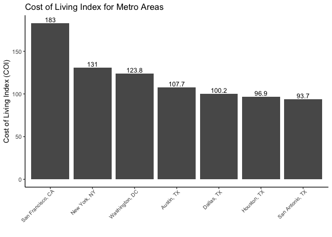<!-- -->

We can see that the cost of living is much higher in San Francisco than
any other region followed by New York City, Washington D.C. and then all
metro areas in Texas.

# Salary

``` r
summary(ds_jobs$min_salary)
```

    ##    Min. 1st Qu.  Median    Mean 3rd Qu.    Max.    NA's 
    ##   19857   56317   81726   82730  103680  205735    1075

The minimum salary in the data set ranges from $19,857 to $205,735 with
a mean of $82,420.

``` r
#checking out the min of Min_Salary
ds_jobs %>% arrange(min_salary) %>% select(job_type, min_salary, max_salary, industry, metro_location) %>% slice(1)
```

    ##    job_type min_salary max_salary  industry metro_location
    ## 1 FULL_TIME      19857      38127 Education     Dallas, TX

``` r
#checking out the max of Max_Salary
ds_jobs %>% arrange(-min_salary) %>% select(job_type, min_salary, max_salary, industry, metro_location) %>% slice(1)
```

    ##    job_type min_salary max_salary                  industry    metro_location
    ## 1 FULL_TIME     205735     233900 Biotech & Pharmaceuticals San Francisco, CA

``` r
ds_jobs %>% ggplot(aes(x = min_salary)) +
  geom_density(alpha = 0.25) +
  labs(
    title = "Distribution of the Minimum Salary for Data Science Jobs \nPosted on Glassdoor",
    x = "Minimum Salary",
    y = "Density") + 
  scale_x_continuous(
    breaks = seq(15000,210000,30000),
    labels = function(x){paste0('$', x/1000, 'K')}) +
  theme_classic()
```

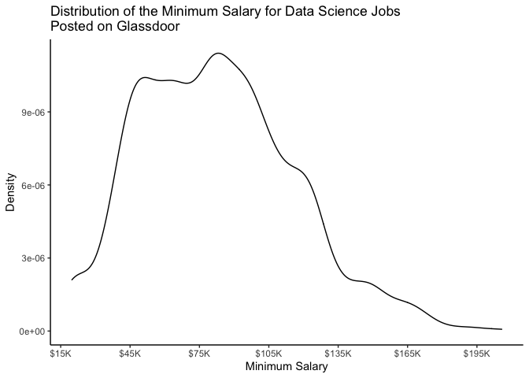<!-- -->

The distribution of minimum salaries is slightly skewed right with a few
values over $150K.

``` r
summary(ds_jobs$max_salary)
```

    ##    Min. 1st Qu.  Median    Mean 3rd Qu.    Max.    NA's 
    ##   35000   91097  116888  120893  147460  383416    1075

The maximum salary in the data set ranges from $35,000 to $383,416 with
a mean of $120,607.

``` r
#checking out the min of Max_Salary
ds_jobs %>% arrange(max_salary) %>% select(job_type, min_salary, max_salary, industry, metro_location) %>% slice(1)
```

    ##    job_type min_salary max_salary industry metro_location
    ## 1 PART_TIME      20000      35000     <NA>   New York, NY

``` r
#checking out the max of Max_Salary
ds_jobs %>% arrange(-max_salary) %>% select(job_type, min_salary, max_salary, industry, metro_location) %>% slice(1)
```

    ##    job_type min_salary max_salary industry metro_location
    ## 1 FULL_TIME     195818     383416  Finance    Houston, TX

``` r
ds_jobs %>% ggplot(aes(x = max_salary)) +
  geom_density(alpha = 0.25) +
  labs(
    title = "Distribution of the Maximum Salary for Data Science Jobs \nPosted on Glassdoor",
    x = "Maximum Salary",
    y = "Density") + 
  scale_x_continuous(
    breaks = seq(30000,390000,50000),
    labels = function(x){paste0('$', x/1000, 'K')}) +
  theme_classic()
```

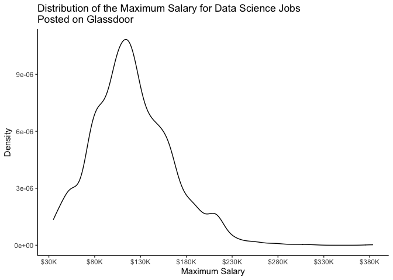<!-- -->

The distribution of Maximum salaries is very right skewed with a long
tail with only a few salaries between $250K and $380K. We might want to
consider some of these values as outliers.

``` r
salary_range <- ds_jobs$max_salary - ds_jobs$min_salary

summary(salary_range)
```

    ##    Min. 1st Qu.  Median    Mean 3rd Qu.    Max.    NA's 
    ##       0   21392   33714   38163   50000  237382    1075

The range between the minimum and maximum salary for data science jobs
ranges from $0 to $237,382.

``` r
salary_range <- data.frame(salary_range)

ggplot(data = salary_range, aes(x = salary_range)) +
  geom_density(alpha = 0.25) +
  labs(
    title = "Range of Salaries for Data Science Jobs \n Posted on Glassdoor",
    x = "Salary Range",
    y = "Density") + 
  scale_x_continuous(
    breaks = seq(0,240000,50000),
    labels = function(x){paste0('$', x/1000, 'K')}) +
  theme_classic()
```

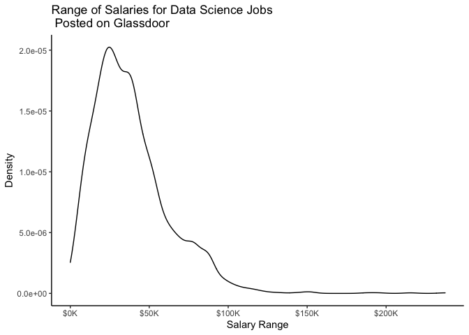<!-- -->

The distribution of the range in salaries between the minimum and
maximum salary for each job is extremely skewed right with a few values
even above $200K difference for the same job.

``` r
#wrangling the data to fit both salaries on the same graph
salary_data <- ds_jobs %>% select(min_salary, max_salary) %>% pivot_longer(
                cols = c(min_salary, max_salary),
                names_to = "type",
                values_to = "salary",
                values_drop_na = TRUE)

#calculating the means
mean_salary <- salary_data %>% group_by(type) %>% 
  mutate(mean_rate = mean(salary))

salary_data %>% ggplot(aes(x = salary, fill = type)) +
  geom_density(alpha = 0.6) +
   scale_fill_viridis(discrete = TRUE, begin = 0.25, end = 0.5, name = "Salary Type",
                     labels = c("Max", "Min")) +
  geom_vline(aes(xintercept=mean_salary$mean_rate, fill = type), 
             linetype = "dashed", show.legend = FALSE) +
  labs(
    title = "The Minimum and Maximum Salary for Data Science Jobs",
    subtitle = "",
    x = "Salary",
    y = "Density") +
  scale_x_continuous(
    breaks = seq(15000,390000,50000),
    labels = function(x){paste0('$', x/1000, 'K')})+ 
  annotate("text",y = 12e-06, x = 65000, label = "$82.5K", size = 3) +
  annotate("text",y = 11.2e-06, x = 140000, label = "$120.6K", size = 3) +
  theme_classic()
```

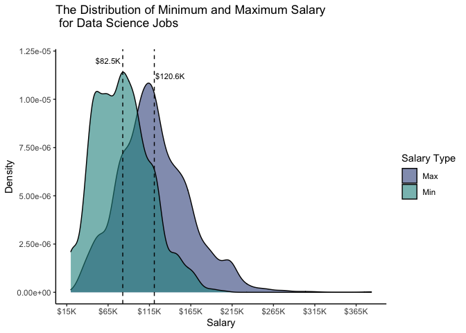<!-- -->

As expected the distribution of maximum salaries is shifted to the right
or above the distribution of minimum salaries. This graph accounts for
all job types but I think it might be beneficial for our analysis to
take this further and either only look at full time positions or look at
full time, part time, intern, etc. separately depending on the spread of
that data.

## Scaled Salary

Now that we understand the distribution of the salary data and the range
between the minimum and maximum salary, we want to look at the scale the
salaries based on cost of living for the metro area in which the job is
located in. With this variable we will be able to analyze salary
differences across different metro areas. The variable is calculated as
follows:

\*`Min_Salary/(COI/100) = Min_Scaled_Salary`

\*`Max_Salary/(COI/100) = Max_Scaled_Salary`

We will graph the new scaled salary variables to understand how they are
distributed.

``` r
#wrangling the data to fit both salaries on the same graph
scaled_salary_data <- ds_jobs %>% select(min_scaled_salary, max_scaled_salary) %>% pivot_longer(
                cols = c(min_scaled_salary, max_scaled_salary),
                names_to = "type",
                values_to = "salary",
                values_drop_na = TRUE)

#calculating the means
mean_scaled_salary <- scaled_salary_data %>% group_by(type) %>% 
                      mutate(mean_rate = mean(salary))

scaled_salary_data %>% ggplot(aes(x = salary, fill = type)) +
   geom_density(alpha = 0.6) +
   scale_fill_viridis(discrete = TRUE, begin = 0.25, end = 0.5, name = "Salary Type",
                     labels = c("Max", "Min")) +
  geom_vline(aes(xintercept=mean_scaled_salary$mean_rate, fill = type), 
             linetype = "dashed", show.legend = FALSE) +
  labs(
    title = "The Scaled Minimum and Maximum Salary for Data Science Jobs",
    subtitle = "",
    x = "Scaled Salary",
    y = "Density") +
  scale_x_continuous(
    breaks = seq(15000,400000,50000),
    labels = function(x){paste0('$', x/1000, 'K')})+ 
  annotate("text",y = 1.8e-05, x = 43000, label = "$60.7K", size = 3) +
  annotate("text",y = 1.5e-05, x = 109000, label = "$89.6K", size = 3) +
  theme_classic()
```

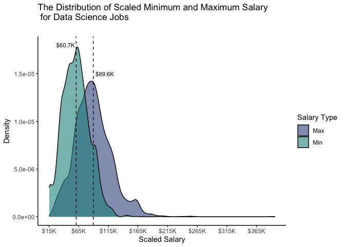<!-- -->

The spread of both the scaled minimum and maximum salaries is smaller
with the exception of the right tails which seem to be a bit longer.

``` r
scaled_salary_range <- ds_jobs$max_scaled_salary - ds_jobs$min_scaled_salary

summary(scaled_salary_range)
```

    ##    Min. 1st Qu.  Median    Mean 3rd Qu.    Max.    NA's 
    ##       0   15020   24364   28810   39577  193600    1075

The range between the scaled minimum and maximum salary for data science
jobs ranges from $0 to $193,600.

``` r
scaled_salary_range <- data.frame(scaled_salary_range)

ggplot(data = scaled_salary_range, aes(x = scaled_salary_range)) +
  geom_density(alpha = 0.25) +
  labs(
    title = "Range of Scaled Salaries for Data Science Jobs \n Posted on Glassdoor",
    x = "Scaled Salary Range",
    y = "Density") + 
  scale_x_continuous(
    breaks = seq(0,200000,50000),
    labels = function(x){paste0('$', x/1000, 'K')}) +
  theme_classic()
```

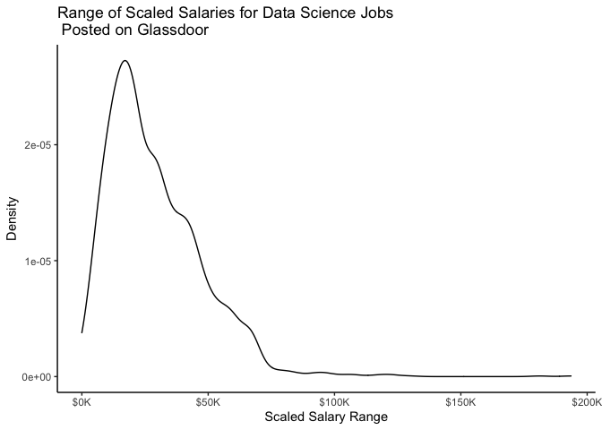<!-- -->

The distribution of the range of the scaled salaries is very similar to
the non-scaled salaries just shifted slightly more to the left with a
slightly longer right tail.

# Metro Area

We wanted to understand the differences in salary ranges between metro
areas in our data set. First, we looked at overall salary ranges between
metro areas.

``` r
ds_filter <- ds_jobs %>%
  filter(!is.na(job_category)) %>%
  filter(job_category == "Data Analyst" | job_category == "Data Engineer" | 
         job_category == "Data Scientist" | job_category == "Machine Learning Engineer" |
         job_category == "Statistician" | job_category == "Other Analyst")

df <- ds_filter %>%
             group_by(metro_location) %>%
             summarise(min = mean(min_salary, na.rm = TRUE),
                       max = mean(max_salary, na.rm = TRUE))

salary_data_loc <- df %>% pivot_longer(
                cols = c(min, max),
                names_to = "type",
                values_to = "salary",
                values_drop_na = TRUE)

p <- ggplot(salary_data_loc, aes(x = reorder(metro_location, -salary), 
                                 y = salary, fill = type)) 

p + geom_bar(stat = "identity", position = 'dodge')+
    labs(title = "Average Salary for Data Science Jobs",
         subtitle = "Glassdoor Job Postings by Metro Area",
         x = "",
         y = "Average Salary") +
    scale_fill_viridis(discrete = TRUE, begin = 0.25, end = 0.5, name = "Salary Type",
                     labels = c("Max", "Min")) + 
    scale_y_continuous(
    breaks = seq(0,1100000,50000),
    labels = function(x){paste0('$', x/1000, 'K')}) +
    geom_text(aes(label=paste0('$', round(salary/1000,1), 'K')),
              position=position_dodge(width=0.9), vjust=-0.25, size = 2.5) +
    theme_classic() +
    theme( axis.text.x = element_text(angle = 45, vjust = 1, hjust=0.95, size = 9))
```

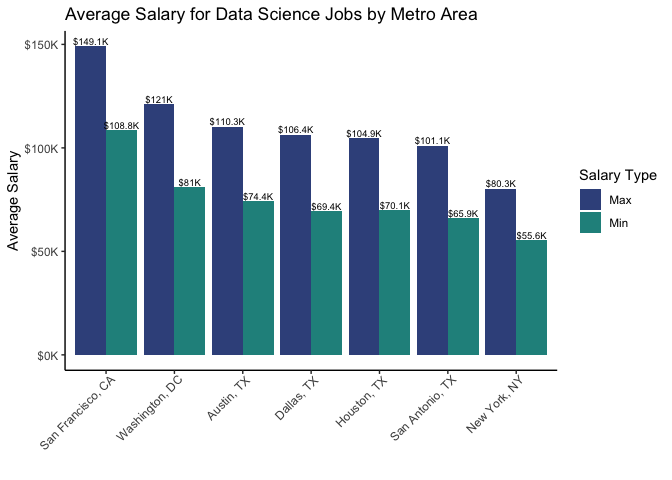<!-- -->

Here we can see that San Francisco Bay area has by far the highest
salary ranges. However, we know that San Francisco has the highest cost
of living and we cannot really compare salaries across locations without
accounting for difference in cost of living. Therefore, we created a
similar graph using scaled salaries.

``` r
ds_filter <- ds_jobs %>%
  filter(!is.na(job_category)) %>%
  filter(job_category == "Data Analyst" | job_category == "Data Engineer" | 
         job_category == "Data Scientist" | job_category == "Machine Learning Engineer" |
         job_category == "Statistician" | job_category == "Other Analyst")

df <- ds_filter %>%
             group_by(metro_location) %>%
             summarise(min = mean(min_scaled_salary, na.rm = TRUE),
                       max = mean(max_scaled_salary, na.rm = TRUE))

salary_data_loc <- df %>% pivot_longer(
                cols = c(min, max),
                names_to = "type",
                values_to = "salary",
                values_drop_na = TRUE)

p <- ggplot(salary_data_loc, aes(x = reorder(metro_location, -salary), y = salary, fill = type)) 

p + geom_bar(stat = "identity", position = 'dodge')+
    labs(title = "Salary for Data Science Jobs",
         subtitle = "Glassdoor Job Postings by Metro Area",
       x = "",
       y = "Average Scaled Salary") +
    scale_fill_viridis(discrete = TRUE, begin = 0.25, end = 0.5, name = "Salary Type",
                     labels = c("Max", "Min")) + 
    scale_y_continuous(
    breaks = seq(0,1100000,50000),
    labels = function(x){paste0('$', x/1000, 'K')}) +
    geom_text(aes(label=paste0('$', round(salary/1000,1), 'K')),
             position=position_dodge(width=0.9), vjust=-0.25, size = 2.5) +
    theme_classic() +
    theme( axis.text.x = element_text(angle = 45, vjust = 1, hjust=0.95, size = 9))
```

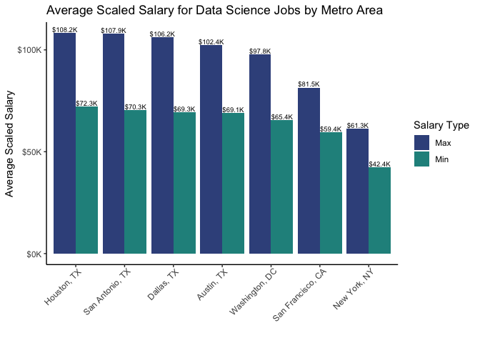<!-- -->

Here we can see that if we scale the salary by cost of living, salaries
actually go much further in terms of quality of life in all four major
metro areas in Texas.

# Job Type

Because different job types require different time commitments, we
wanted to look at the difference in salary ranges for different job
types because intuitively it seems like part time jobs or internships
would most likely have lower salary ranges.

``` r
scaled_salary_data <- ds_jobs %>% select(min_scaled_salary, max_scaled_salary, job_category, industry, job_type) %>% pivot_longer(
                cols = c(min_scaled_salary, max_scaled_salary),
                names_to = "type",
                values_to = "salary",
                values_drop_na = TRUE)

scaled_salary_data <- scaled_salary_data %>% mutate(type = case_when(
  type == "min_scaled_salary" ~ "min",
  type == "max_scaled_salary" ~ "max"))

scaled_salary_data_jc <- scaled_salary_data %>% filter(!is.na(job_type))
ds_related <- c("Data Scientist", "Data Analyst", "Data Engineer", 
                "Machine Learning Engineer", "Statistician", "Other Analyst")

scaled_salary_data_jc_related <- scaled_salary_data_jc %>% 
  filter(job_category %in% ds_related)

mean_salary_jc <- scaled_salary_data_jc_related %>% group_by(type, job_type) %>% 
  mutate(mean_rate = mean(salary))

scaled_salary_data_jc_related %>% ggplot(aes(x = salary, fill = type)) +
  geom_density(alpha = 0.60) +
  labs(
    title = "Salary by Job Type",
    x = "Scaled Salary",
    y = "Density") +
  scale_x_continuous(
    breaks = seq(15000,260000,75000),
    labels = function(x){paste0('$', x/1000, 'K')}) +
  geom_vline(aes(xintercept=mean_salary_jc$mean_rate, col = type, group = job_type), 
             linetype = "dashed", show.legend = FALSE) +
  scale_fill_viridis(discrete = TRUE, begin = 0.25, end = 0.5, name = "Salary Type",
                     labels = c("Max", "Min")) + 
  scale_color_viridis(discrete = TRUE, begin = 0.25, end = 0.5, guide = FALSE) +
  geom_text(data = mean_salary_jc, aes(x = ifelse(type == "max", mean_rate+25000,
                                                  mean_rate-25000), y = 2.4e-05, 
                                       label = paste0('$', round(mean_rate/1000,1), 'K'), 
                                       group = job_type, col = type), size = 2) +
  facet_wrap(~job_type) + 
  theme_classic() +
  theme(strip.text = element_text(face = "bold", size = 7),
        axis.text.x = element_text(size = 6))
```

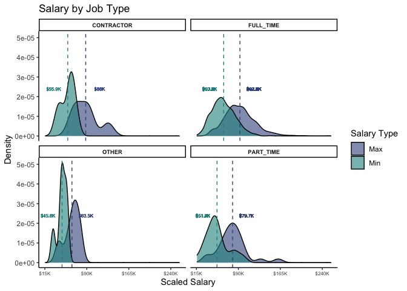<!-- -->

Here we can see that although full time positions do have higher salary
ranges, they are not that different compared to other job types.

# Job Category

Is there a difference in salary between the different types of roles
within data science?

We want to look at different types of jobs within the data science field
to see if there is a difference in salary between different roles. First
we will look at the distribution of the minimum and maximum salary for
each job category to understand their distributions. We used the scaled
salary variables in this instance because we are looking at comparing
salaries of jobs across all metro areas.

``` r
#wrangling the data to fit both salaries on the same graph
scaled_salary_data <- ds_jobs %>% select(min_scaled_salary, max_scaled_salary, job_category, industry, job_type) %>% pivot_longer(
                cols = c(min_scaled_salary, max_scaled_salary),
                names_to = "type",
                values_to = "salary",
                values_drop_na = TRUE)

#cleaning up the salary type
scaled_salary_data <- scaled_salary_data %>% mutate(type = case_when(
  type == "min_scaled_salary" ~ "min",
  type == "max_scaled_salary" ~ "max"))

#create vector of jobs closely related to data science
ds_related <- c("Data Scientist", "Data Analyst", "Data Engineer", "Machine Learning Engineer", "Statistician", "Other Analyst")
```

``` r
#remove NAs from job_category
scaled_salary_data_jc <- scaled_salary_data %>% filter(!is.na(job_category))

#density graph by job category
scaled_salary_data_jc %>% ggplot(aes(x = salary, fill = type)) +
  geom_density(alpha = 0.8) +
  labs(
    title = "Salary by Job Category",
    x = "Scaled Salary",
    y = "Density") +
  scale_fill_viridis(discrete = TRUE, begin = 0.25, end = 0.5, name = "Salary Type",
                     labels = c("Max", "Min")) +
  scale_x_continuous(
    breaks = seq(15000,400000,100000),
    labels = function(x){paste0('$', x/1000, 'K')}) +
  facet_wrap(~job_category) + 
  theme_classic() +
  theme(strip.text = element_text(face = "bold", size = 7),
        axis.text.x = element_text(size = 6))
```

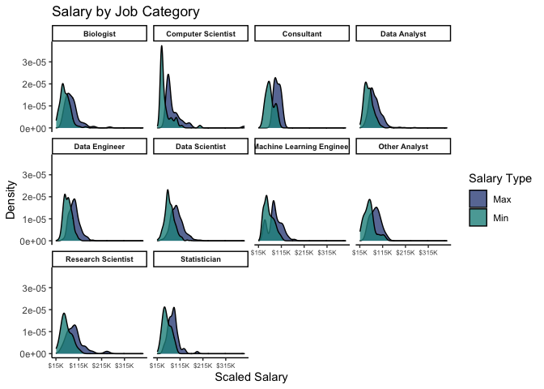<!-- -->

At first glance all the distributions seem similar. They are
approximately normally distributed, but are all a bit right skewed. We
can look at boxplots of the same data to see the summary statistics a
bit better.

``` r
#boxplots for each job category
scaled_salary_data_jc %>% ggplot(aes(y = salary, x = job_category, fill = type)) +
  geom_boxplot(alpha = 0.85) +
  labs(
    title = "Salary by Job Category",
    y = "Salary",
    x = "") +
  scale_fill_viridis(discrete = TRUE, begin = 0.25, end = 0.5, name = "Salary Type",
                     labels = c("Max", "Min")) +
  scale_y_continuous(
    breaks = seq(15000,400000,75000),
    labels = function(x){paste0('$', x/1000, 'K')}) +
  theme_classic() +
  coord_flip()
```

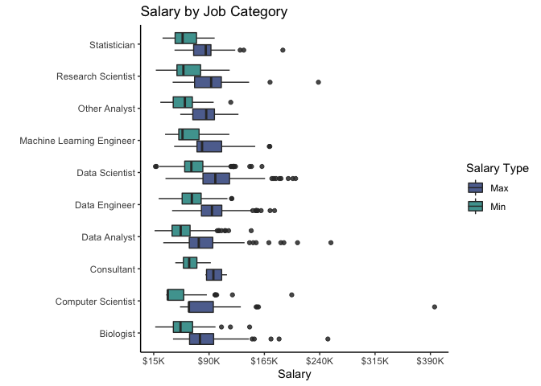<!-- -->

We can see in most instances there are outliers on the upper end of the
distribution. Even with the outliers, there does not seem to be too much
difference in salary distribution for different job categories.

This data contains observations for several different job types such as
full time, part time, contractor, etc. It does not make sense to compare
the salary ranges of certain job types such as full time versus part
time so we will look at only jobs that are typically a full 40 hours a
week.

``` r
#remove part time jobs 
scaled_salary_data_jc <- scaled_salary_data_jc %>% filter(job_type != "PART_TIME")
```

To get a better a understanding of a comparison of salaries between
different roles within data science, we want to look at the average for
maximum and minimum scaled salaries based on job roles.

``` r
#find average min and max salary for each job category
jc_avg_salary <- ds_jobs %>% filter(!is.na(job_category) & !is.na(min_scaled_salary) & !is.na(max_scaled_salary)) %>% 
  group_by(job_category) %>% 
  summarise(avg_max_salary = mean(max_scaled_salary), 
            avg_min_salary = mean(min_scaled_salary)) %>% ungroup()

#pivot data for ease of graphing
jc_avg_salary_long <- jc_avg_salary %>% pivot_longer(cols = c(avg_max_salary, avg_min_salary),
                names_to = "type",
                values_to = "salary",
                values_drop_na = TRUE)

#bar plot of salary by job category
jc_avg_salary_long %>% ggplot(aes(x = reorder(job_category, -salary), y = salary ,fill = type))+
  geom_bar(stat = "identity", position = 'dodge') +
  labs(
    title = "Average Salary by Job Category",
    x = "",
    y = "Scaled Salary") +
  scale_fill_viridis(discrete = TRUE, begin = 0.25, end = 0.5, name = "Salary Type",
                     labels = c("Max", "Min")) + 
  scale_y_continuous(
    breaks = seq(0,110000,25000),
    labels = function(x){paste0('$', x/1000, 'K')}) + 
  geom_text(aes(label=paste0('$', round(salary/1000,1), 'K')),
            position=position_dodge(width=0.9), vjust=-0.25, size = 2) +
  theme_classic() +
  theme( axis.text.x = element_text(angle = 45, vjust = 1, hjust=0.95, size = 8))
```

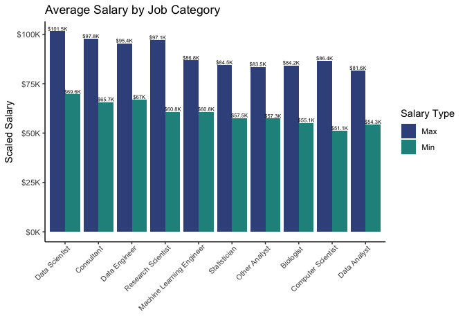<!-- -->

Here we can see that the highest paying role is Data Scientist based on
both minimum and maximum salary and the lowest is Data Analyst based on
the maximum salary and Computer Scientist based on the minimum of the
salary range.

So far the analysis has been for all job roles, but since there are so
many we wanted to narrow the analysis to just those job roles that are
most closely related to data science.

## Most Related to Data Science

The roles most related to the field of data science are Data Scientist,
Data Analyst, Data Engineer, Machine Learning Engineer, Statistician and
Other Analyst. We can look at the distribution of salary for only these
roles.

``` r
#filter for jobs in ds related jobs vector
scaled_salary_data_jc_related <- scaled_salary_data_jc %>% 
  filter(job_category %in% ds_related)

#calculate mean salary by job category to use in graph
mean_salary_jc <- scaled_salary_data_jc_related %>% group_by(type, job_category) %>% 
  mutate(mean_rate = mean(salary))

#density graph for ds related jobs
scaled_salary_data_jc_related %>% ggplot(aes(x = salary, fill = type)) +
  geom_density(alpha = 0.60) +
  labs(
    title = "Distribution of Scaled Salary for Data Science Roles",
    x = "Scaled Salary",
    y = "Density") +
  scale_x_continuous(
    breaks = seq(15000,260000,75000),
    labels = function(x){paste0('$', x/1000, 'K')}) +
  geom_vline(aes(xintercept=mean_salary_jc$mean_rate, col = type, group = job_category),
              linetype = "dashed", show.legend = FALSE) +
  scale_fill_viridis(discrete = TRUE, begin = 0.25, end = 0.5, name = "Salary Type",
                     labels = c("Max", "Min")) + 
  scale_color_viridis(discrete = TRUE, begin = 0.25, end = 0.5, guide = FALSE) +
  geom_text(data = mean_salary_jc, aes(x = ifelse(type == "max", mean_rate+30000,
                                                   mean_rate-28000), y = 2.4e-05, 
                                        label = paste0('$', round(mean_rate/1000,1), 'K'),
                                        group = job_category, col = type), size = 2.5) +
  facet_wrap(~job_category) + 
  theme_classic() +
  theme(strip.text = element_text(face = "bold", size = 7),
        axis.text.x = element_text(size = 6))
```

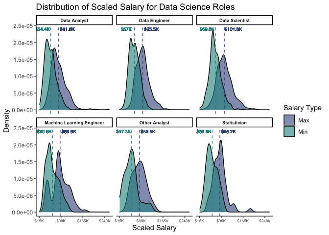<!-- -->

The distribution of both minimum and maximum salary is pretty similar
for all of the different jobs roles. In addition, the ratio or
proportion of minimum salaries overlapping with maximum salaries is
fairly similar between the different job categories.

``` r
#filter for jobs in ds related jobs vector
jc_avg_salary_related <- jc_avg_salary_long %>% 
  filter(job_category %in% ds_related)

#bar plot of salary by job category for ds jobs
jc_avg_salary_related %>% ggplot(aes(x = reorder(job_category, -salary), y = salary ,
                                     fill = type)) +
  geom_bar(stat = "identity", position = 'dodge') +
  labs(
    title = "Salary for Data Science Roles",
    subtitle = "Glassdoor Job Openings",
    x = "",
    y = "Average Scaled Salary") +
  scale_fill_viridis(discrete = TRUE, begin = 0.25, end = 0.5, name = "Salary Type",
                     labels = c("Max", "Min")) + 
  scale_y_continuous(
    breaks = seq(0,110000,20000),
    labels = function(x){paste0('$', x/1000, 'K')}) +
  geom_text(aes(label=paste0('$', round(salary/1000,1), 'K')),
            position=position_dodge(width=0.9), vjust=-0.25, size = 2.5) +
  theme_classic() +
  theme(axis.text.x = element_text(angle = 45, vjust = 1, hjust=0.95, size = 8))
```

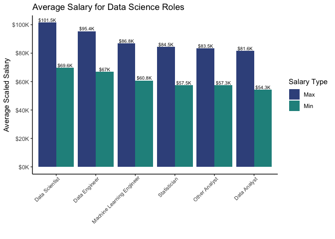<!-- -->

In looking at the average minimum and maximum salary for each job
category we can see a distinct pattern. The minimum and maximum have the
same levels per job category with Data Scientist having the highest
average maximum and minimum salary then Data Engineer and so on until
Data Analyst which has the lowest average maximum and minimum salary
compared to other data science related jobs. For those looking for the
highest paying jobs in data science, they should look at Data Scientist
and Data Engineer roles first.

# Job Industry

Is there a salary difference based on the industry the data science job
is in?

We will look at the top 5 industries and compare their scaled minimum
and maximum salary ranges to see if there is a difference in salaries
based on the type of industry a job is in.

``` r
#remove NAs from industry
scaled_salary_data_ji <- scaled_salary_data %>% filter(!is.na(industry))

#filter out part time jobs
scaled_salary_data_ji <- scaled_salary_data_ji %>% filter(job_type != "PART_TIME")

#find top 5 industries for ds jobs by count of ds jobs in each industry
scaled_salary_data_ji_related <- scaled_salary_data_ji %>% 
  group_by(industry) %>% 
  summarise(count = n()) %>%
  arrange(desc(count)) %>%
  slice(1:5) %>%
  select(industry) %>% 
  ungroup()
```

    ## `summarise()` ungrouping output (override with `.groups` argument)

``` r
#filter for jobs in top 5 industries
scaled_salary_data_ji <- scaled_salary_data_ji %>% 
  filter(industry %in% scaled_salary_data_ji_related$industry)

#calculate mean salary by job category to use in graph
mean_salary_ji <- scaled_salary_data_ji %>% group_by(type, industry) %>% 
  mutate(mean_rate = mean(salary))

#density plot of salary for top 5 industries
scaled_salary_data_ji %>% ggplot(aes(x = salary, fill = type)) +
  geom_density(alpha = 0.6) +
  labs(
    title = "Distribution of Scaled Salary for Top 5 Industries",
    x = "Scaled Salary",
    y = "Density") +
  scale_x_continuous(
    breaks = seq(15000,400000,100000),
    labels = function(x){paste0('$', x/1000, 'K')}) +
  geom_vline(aes(xintercept=mean_salary_ji$mean_rate, col = type, group = industry), 
             linetype = "dashed", show.legend = FALSE) +
  scale_fill_viridis(discrete = TRUE, begin = 0.25, end = 0.5, name = "Salary Type",
                     labels = c("Max", "Min")) + 
  scale_color_viridis(discrete = TRUE, begin = 0.25, end = 0.5, guide = FALSE) +
  geom_text(data = mean_salary_ji, aes(x = ifelse(type == "max", mean_rate+35000,
                                                  mean_rate-35000), y = 2.5e-05, 
                                       label = paste0('$', round(mean_rate/1000,1), 'K'), 
                                       group = industry, col = type), size = 2.5,
                                       family = "sans") +
  facet_wrap(~industry) + 
  theme_classic() +
  theme(strip.text = element_text(face = "bold", size = 7),
        axis.text.x = element_text(size = 6))
```

<!-- -->

At first glance, it does not look like there is much of a difference in
distribution of minimum or maximum salary ranges between different
industries. Again just like with job categories it seems like the
salarly distributions are approximately normally distributed with a
right skew.

``` r
#calculate average min and max salary for each industry
ji_avg_salary <- ds_jobs %>% filter(!is.na(industry) & !is.na(min_scaled_salary & 
                             job_type != "PART_TIME") & !is.na(max_scaled_salary)) %>%
  group_by(industry) %>% 
  summarise(avg_max_salary = mean(max_scaled_salary), 
            avg_min_salary = mean(min_scaled_salary)) %>% ungroup()
```

    ## `summarise()` ungrouping output (override with `.groups` argument)

``` r
#pivot data for ease of graphing
ji_avg_salary_long <- ji_avg_salary %>% pivot_longer(cols = c(avg_max_salary, avg_min_salary),
                names_to = "type",
                values_to = "salary",
                values_drop_na = TRUE)

#filter for top 5 industries
ji_avg_salary_long_related <- ji_avg_salary_long %>% 
  filter(industry %in% scaled_salary_data_ji_related$industry)

#barplot of avg min and max salary by industry
ji_avg_salary_long_related %>% ggplot(aes(x = reorder(industry, -salary), y = salary ,fill = type)) +
  geom_bar(stat = "identity", position = 'dodge') +
  labs(
    title = "Average Salary for the Top 5 Industries",
    subtitle = "Data Science Related Job Openings",
    x = "",
    y = "Average Scaled Salary") +
  scale_fill_viridis(discrete = TRUE, begin = 0.25, end = 0.5, name = "Salary Type",
                     labels = c("Max", "Min")) + 
  scale_y_continuous(
    breaks = seq(0,100000,20000),
    labels = function(x){paste0('$', x/1000, 'K')}) +
  geom_text(aes(label=paste0('$', round(salary/1000,1), 'K')),
            position=position_dodge(width=0.9), vjust=-0.25, size = 2.5) +
  theme_classic() +
  theme(axis.text.x = element_text(angle = 45, vjust = 1, hjust=0.95, size = 8))
```

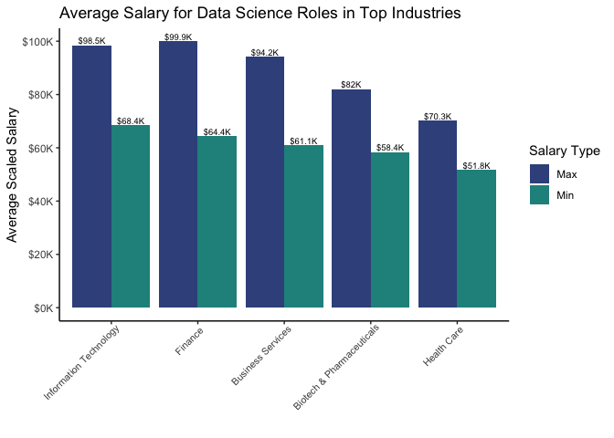<!-- -->

There does seem to be a trend in the average minimum and maximum
salaries for the top 5 industries. Information Technology has the
highest average minimum salary followed by Finance with a slightly
higher average maximum salary, then Business Services, Biotech &
Pharmaceuticals and lastly Health Care. If an individual is looking for
a high paying job in the data science field, they should look at these 5
industries that have the highest average salaries.
