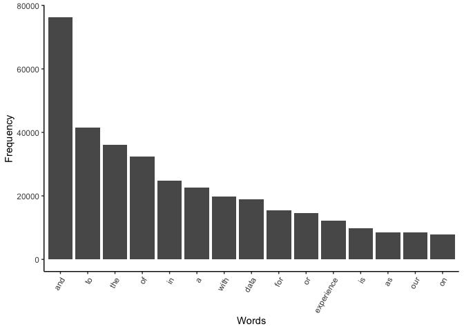
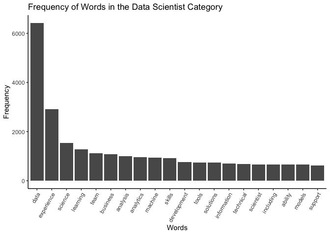
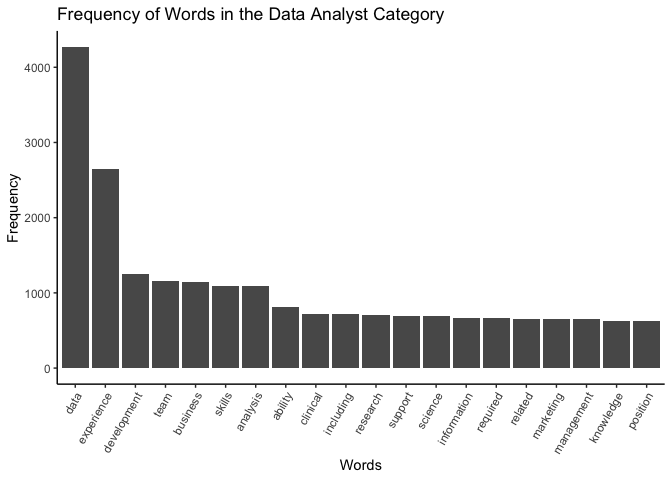
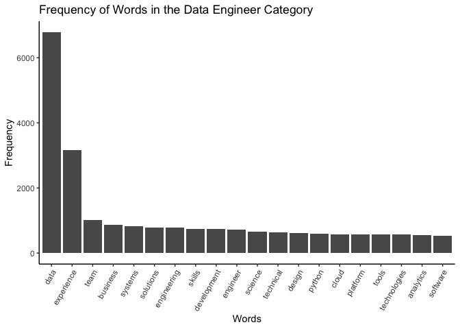
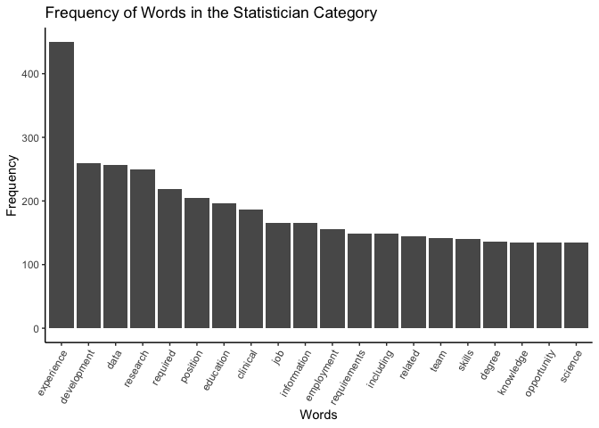
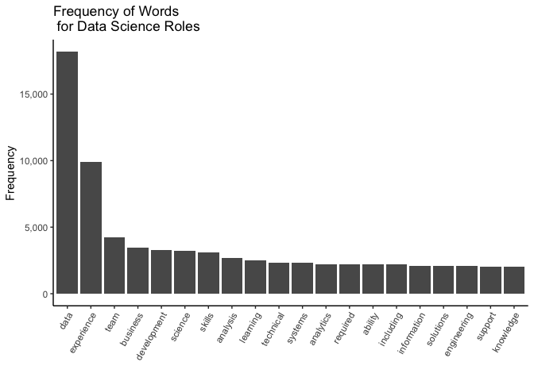
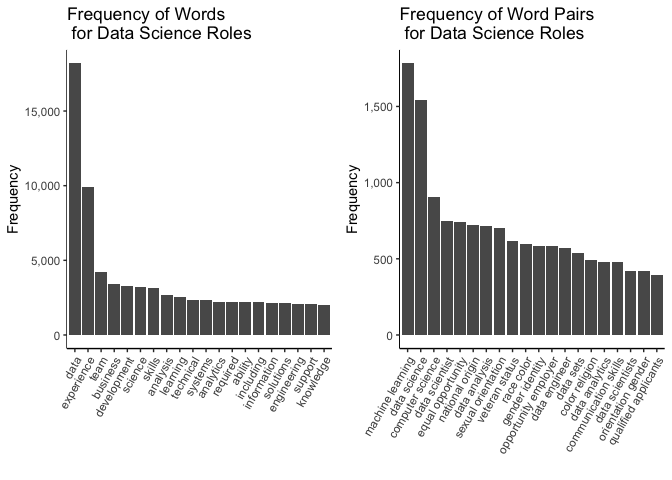

Text Analysis
================

In the file we perform text analysis on the job description to see if
there are any skills or experience a candidate should focus on during
their job search.

## Word count

We want to use text analysis on the job description to see if there is a
skill that is repeated throughout. This would be an important skill if
it were repeated that applicants should attempt to improve if they are
interested in the jobs.

Forst, we tokenized the corpus and generated a word count.

``` r
job_words <- ds_jobs %>% select(job_category,job_desc) %>% unnest_tokens(word, job_desc)
head(job_words)
```

    ##     job_category    word
    ## 1   Data Analyst     who
    ## 1.1 Data Analyst   we're
    ## 1.2 Data Analyst looking
    ## 1.3 Data Analyst     for
    ## 1.4 Data Analyst     the
    ## 1.5 Data Analyst   chief

``` r
job_words %>% count(word, sort = T) %>% slice(1:15) %>% 
  ggplot(aes(x = reorder(word, n, function(n) -n), y = n)) + 
  geom_bar(stat = "identity") + 
  theme_classic() +
  theme(axis.text.x = element_text(angle = 60, hjust = 1)) + 
  labs(x= "Words",
       y = "Frequency")
```

<!-- -->

Second, we removed stop words and generated a new word count.

``` r
better_line_words <- job_words %>% anti_join(stop_words)
```

Lastly, we created a visualization of the word count distribution.

``` r
better_line_words %>% count(word, sort = T) %>% slice(1:20) %>% 
  ggplot(aes(x = reorder(word, n, function(n) -n), y = n)) + 
  geom_bar(stat = "identity") + 
  theme_classic() +
  theme(axis.text.x = element_text(angle = 60, hjust = 1)) + 
  labs(
    x = "Words",
    title = "Word Frequency for All Jobs in the Data",
    y = "Frequency")
```

<!-- -->

## Interpretation

No skills were mentioned frequently so we wanted to use TF-IDF just to
see what the results yield. Keep in mind that this is for all of the
jobs in the data set. We will filter by DS jobs later in the report.

## Usage

This text analysis is not included in our final report because we have
been emphasizing looking at 6 DS categories and this incorporates all
job categories.

# TF-IDF

First we generated a tf-idf measure of words in the dataset.

``` r
idf_words <- ds_jobs %>% select(job_category, job_desc) %>% 
  unnest_tokens(word,job_desc) %>% count(job_category, word, sort = T)

better_idf_words <- idf_words %>% anti_join(stop_words)

description_length <- better_idf_words %>% group_by(job_category) %>% summarize(total = sum(n()))

better_idf_words <- left_join(better_idf_words, description_length)

tfidf_words <- better_idf_words %>% bind_tf_idf(word, job_category, n)
```

    ## Warning: A value for tf_idf is negative:
    ##  Input should have exactly one row per document-term combination.

``` r
tfidf_words <- tfidf_words %>% arrange(desc(tf_idf)) %>% slice(1:15)

tfidf_words %>% arrange(desc(tf_idf)) %>% head()
```

    ##                job_category      word   n total          tf       idf
    ## 1                Consultant  incident 330   881 0.032990103 0.6931472
    ## 2                Consultant forensics 240   881 0.023992802 0.9162907
    ## 3                Consultant    encase  90   881 0.008997301 2.3025851
    ## 4                Consultant       ftk  90   881 0.008997301 2.3025851
    ## 5 Machine Learning Engineer    teecom 510  5951 0.007674135 2.3025851
    ## 6                Consultant   crypsis  60   881 0.005998201 2.3025851
    ##       tf_idf
    ## 1 0.02286700
    ## 2 0.02198438
    ## 3 0.02071705
    ## 4 0.02071705
    ## 5 0.01767035
    ## 6 0.01381137

Second, we created a visualization of the tf-idf measure.

``` r
tfidf_words$word <- factor(tfidf_words$word, levels = tfidf_words$word[order(desc(tfidf_words$tf_idf))])
```

``` r
ggplot(tfidf_words, aes(x = word, y = tf_idf))+
  geom_bar(stat = "identity") + 
  theme_classic() +
  theme(axis.text.x = element_text(angle = 60, hjust = 1)) + 
  xlab("Words")
```

<!-- -->

# Word Frequency by Job Category

Word count for every job category would not be beneficial to the final
report so we will begin to do text analysis on each job category and
then on all of the categories combined. We are doing this to see if
there are any skills that applicants should have experience with before
applying. This could help them become more successful applicants.

## Data Scientist

First, we tokenized our corpus and generated a word count.

``` r
ds_words <- ds_jobs%>%
  filter(job_category == "Data Scientist")

job_words <- ds_words %>% select(job_category,job_desc) %>% unnest_tokens(word, job_desc)
head(job_words)
```

    ##       job_category     word
    ## 1   Data Scientist    faire
    ## 1.1 Data Scientist       is
    ## 1.2 Data Scientist    using
    ## 1.3 Data Scientist  machine
    ## 1.4 Data Scientist learning
    ## 1.5 Data Scientist       to

Second, we removed stop words and generated a new word count.

``` r
better_line_words <- job_words %>% anti_join(stop_words)
```

Lastly, we created a visualization of the word count distribution.

``` r
better_line_words %>% count(word, sort = T) %>% slice(1:20) %>% 
  ggplot(aes(x = reorder(word, n, function(n) -n), y = n)) + 
  geom_bar(stat = "identity") + 
  theme_classic() +
  theme(axis.text.x = element_text(angle = 60, hjust = 1)) + 
  labs(
    x = "Words",
    title = "Frequency of Words in the Data Scientist Category",
    y = "Frequency")
```

<!-- -->

### Interpretation

After filtering by “Data Scientist,” it looks like employees should have
some kind of analytical skills as well as machine learning skills.
“Models” is also in the top 15 so this could augment the machine
learning skill that data scientists need.

## Data Analyst

Now we will check to see if there are any skills that are important for
data analysts.

First, we tokenized our corpus and generated a word count.

``` r
analyst_words <- ds_jobs%>%
  filter(job_category == "Data Analyst")

job_words <- analyst_words %>% select(job_category,job_desc) %>% unnest_tokens(word, job_desc)
head(job_words)
```

    ##     job_category    word
    ## 1   Data Analyst     who
    ## 1.1 Data Analyst   we're
    ## 1.2 Data Analyst looking
    ## 1.3 Data Analyst     for
    ## 1.4 Data Analyst     the
    ## 1.5 Data Analyst   chief

Second, we removed stop words and generated a new word count.

``` r
better_line_words <- job_words %>% anti_join(stop_words)
```

Lastly, we created a visualization of the word count distribution.

``` r
better_line_words %>% count(word, sort = T) %>% slice(1:20) %>% 
  ggplot(aes(x = reorder(word, n, function(n) -n), y = n)) + 
  geom_bar(stat = "identity") + 
  theme_classic() +
  theme(axis.text.x = element_text(angle = 60, hjust = 1)) + 
  labs(
    x = "Words",
    title = "Frequency of Words in the Data Analyst Category",
    y = "Frequency")
```

<!-- -->

### Interpretation

We don’t learn as much from this graph as we did for the data scientist
graph. However, we see soft skills such as “team”, “analysis”,
“research” so the employee should be equipped with the ability to
work with others and look at previous data to draw conclusions.

## Data Engineer

We did the same analysis for Data Engineer.

First, we tokenized our corpus and generated a word count.

``` r
engineer_words <- ds_jobs%>%
  filter(job_category == "Data Engineer")

job_words <- engineer_words %>% select(job_category,job_desc) %>% unnest_tokens(word, job_desc)
head(job_words)
```

    ##      job_category      word
    ## 1   Data Engineer   addepar
    ## 1.1 Data Engineer       has
    ## 1.2 Data Engineer       the
    ## 1.3 Data Engineer potential
    ## 1.4 Data Engineer        to
    ## 1.5 Data Engineer      make

Second, we removed stop words and generate a new word count.

``` r
better_line_words <- job_words %>% anti_join(stop_words)
```

Lastly, we created a visualization of the word count distribution.

``` r
better_line_words %>% count(word, sort = T) %>% slice(1:20) %>% 
  ggplot(aes(x = reorder(word, n, function(n) -n), y = n)) + 
  geom_bar(stat = "identity") + 
  theme_classic() +
  theme(axis.text.x = element_text(angle = 60, hjust = 1)) + 
  labs(
    x = "Words",
    title = "Frequency of Words in the Data Engineer Category",
    y = "Frequency")
```

<!-- -->

### Interpretation

Python is listed as a commonly used word for data engineering so a data
engineer ought to learn Python if they wish to be a successful
applicant. Cloud is also a commonly used word so I assume this would be
some type of google storage.

## Machine Learning Engineer

First we tokenized our corpus and generated a word count.

``` r
ml_words <- ds_jobs%>%
  filter(job_category == "Machine Learning Engineer")

job_words <- ml_words %>% select(job_category,job_desc) %>% unnest_tokens(word, job_desc)
head(job_words)
```

    ##                  job_category       word
    ## 1   Machine Learning Engineer excavation
    ## 1.1 Machine Learning Engineer contractor
    ## 1.2 Machine Learning Engineer    looking
    ## 1.3 Machine Learning Engineer        for
    ## 1.4 Machine Learning Engineer          a
    ## 1.5 Machine Learning Engineer       self

Secondly, we removed stop words and generated a new word count.

``` r
better_line_words <- job_words %>% anti_join(stop_words)
```

Lastly, we created a visualization of the word count distribution.

``` r
better_line_words %>% count(word, sort = T) %>% slice(1:20) %>% 
  ggplot(aes(x = reorder(word, n, function(n) -n), y = n)) + 
  geom_bar(stat = "identity") + 
  theme_classic() +
  theme(axis.text.x = element_text(angle = 60, hjust = 1)) + 
  labs(
    x = "Words",
    title = "Frequency of Words in the Machine Learning Engineer\nCategory",
    y = "Frequency")
```

<!-- -->

### Interpretation

No hard skills are commonly used in the descriptions. Commonly used
words such as “team” and “decisions” could suggest that a machine
learning engineer must work with other to make decisions. This makes
sense because the machine learning engineer will be making the
predictive models for the company.

## Statisticians

Again, we did the same anaylsis on statistics job descriptions.

First, we tokenized our corpus and generated a word count.

``` r
stats_words <- ds_jobs%>%
  filter(job_category == "Statistician")

job_words <- stats_words %>% select(job_category,job_desc) %>% unnest_tokens(word, job_desc)
head(job_words)
```

    ##     job_category      word
    ## 1   Statistician        sr
    ## 1.1 Statistician scientist
    ## 1.2 Statistician        ii
    ## 1.3 Statistician  location
    ## 1.4 Statistician       san
    ## 1.5 Statistician francisco

Secondly, we removed stop words and generated a new word count.

``` r
better_line_words <- job_words %>% anti_join(stop_words)
```

Lastly, we created a visualization of the word count distribution.

``` r
better_line_words %>% count(word, sort = T) %>% slice(1:20) %>% 
  ggplot(aes(x = reorder(word, n, function(n) -n), y = n)) + 
  geom_bar(stat = "identity") + 
  theme_classic() +
  theme(axis.text.x = element_text(angle = 60, hjust = 1)) + 
  labs(
    x = "Words",
    title = "Frequency of Words in the Statistician Category",
    y = "Frequency")
```

<!-- -->

### Interpretation

No hard skills in the job descriptions. It would be difficult to
determine much from commonly used words in the job description for
statisticians.

## Other Analyst

Finally, we did the same analysis for Other Analyst.

First, we tokenized our corpus and generated a word count.

``` r
other_analyst_words <- ds_jobs%>%
  filter(job_category == "Other Analyst")

job_words <- other_analyst_words %>% select(job_category,job_desc) %>% 
             unnest_tokens(word, job_desc)
head(job_words)
```

    ##      job_category        word
    ## 1   Other Analyst         the
    ## 1.1 Other Analyst  positionwe
    ## 1.2 Other Analyst         are
    ## 1.3 Other Analyst     seeking
    ## 1.4 Other Analyst          an
    ## 1.5 Other Analyst experienced

Secondly, we removed stop words and generated a new word count.

``` r
better_line_words <- job_words %>% anti_join(stop_words)
```

Lastly, we created a visualization of the word count distribution.

``` r
better_line_words %>% count(word, sort = T) %>% slice(1:20) %>% 
  ggplot(aes(x = reorder(word, n, function(n) -n), y = n)) + 
  geom_bar(stat = "identity") + 
  theme_classic() +
  theme(axis.text.x = element_text(angle = 60, hjust = 1)) + 
  labs(
    x = "Words",
    title = "Frequency of Words in the Other Analyst Category",
    y = "Frequency")
```

<!-- -->

### Interpretation

Nothing to learn from this analysis. Only 28 jobs are in this category
and it is grouped at other so it is hard to perform analysis on this
group. There are soft skills that were seen in other data science
positions such as analytical skills.

# All DS jobs

After looking at data science role separately, we wanted to look at job
descriptions for data science roles as a whole.

``` r
#filtering the data set for ds roles
ds_filter <- ds_jobs %>%
  filter(!is.na(job_category)) %>%
  filter(job_category == "Data Analyst" | job_category == "Data Engineer" | 
         job_category == "Data Scientist" | 
         job_category == "Machine Learning Engineer" |
         job_category == "Other Analyst" | job_category == "Statistician")

job_words <- ds_filter %>% select(job_category,job_desc) %>% unnest_tokens(word, job_desc)
```

``` r
better_line_words <- job_words %>% anti_join(stop_words)
```

``` r
one_word <- better_line_words %>% count(word, sort = T) %>% slice(1:20) %>% 
  ggplot(aes(x = reorder(word, n, function(n) -n), y = n)) + 
  geom_bar(stat = "identity") + 
  labs(
    x = "",
    title = "Frequency of Words \n for Data Science Roles",
    y = "Frequency") +
  scale_y_continuous(labels = comma) +
  theme_classic() +
  theme(axis.text.x = element_text(angle = 60, hjust = 1))

one_word
```

<!-- -->

## Interpretation

This graph is all inclusive for the data science related positions. It
shows that applicants who are interested in a data science related
position should have an analytical mindset. They also should be able to
work well in teams.

# Two Word Text Analysis

Let’s see if we can get better results using two-word phrases for our
text analysis rather than looking at each word seperately as we did
above.

Tokenizing the text

``` r
job_words <- ds_filter %>% select(job_category,job_desc) %>% unnest_tokens(word, job_desc,token = "ngrams",format = "text", n =2)
```

Removing stop words

``` r
better_line_words <- job_words %>% anti_join(stop_words)
head(better_line_words[,2])
```

    ## [1] "who we're"       "we're looking"   "looking for"     "for the"        
    ## [5] "the chief"       "chief marketing"

``` r
# split words b/c two word phrases aren't in stop words
best <- separate(better_line_words,col = word, into = c("first", "second"), sep = " ")

# now take out stop words from the two created columns
best_line_words <- best %>% anti_join(stop_words, by = c("first"="word"))
better_line_words <- best_line_words %>% anti_join(stop_words, by = c("second"="word"))

# join the columns back together
better_line_words$word <- paste(better_line_words$first,better_line_words$second, sep = " ")
```

Creating a visualization

``` r
two_word <- better_line_words %>% count(word, sort = T) %>% slice(1:20) %>% 
  ggplot(aes(x = reorder(word, n, function(n) -n), y = n)) + 
  geom_bar(stat = "identity") + 
  labs(
    x = "",
    title = "Frequency of Word Pairs \n for Data Science Roles",
    y = "Frequency") +
  scale_y_continuous(labels = comma) +
  theme_classic() +
  theme(axis.text.x = element_text(angle = 60, hjust = 1))

two_word
```

<!-- -->

## Interpretation

We did not many interesting results by doing a text analysis with the
the most used words so we are now doing a text analysis with the most
commonly used two-word phrases. Now we can see popular jobs within our
data set such as machine learning and data scientist.

# Combine Plots

``` r
ggarrange(one_word,two_word,ncol = 2, nrow = 1)
```

<!-- -->

# Conclusions

Going into this exploration, we were interested in finding out if there
were a common words among job descriptions such as hard skills that
applicants would need to learn (R, Python) that would help them get a
data science related job. We found that this was not case. There were
soft skills that applicants should look to hone before applying such as
analytical skills and getting experience working in teams.
