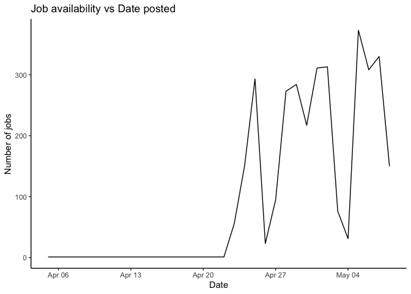

Limitations
================

This file contains the graphs related to the limitations within our
analysis.

# Time series analysis

This data about the job postings are listed from Glassdoor scraped
during the Covid-19 pandemic. According to the Glassdoor findings, there
were very few jobs posted in the beginning of April and then there is a
sudden rise at the end of April. It’s very clear that the job market was
not stable during the pandemic and jobs were only scraped for a small
period of time.

``` r
table_date_posted <- data.frame(table(ds_jobs$date_posted))
table_date_posted$Var1 <- as.Date(table_date_posted$Var1, format = "%Y-%m-%d") 
ggplot(table_date_posted, aes(x = Var1, y = Freq)) +
  geom_line() +
  theme_classic() +
  labs(title = "Timeline of Job Postings on Glassdoor (2020)",
       x = "",
       y = "Number of Jobs")
```

<!-- -->
