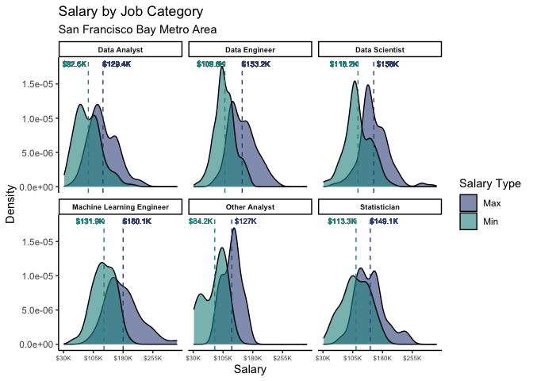
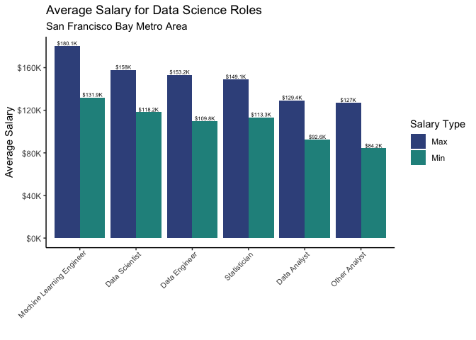
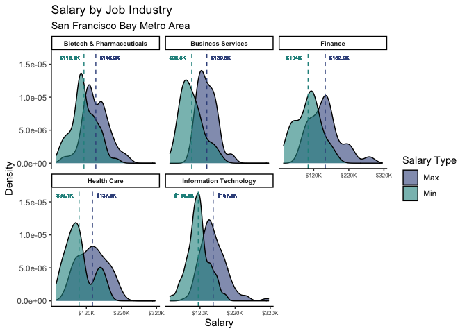
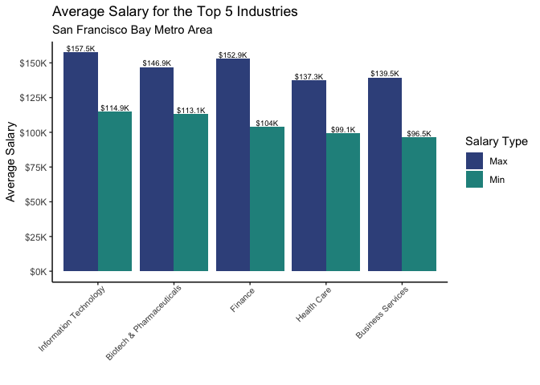
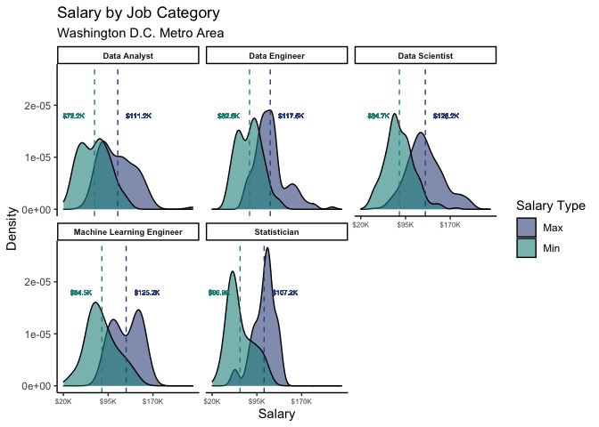
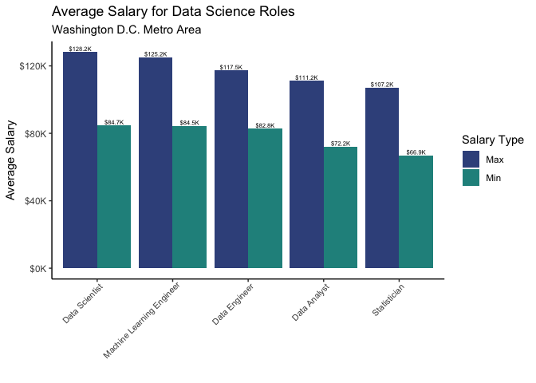
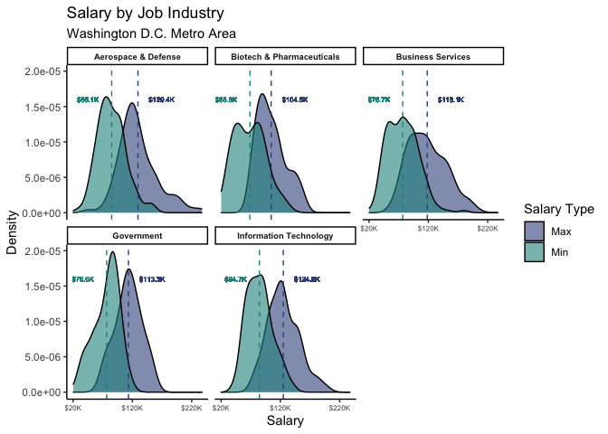
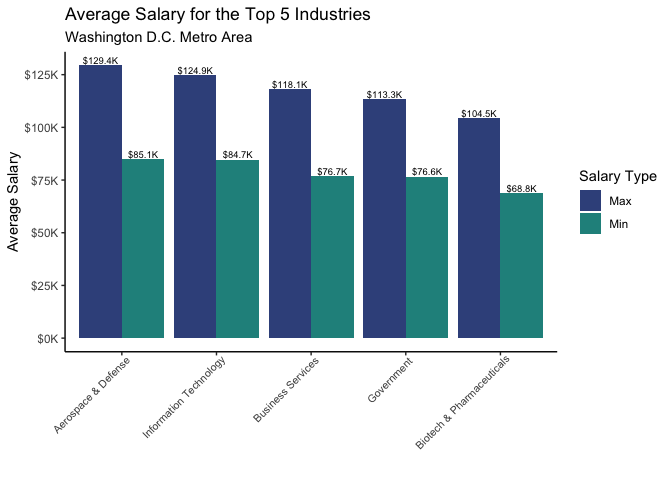

Metro Area Comparison
================

In this file we are comparing data science jobs between the top two
metro areas in our data set, San Francisco and Washington D.C., as they
both had a comparible about of job openings.

We can see that there are significantly more full time jobs in San
Francisco, Washington DC and New York City. We want to look at salaries
of different data science roles within each metro area to see if there
are difference to the overall data set. Are salaries for different roles
in data science the same in different metro locations?

``` r
ds_related <- c("Data Scientist", "Data Analyst", "Data Engineer", 
                "Machine Learning Engineer", "Statistician", "Other Analyst")

ds_jobs %>% filter(job_type != "PART_TIME" & job_category %in% ds_related) %>% group_by(metro_location) %>% 
  summarise(count = n()) %>% arrange(-count)
```

    ## # A tibble: 7 x 2
    ##   metro_location    count
    ##   <chr>             <int>
    ## 1 San Francisco, CA   750
    ## 2 Washington, DC      702
    ## 3 Dallas, TX          230
    ## 4 Austin, TX          153
    ## 5 New York, NY        120
    ## 6 Houston, TX          81
    ## 7 San Antonio, TX      41

## San Francisco

We want to filter the data set for only full time data science related
jobs in San Francisco and look at the distribution of minimum and
maximum salary as well as average salaries across different data science
related roles. For this analysis we are using the salary, not the scaled
salary, as we are only look at each metro location separately and do not
need to account for cost of living in the comparison.

``` r
#filtering for SF data
sf_data <- ds_jobs %>% filter(job_type != "PART_TIME" & 
                              metro_location == "San Francisco, CA" &
                              job_category %in% ds_related) 

#wrangling the data to fit both salaries on the same graph
salary_data_sf <- sf_data %>% select(min_salary, max_salary, job_category, industry, job_type, metro_location) %>% 
  pivot_longer(
                cols = c(min_salary, max_salary),
                names_to = "type",
                values_to = "salary",
                values_drop_na = TRUE)

#calculate mean salary by job category to use in graph
mean_salary_sf <- salary_data_sf %>% group_by(type, job_category) %>% 
  mutate(mean_rate = mean(salary))

#density graph for ds related jobs
salary_data_sf %>% ggplot(aes(x = salary, fill = type)) +
  geom_density(alpha = 0.60) +
  labs(
    title = "Salary by Job Category",
    subtitle = "San Francisco Bay Metro Area",
    x = "Salary",
    y = "Density") +
  scale_x_continuous(
    breaks = seq(30000,320000,75000),
    labels = function(x){paste0('$', x/1000, 'K')}
  ) +
   geom_vline(aes(xintercept=mean_salary_sf$mean_rate, col = type, group = job_category), linetype = "dashed", show.legend = FALSE) +
scale_fill_viridis(discrete = TRUE, begin = 0.25, end = 0.5, name = "Salary Type",
                     labels = c("Max", "Min")) + 
scale_color_viridis(discrete = TRUE, begin = 0.25, end = 0.5, guide = FALSE) +
  geom_text(data = mean_salary_sf, aes(x = ifelse(type == "max_salary", mean_rate+35000, mean_rate-35000), y = 1.8e-05, label = paste0('$', round(mean_rate/1000,1), 'K'), group = job_category, col = type), size = 2.5) +
  facet_wrap(~job_category) + 
  theme_classic() +
  theme(strip.text = element_text(face = "bold", size = 7),
        axis.text.x = element_text(size = 6))
```

<!-- -->

The shape of the distribution for San Francisco looks similar to the
distribution of salary for all metro areas although it looks less skewed
to the right.

``` r
#calculating the average min and max salary for SF
sf_avg_salary <- sf_data %>% filter(!is.na(min_salary) & !is.na(max_salary)) %>% 
  group_by(job_category) %>% 
  summarise(avg_max_salary = mean(max_salary), 
            avg_min_salary = mean(min_salary))

#pivot data for ease of graphing
sf_avg_salary_long <- sf_avg_salary %>% pivot_longer(cols = c(avg_max_salary, avg_min_salary),
                names_to = "type",
                values_to = "salary",
                values_drop_na = TRUE)

#bar plot of salary by job category
sf_avg_salary_long %>% ggplot(aes(x = reorder(job_category, -salary), y = salary ,fill = type))+
  geom_bar(stat = "identity", position = 'dodge') +
  labs(
    title = "Average Salary for Data Science Roles",
    subtitle = "San Francisco Bay Metro Area",
    x = "",
    y = "Average Salary") +
  scale_fill_viridis(discrete = TRUE, begin = 0.25, end = 0.5, name = "Salary Type",
                     labels = c("Max", "Min")) + 
  scale_y_continuous(
    breaks = seq(0,190000,40000),
    labels = function(x){paste0('$', x/1000, 'K')}
  ) + 
  geom_text(aes(label=paste0('$', round(salary/1000,1), 'K')), position=position_dodge(width=0.9), vjust=-0.25, size = 2) +
  theme_classic() +
  theme( axis.text.x = element_text(angle = 45, vjust = 1, hjust=0.95, size = 8))
```

<!-- -->

In the San Francisco Bay area it looks like the role with the highest
average minimum and maximum salary is a machine learning engineer. The
average minimum is surprisingly high at $131.9K, but we do know that
these salaries are a bit higher due to San Francisco having the highest
cost of living.

``` r
sf_salary_industries <- salary_data_sf %>% filter(!is.na(industry))%>%                                                            group_by(industry) %>% 
                                           summarise(count = n()) %>%
                                           arrange(desc(count)) %>%
                                           slice(1:5) %>%
                                           select(industry) %>% 
                                           ungroup()

#filter for jobs in top 5 industries
sf_ji <- salary_data_sf %>% 
  filter(industry %in% sf_salary_industries$industry & !is.na(industry))

#calculate mean salary by job category to use in graph
mean_sf_ji <- sf_ji %>% group_by(type, industry) %>% 
  mutate(mean_rate = mean(salary))

#density plot of salary for top 5 industries
sf_ji %>% ggplot(aes(x = salary, fill = type)) +
  geom_density(alpha = 0.6) +
  labs(
    title = "Salary by Job Industry",
    subtitle = "San Francisco Bay Metro Area",
    x = "Salary",
    y = "Density") +
  scale_x_continuous(
    breaks = seq(20000,385000,100000),
    labels = function(x){paste0('$', x/1000, 'K')}
  ) +
  geom_vline(aes(xintercept=mean_sf_ji$mean_rate, col = type, group = industry), linetype = "dashed", show.legend = FALSE) +
scale_fill_viridis(discrete = TRUE, begin = 0.25, end = 0.5, name = "Salary Type",
                     labels = c("Max", "Min")) + 
  scale_color_viridis(discrete = TRUE, begin = 0.25, end = 0.5, guide = FALSE) +
  geom_text(data = mean_sf_ji, aes(x = ifelse(type == "max_salary", mean_rate+40000, mean_rate-40000), y = 1.6e-05, label = paste0('$', round(mean_rate/1000,1), 'K'), group = industry, col = type), size = 2) +
  facet_wrap(~industry) + 
  theme_classic() +
  theme(strip.text = element_text(face = "bold", size = 7),
    axis.text.x = element_text(size = 6))
```

<!-- -->

The top 5 industries in the San Francisco Bay area are the same as the
top 5 industries across all metro areas in the data.

``` r
#calculate average min and max salary for each industry
ji_sf_avg <- sf_data %>% filter(!is.na(min_salary) & !is.na(max_salary) &
                                industry %in% sf_salary_industries$industry) %>% 
                                group_by(industry) %>% 
                                summarise(avg_max_salary = mean(max_salary), 
                                avg_min_salary = mean(min_salary))

#pivot data for ease of graphing
ji_sf_avg_long <- ji_sf_avg %>% pivot_longer(cols = c(avg_max_salary, avg_min_salary),
                names_to = "type",
                values_to = "salary",
                values_drop_na = TRUE)

#barplot of avg min and max salary by industry
ji_sf_avg_long %>% ggplot(aes(x = reorder(industry, -salary), y = salary ,fill = type)) +
  geom_bar(stat = "identity", position = 'dodge') +
  labs(
    title = "Average Salary for the Top 5 Industries",
    subtitle = "San Francisco Bay Metro Area",
    x = "",
    y = "Average Salary") +
scale_fill_viridis(discrete = TRUE, begin = 0.25, end = 0.5, name = "Salary Type",
                     labels = c("Max", "Min")) + 
  scale_y_continuous(
    breaks = seq(0,160000,25000),
    labels = function(x){paste0('$', x/1000, 'K')}
  ) +
  geom_text(aes(label=paste0('$', round(salary/1000,1), 'K')), position=position_dodge(width=0.9), vjust=-0.25, size = 2.5) +
  theme_classic() +
  theme(axis.text.x = element_text(angle = 45, vjust = 1, hjust=0.95, size = 8))
```

<!-- -->
The industry with the highest average maximum and minimum salary in the
San Francisco Bay area is Information Technology. The lowest average
maximum salary is Health Care with the lowest average minimum salary in
Business Services although these two industries have very close ranges
in average salaries overall.

## Washington DC

We want to filter the data set for only full time data science related
jobs in Washington D.C. and look at the distribution of minimum and
maximum salary as well as average salaries across different data science
related roles. For this analysis we are using the salary, not the scaled
salary, as we are only look at each metro location separately and do not
need to account for cost of living in the comparison.

``` r
#filtering for DC data
dc_data <- ds_jobs %>% filter(job_type != "PART_TIME" & 
                              metro_location == "Washington, DC" &
                              job_category %in% ds_related) 

dc_data %>% group_by(job_category) %>% 
  summarise(count = n())
```

    ## # A tibble: 6 x 2
    ##   job_category              count
    ##   <chr>                     <int>
    ## 1 Data Analyst                125
    ## 2 Data Engineer               209
    ## 3 Data Scientist              322
    ## 4 Machine Learning Engineer    24
    ## 5 Other Analyst                 1
    ## 6 Statistician                 21

Due to there only being one Other Analyst job role in Washington, D.C.,
we will remove this category from our analysis as it does not make sense
to compare the density of different job categories for just one data
point.

``` r
dc_data <- dc_data %>% filter(job_category != "Other Analyst")

#wrangling the data to fit both salaries on the same graph
salary_data_dc <- dc_data %>% select(min_salary, max_salary, job_category, industry, job_type, metro_location) %>% 
  pivot_longer(
                cols = c(min_salary, max_salary),
                names_to = "type",
                values_to = "salary",
                values_drop_na = TRUE)

#calculate mean salary by job category to use in graph
mean_salary_dc <- salary_data_dc %>% group_by(type, job_category) %>% 
  mutate(mean_rate = mean(salary))

#density graph for ds related jobs
salary_data_dc %>% ggplot(aes(x = salary, fill = type)) +
  geom_density(alpha = 0.60) +
  labs(
    title = "Salary by Job Category",
    subtitle = "Washington D.C. Metro Area",
    x = "Salary",
    y = "Density") +
  scale_x_continuous(
    breaks = seq(20000,240000,75000),
    labels = function(x){paste0('$', x/1000, 'K')}
  ) +
   geom_vline(aes(xintercept=mean_salary_dc$mean_rate, col = type, group = job_category), linetype = "dashed", show.legend = FALSE) +
scale_fill_viridis(discrete = TRUE, begin = 0.25, end = 0.5, name = "Salary Type",
                     labels = c("Max", "Min")) + 
scale_color_viridis(discrete = TRUE, begin = 0.25, end = 0.5, guide = FALSE) +
  geom_text(data = mean_salary_dc, aes(x = ifelse(type == "max_salary", mean_rate+35000, mean_rate-35000), y = 1.8e-05, label = paste0('$', round(mean_rate/1000,1), 'K'), group = job_category, col = type), size = 2) +
  facet_wrap(~job_category) + 
  theme_classic() +
  theme(strip.text = element_text(face = "bold", size = 7),
        axis.text.x = element_text(size = 6))
```

<!-- -->

The shape of the distribution for Washington DC looks similar to the
distribution of salary for all metro areas although it looks less skewed
to the right.

``` r
#calculating the average min and max salary for DC
dc_avg_salary <- dc_data %>% filter(!is.na(min_salary) & !is.na(max_salary)) %>% 
  group_by(job_category) %>% 
  summarise(avg_max_salary = mean(max_salary), 
            avg_min_salary = mean(min_salary))

#pivot data for ease of graphing
dc_avg_salary_long <- dc_avg_salary %>% pivot_longer(cols = c(avg_max_salary, avg_min_salary),
                names_to = "type",
                values_to = "salary",
                values_drop_na = TRUE)

#bar plot of salary by job category
dc_avg_salary_long %>% ggplot(aes(x = reorder(job_category, -salary), y = salary ,fill = type))+
  geom_bar(stat = "identity", position = 'dodge') +
  labs(
    title = "Average Salary for Data Science Roles",
    subtitle = "Washington D.C. Metro Area",
    x = "",
    y = "Average Salary") +
  scale_fill_viridis(discrete = TRUE, begin = 0.25, end = 0.5, name = "Salary Type",
                     labels = c("Max", "Min")) + 
  scale_y_continuous(
    breaks = seq(0,165000,40000),
    labels = function(x){paste0('$', x/1000, 'K')}
  ) + 
  geom_text(aes(label=paste0('$', round(salary/1000,1), 'K')), position=position_dodge(width=0.9), vjust=-0.25, size = 2) +
  theme_classic() +
  theme( axis.text.x = element_text(angle = 45, vjust = 1, hjust=0.95, size = 8))
```

<!-- -->

Like the overall distribution, the data science related job with the
highest average maximum and minimum salary in Washington D.C. is a Data
Scientist.

``` r
dc_salary_industries <- salary_data_dc %>% filter(!is.na(industry))%>%                                                            group_by(industry) %>% 
                                           summarise(count = n()) %>%
                                           arrange(desc(count)) %>%
                                           slice(1:5) %>%
                                           select(industry) %>% 
                                           ungroup()

#filter for jobs in top 5 industries
dc_ji <- salary_data_dc %>% 
  filter(industry %in% dc_salary_industries$industry & !is.na(industry))

#calculate mean salary by job category to use in graph
mean_dc_ji <- dc_ji %>% group_by(type, industry) %>% 
  mutate(mean_rate = mean(salary))

#density plot of salary for top 5 industries
dc_ji %>% ggplot(aes(x = salary, fill = type)) +
  geom_density(alpha = 0.6) +
  labs(
    title = "Salary by Job Industry",
    subtitle = "Washington D.C. Metro Area",
    x = "Salary",
    y = "Density") +
  scale_x_continuous(
    breaks = seq(20000,240000,100000),
    labels = function(x){paste0('$', x/1000, 'K')}
  ) +
  geom_vline(aes(xintercept=mean_dc_ji$mean_rate, col = type, group = industry), linetype = "dashed", show.legend = FALSE) +
scale_fill_viridis(discrete = TRUE, begin = 0.25, end = 0.5, name = "Salary Type",
                     labels = c("Max", "Min")) + 
  scale_color_viridis(discrete = TRUE, begin = 0.25, end = 0.5, guide = FALSE) +
  geom_text(data = mean_dc_ji, aes(x = ifelse(type == "max_salary", mean_rate+40000, mean_rate-40000), y = 1.6e-05, label = paste0('$', round(mean_rate/1000,1), 'K'), group = industry, col = type), size = 2) +
  facet_wrap(~industry) + 
  theme_classic() +
  theme(strip.text = element_text(face = "bold", size = 7),
    axis.text.x = element_text(size = 6))
```

<!-- -->

The top 5 industries in the Washington D.C. metro area are Aerospace &
Defense, Biotech & Pharmaceuticals, Business Services, Government and
Information Technology. The spread of salary ranges are approximately
distributed. This is different than the overall top 5 industries which
makes sense because there is a much larger government presence in D.C.
making it a leader in both the Government and Aerospace & Defense
industries.

``` r
#calculate average min and max salary for each industry
ji_dc_avg <- dc_data %>% filter(!is.na(min_salary) & !is.na(max_salary) &
                                industry %in% dc_salary_industries$industry) %>% 
                                group_by(industry) %>% 
                                summarise(avg_max_salary = mean(max_salary), 
                                avg_min_salary = mean(min_salary))

#pivot data for ease of graphing
ji_dc_avg_long <- ji_dc_avg %>% pivot_longer(cols = c(avg_max_salary, avg_min_salary),
                names_to = "type",
                values_to = "salary",
                values_drop_na = TRUE)

#barplot of avg min and max salary by industry
ji_dc_avg_long %>% ggplot(aes(x = reorder(industry, -salary), y = salary ,fill = type)) +
  geom_bar(stat = "identity", position = 'dodge') +
  labs(
    title = "Average Salary for the Top 5 Industries",
    subtitle = "Washington D.C. Metro Area",
    x = "",
    y = "Average Salary") +
scale_fill_viridis(discrete = TRUE, begin = 0.25, end = 0.5, name = "Salary Type",
                     labels = c("Max", "Min")) + 
  scale_y_continuous(
    breaks = seq(0,130000,25000),
    labels = function(x){paste0('$', x/1000, 'K')}
  ) +
  geom_text(aes(label=paste0('$', round(salary/1000,1), 'K')), position=position_dodge(width=0.9), vjust=-0.25, size = 2.5) +
  theme_classic() +
  theme(axis.text.x = element_text(angle = 45, vjust = 1, hjust=0.95, size = 8))
```

<!-- -->

The industry with the highest average salaries in the Washington, D.C.
metro area is Aerospace & Defense.

## New York City

While it would be interesting to look at the salaries for different job
categories and industries in New York City metro area, unfortunately we
do not have enough data in this data set to do a proper analysis. This
is a limitation as if we were able to access more data we might have
been able to incorporate a more thorough and granular analysis of the
data science job market in New York City.
