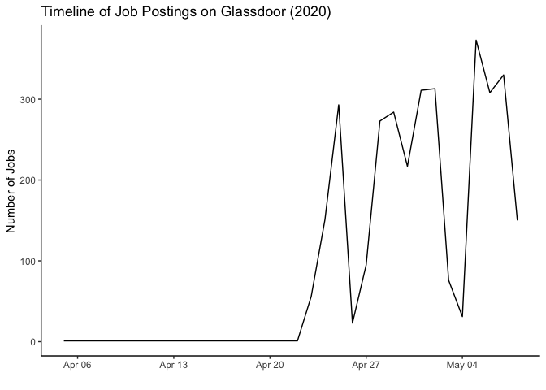

3\_7\_Limitations
================

# Time series analysis

This data about the job postings are listed from glassdoor scraped
during covid time. According to the glassdoor findings, there were very
few jobs posted around April end and there’s a sudden rise the upcoming
week. It’s very clear that the job market was not stable during the
pandemic.

``` r
table_date_posted <- data.frame(table(ds_jobs$date_posted))
table_date_posted$Var1 <- as.Date(table_date_posted$Var1, format = "%Y-%m-%d") 
class(table_date_posted$Var1)
```

    ## [1] "Date"

``` r
ggplot(table_date_posted, aes(x = Var1, y = Freq)) +
  geom_line() +
  theme_classic() +
  labs(title = "Job availability vs Date posted",
       x = "Date",
       y = "Number of jobs")
```

<!-- -->
