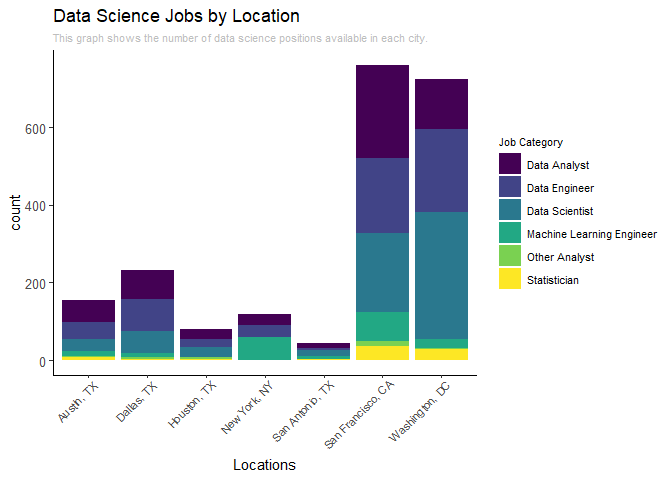
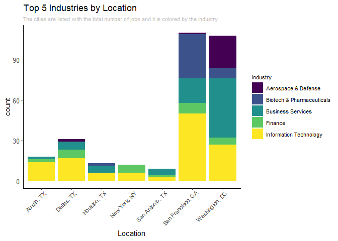

Industry Analysis
================

# Location of job bucket

I want to take the values from the job\_category variable and graph it
against the location data to see if which jobs are in each location.

<details>

<summary>Click to expand</summary> \# Load
    Data

``` r
library(tidyverse)
```

    ## -- Attaching packages ---------------------------------------------------- tidyverse 1.3.0 --

    ## v ggplot2 3.3.2     v purrr   0.3.4
    ## v tibble  3.0.3     v dplyr   1.0.2
    ## v tidyr   1.1.2     v stringr 1.4.0
    ## v readr   1.3.1     v forcats 0.5.0

    ## -- Conflicts ------------------------------------------------------- tidyverse_conflicts() --
    ## x dplyr::filter() masks stats::filter()
    ## x dplyr::lag()    masks stats::lag()

``` r
library(readr)
library(viridis)
```

    ## Loading required package: viridisLite

``` r
library(gt)
```

    ## Warning: package 'gt' was built under R version 4.0.3

``` r
setwd("C:/Users/Matt Flaherty/Documents/Projects/eda20-team4-project")
ds_jobs <- read_csv("Data Cleaning/ds_jobs.csv")
```

    ## Parsed with column specification:
    ## cols(
    ##   .default = col_double(),
    ##   state = col_character(),
    ##   city = col_character(),
    ##   job_title = col_character(),
    ##   company = col_character(),
    ##   job_desc = col_character(),
    ##   industry = col_character(),
    ##   date_posted = col_date(format = ""),
    ##   valid_until = col_date(format = ""),
    ##   job_type = col_character(),
    ##   location = col_character(),
    ##   metro_location = col_character(),
    ##   job_category = col_character()
    ## )

    ## See spec(...) for full column specifications.

# Job Bucket vs location

Filter by only DS jobs. There are a few other scientist jobs right now.
Also take out the NAs

``` r
ds_filter <- ds_jobs %>%
  filter(!is.na(job_category)) %>%
  filter(job_category == "Data Analyst" | job_category == "Data Engineer" | job_category == "Data Scientist" | job_category == "Machine Learning Engineer" | job_category == "Statistician" | job_category == "Other Analyst")
```

</details>

``` r
ggplot(ds_filter, aes(metro_location, fill = job_category)) +
  geom_bar()+
  scale_fill_viridis(discrete = TRUE) +
  labs(
    title = "Data Science Jobs by Location",
    x = "Locations",
    subtitle = "This graph shows the number of data science positions available in each city.",
    fill = "Job Category"
  )+
  theme_classic() +
  theme(
    axis.text.x = element_text(angle = 45, vjust = 1, hjust=0.95, size = 8),
    axis.text = element_text(size =10),
    plot.subtitle=element_text(size=8, color = "grey"),
    legend.text = element_text(size = 8),
    legend.title = element_text(size = 8)) 
```

<!-- -->

## Interpretation

San Fran and DC have the most job postings in this data set for data
scientists. Within this, Data Analyst, Data Engineer, and Data Scientist
are the job categories that dominate. Thus, if a data science student is
looking for a job, then based on this data, the student should look for
jobs in the bay area and DC.

# Industry vs Location

I also want to know which industries are offered in each state. I only
want the top 5 industries so that my graph is easier to read.

<details>

<summary>Click to expand</summary>

``` r
ds_filter2 <- ds_filter %>%
  filter(!is.na(industry))

ds_filter3 <- ds_filter2 %>%
  group_by(industry) %>%
  summarise(count = n()) %>%
  arrange(desc(count)) %>%
  slice(1:5)%>%
  ungroup()
```

    ## `summarise()` ungrouping output (override with `.groups` argument)

``` r
ds_filter2 <- ds_filter2 %>%
  filter(industry == ds_filter3$industry)
```

    ## Warning in industry == ds_filter3$industry: longer object length is not a
    ## multiple of shorter object length

</details>

``` r
ggplot(ds_filter2, aes(metro_location,fill = industry)) +
  geom_bar() +
  scale_fill_viridis(discrete = TRUE)+
  labs(
    title = "Top 5 Industries by Location",
    x = "Location",
    subtitle = "The cities are listed with the total number of jobs and it is colored by the industry"
  )+
  theme_classic() +
  theme(
    axis.text.x = element_text(angle = 45, vjust = 1, hjust=0.95, size = 8),
    axis.text = element_text(size =10),
    plot.subtitle=element_text(size=8, color = "grey"),
    legend.text = element_text(size = 8),
    legend.title = element_text(size = 8)
  )
```

<!-- -->

## Interpretation

Filtering by the 6 data science categories from `job_category`, we can
see that San Francisco and DC still hold the majority of data science
jobs. Now we can also see in which industries these data science jobs
are so applicants can determine good industries for data scientists.
Judging by this graph, IT seems to be where most of the jobs in these
areas are being posted. I think that this is because companies will put
their data science positions with IT.

# count of job\_category

``` r
ds_jobs %>%
  filter(!is.na(job_category)) %>%
  filter(job_category == "Data Analyst" | job_category == "Data Engineer" | job_category == "Data Scientist" | job_category == "Machine Learning Engineer" | job_category == "Statistician" | job_category == "Other Analyst") %>%
  rename(`Job Category` = job_category) %>%
  group_by(`Job Category`) %>%
  summarise(count = n()) %>%
  arrange(desc(count)) %>%
  gt()
```

    ## `summarise()` ungrouping output (override with `.groups` argument)

<!--html_preserve-->

<style>html {
  font-family: -apple-system, BlinkMacSystemFont, 'Segoe UI', Roboto, Oxygen, Ubuntu, Cantarell, 'Helvetica Neue', 'Fira Sans', 'Droid Sans', Arial, sans-serif;
}

#oekauwsxem .gt_table {
  display: table;
  border-collapse: collapse;
  margin-left: auto;
  margin-right: auto;
  color: #333333;
  font-size: 16px;
  font-weight: normal;
  font-style: normal;
  background-color: #FFFFFF;
  width: auto;
  border-top-style: solid;
  border-top-width: 2px;
  border-top-color: #A8A8A8;
  border-right-style: none;
  border-right-width: 2px;
  border-right-color: #D3D3D3;
  border-bottom-style: solid;
  border-bottom-width: 2px;
  border-bottom-color: #A8A8A8;
  border-left-style: none;
  border-left-width: 2px;
  border-left-color: #D3D3D3;
}

#oekauwsxem .gt_heading {
  background-color: #FFFFFF;
  text-align: center;
  border-bottom-color: #FFFFFF;
  border-left-style: none;
  border-left-width: 1px;
  border-left-color: #D3D3D3;
  border-right-style: none;
  border-right-width: 1px;
  border-right-color: #D3D3D3;
}

#oekauwsxem .gt_title {
  color: #333333;
  font-size: 125%;
  font-weight: initial;
  padding-top: 4px;
  padding-bottom: 4px;
  border-bottom-color: #FFFFFF;
  border-bottom-width: 0;
}

#oekauwsxem .gt_subtitle {
  color: #333333;
  font-size: 85%;
  font-weight: initial;
  padding-top: 0;
  padding-bottom: 4px;
  border-top-color: #FFFFFF;
  border-top-width: 0;
}

#oekauwsxem .gt_bottom_border {
  border-bottom-style: solid;
  border-bottom-width: 2px;
  border-bottom-color: #D3D3D3;
}

#oekauwsxem .gt_col_headings {
  border-top-style: solid;
  border-top-width: 2px;
  border-top-color: #D3D3D3;
  border-bottom-style: solid;
  border-bottom-width: 2px;
  border-bottom-color: #D3D3D3;
  border-left-style: none;
  border-left-width: 1px;
  border-left-color: #D3D3D3;
  border-right-style: none;
  border-right-width: 1px;
  border-right-color: #D3D3D3;
}

#oekauwsxem .gt_col_heading {
  color: #333333;
  background-color: #FFFFFF;
  font-size: 100%;
  font-weight: normal;
  text-transform: inherit;
  border-left-style: none;
  border-left-width: 1px;
  border-left-color: #D3D3D3;
  border-right-style: none;
  border-right-width: 1px;
  border-right-color: #D3D3D3;
  vertical-align: bottom;
  padding-top: 5px;
  padding-bottom: 6px;
  padding-left: 5px;
  padding-right: 5px;
  overflow-x: hidden;
}

#oekauwsxem .gt_column_spanner_outer {
  color: #333333;
  background-color: #FFFFFF;
  font-size: 100%;
  font-weight: normal;
  text-transform: inherit;
  padding-top: 0;
  padding-bottom: 0;
  padding-left: 4px;
  padding-right: 4px;
}

#oekauwsxem .gt_column_spanner_outer:first-child {
  padding-left: 0;
}

#oekauwsxem .gt_column_spanner_outer:last-child {
  padding-right: 0;
}

#oekauwsxem .gt_column_spanner {
  border-bottom-style: solid;
  border-bottom-width: 2px;
  border-bottom-color: #D3D3D3;
  vertical-align: bottom;
  padding-top: 5px;
  padding-bottom: 6px;
  overflow-x: hidden;
  display: inline-block;
  width: 100%;
}

#oekauwsxem .gt_group_heading {
  padding: 8px;
  color: #333333;
  background-color: #FFFFFF;
  font-size: 100%;
  font-weight: initial;
  text-transform: inherit;
  border-top-style: solid;
  border-top-width: 2px;
  border-top-color: #D3D3D3;
  border-bottom-style: solid;
  border-bottom-width: 2px;
  border-bottom-color: #D3D3D3;
  border-left-style: none;
  border-left-width: 1px;
  border-left-color: #D3D3D3;
  border-right-style: none;
  border-right-width: 1px;
  border-right-color: #D3D3D3;
  vertical-align: middle;
}

#oekauwsxem .gt_empty_group_heading {
  padding: 0.5px;
  color: #333333;
  background-color: #FFFFFF;
  font-size: 100%;
  font-weight: initial;
  border-top-style: solid;
  border-top-width: 2px;
  border-top-color: #D3D3D3;
  border-bottom-style: solid;
  border-bottom-width: 2px;
  border-bottom-color: #D3D3D3;
  vertical-align: middle;
}

#oekauwsxem .gt_from_md > :first-child {
  margin-top: 0;
}

#oekauwsxem .gt_from_md > :last-child {
  margin-bottom: 0;
}

#oekauwsxem .gt_row {
  padding-top: 8px;
  padding-bottom: 8px;
  padding-left: 5px;
  padding-right: 5px;
  margin: 10px;
  border-top-style: solid;
  border-top-width: 1px;
  border-top-color: #D3D3D3;
  border-left-style: none;
  border-left-width: 1px;
  border-left-color: #D3D3D3;
  border-right-style: none;
  border-right-width: 1px;
  border-right-color: #D3D3D3;
  vertical-align: middle;
  overflow-x: hidden;
}

#oekauwsxem .gt_stub {
  color: #333333;
  background-color: #FFFFFF;
  font-size: 100%;
  font-weight: initial;
  text-transform: inherit;
  border-right-style: solid;
  border-right-width: 2px;
  border-right-color: #D3D3D3;
  padding-left: 12px;
}

#oekauwsxem .gt_summary_row {
  color: #333333;
  background-color: #FFFFFF;
  text-transform: inherit;
  padding-top: 8px;
  padding-bottom: 8px;
  padding-left: 5px;
  padding-right: 5px;
}

#oekauwsxem .gt_first_summary_row {
  padding-top: 8px;
  padding-bottom: 8px;
  padding-left: 5px;
  padding-right: 5px;
  border-top-style: solid;
  border-top-width: 2px;
  border-top-color: #D3D3D3;
}

#oekauwsxem .gt_grand_summary_row {
  color: #333333;
  background-color: #FFFFFF;
  text-transform: inherit;
  padding-top: 8px;
  padding-bottom: 8px;
  padding-left: 5px;
  padding-right: 5px;
}

#oekauwsxem .gt_first_grand_summary_row {
  padding-top: 8px;
  padding-bottom: 8px;
  padding-left: 5px;
  padding-right: 5px;
  border-top-style: double;
  border-top-width: 6px;
  border-top-color: #D3D3D3;
}

#oekauwsxem .gt_striped {
  background-color: rgba(128, 128, 128, 0.05);
}

#oekauwsxem .gt_table_body {
  border-top-style: solid;
  border-top-width: 2px;
  border-top-color: #D3D3D3;
  border-bottom-style: solid;
  border-bottom-width: 2px;
  border-bottom-color: #D3D3D3;
}

#oekauwsxem .gt_footnotes {
  color: #333333;
  background-color: #FFFFFF;
  border-bottom-style: none;
  border-bottom-width: 2px;
  border-bottom-color: #D3D3D3;
  border-left-style: none;
  border-left-width: 2px;
  border-left-color: #D3D3D3;
  border-right-style: none;
  border-right-width: 2px;
  border-right-color: #D3D3D3;
}

#oekauwsxem .gt_footnote {
  margin: 0px;
  font-size: 90%;
  padding: 4px;
}

#oekauwsxem .gt_sourcenotes {
  color: #333333;
  background-color: #FFFFFF;
  border-bottom-style: none;
  border-bottom-width: 2px;
  border-bottom-color: #D3D3D3;
  border-left-style: none;
  border-left-width: 2px;
  border-left-color: #D3D3D3;
  border-right-style: none;
  border-right-width: 2px;
  border-right-color: #D3D3D3;
}

#oekauwsxem .gt_sourcenote {
  font-size: 90%;
  padding: 4px;
}

#oekauwsxem .gt_left {
  text-align: left;
}

#oekauwsxem .gt_center {
  text-align: center;
}

#oekauwsxem .gt_right {
  text-align: right;
  font-variant-numeric: tabular-nums;
}

#oekauwsxem .gt_font_normal {
  font-weight: normal;
}

#oekauwsxem .gt_font_bold {
  font-weight: bold;
}

#oekauwsxem .gt_font_italic {
  font-style: italic;
}

#oekauwsxem .gt_super {
  font-size: 65%;
}

#oekauwsxem .gt_footnote_marks {
  font-style: italic;
  font-size: 65%;
}
</style>

<div id="oekauwsxem" style="overflow-x:auto;overflow-y:auto;width:auto;height:auto;">

<table class="gt_table">

<thead class="gt_col_headings">

<tr>

<th class="gt_col_heading gt_columns_bottom_border gt_left" rowspan="1" colspan="1">

Job
Category

</th>

<th class="gt_col_heading gt_columns_bottom_border gt_center" rowspan="1" colspan="1">

count

</th>

</tr>

</thead>

<tbody class="gt_table_body">

<tr>

<td class="gt_row gt_left">

Data Scientist

</td>

<td class="gt_row gt_center">

660

</td>

</tr>

<tr>

<td class="gt_row gt_left">

Data Engineer

</td>

<td class="gt_row gt_center">

592

</td>

</tr>

<tr>

<td class="gt_row gt_left">

Data Analyst

</td>

<td class="gt_row gt_center">

569

</td>

</tr>

<tr>

<td class="gt_row gt_left">

Machine Learning Engineer

</td>

<td class="gt_row gt_center">

190

</td>

</tr>

<tr>

<td class="gt_row gt_left">

Statistician

</td>

<td class="gt_row gt_center">

80

</td>

</tr>

<tr>

<td class="gt_row gt_left">

Other Analyst

</td>

<td class="gt_row gt_center">

28

</td>

</tr>

</tbody>

</table>

</div>

<!--/html_preserve-->

# count of job openings per area

``` r
ds_jobs %>%
  rename(`Metro Location` = metro_location) %>%
  group_by(`Metro Location`) %>%
  summarise(count = n()) %>%
  arrange(desc(count))%>%
  gt()
```

    ## `summarise()` ungrouping output (override with `.groups` argument)

<!--html_preserve-->

<style>html {
  font-family: -apple-system, BlinkMacSystemFont, 'Segoe UI', Roboto, Oxygen, Ubuntu, Cantarell, 'Helvetica Neue', 'Fira Sans', 'Droid Sans', Arial, sans-serif;
}

#xhpcwvrlod .gt_table {
  display: table;
  border-collapse: collapse;
  margin-left: auto;
  margin-right: auto;
  color: #333333;
  font-size: 16px;
  font-weight: normal;
  font-style: normal;
  background-color: #FFFFFF;
  width: auto;
  border-top-style: solid;
  border-top-width: 2px;
  border-top-color: #A8A8A8;
  border-right-style: none;
  border-right-width: 2px;
  border-right-color: #D3D3D3;
  border-bottom-style: solid;
  border-bottom-width: 2px;
  border-bottom-color: #A8A8A8;
  border-left-style: none;
  border-left-width: 2px;
  border-left-color: #D3D3D3;
}

#xhpcwvrlod .gt_heading {
  background-color: #FFFFFF;
  text-align: center;
  border-bottom-color: #FFFFFF;
  border-left-style: none;
  border-left-width: 1px;
  border-left-color: #D3D3D3;
  border-right-style: none;
  border-right-width: 1px;
  border-right-color: #D3D3D3;
}

#xhpcwvrlod .gt_title {
  color: #333333;
  font-size: 125%;
  font-weight: initial;
  padding-top: 4px;
  padding-bottom: 4px;
  border-bottom-color: #FFFFFF;
  border-bottom-width: 0;
}

#xhpcwvrlod .gt_subtitle {
  color: #333333;
  font-size: 85%;
  font-weight: initial;
  padding-top: 0;
  padding-bottom: 4px;
  border-top-color: #FFFFFF;
  border-top-width: 0;
}

#xhpcwvrlod .gt_bottom_border {
  border-bottom-style: solid;
  border-bottom-width: 2px;
  border-bottom-color: #D3D3D3;
}

#xhpcwvrlod .gt_col_headings {
  border-top-style: solid;
  border-top-width: 2px;
  border-top-color: #D3D3D3;
  border-bottom-style: solid;
  border-bottom-width: 2px;
  border-bottom-color: #D3D3D3;
  border-left-style: none;
  border-left-width: 1px;
  border-left-color: #D3D3D3;
  border-right-style: none;
  border-right-width: 1px;
  border-right-color: #D3D3D3;
}

#xhpcwvrlod .gt_col_heading {
  color: #333333;
  background-color: #FFFFFF;
  font-size: 100%;
  font-weight: normal;
  text-transform: inherit;
  border-left-style: none;
  border-left-width: 1px;
  border-left-color: #D3D3D3;
  border-right-style: none;
  border-right-width: 1px;
  border-right-color: #D3D3D3;
  vertical-align: bottom;
  padding-top: 5px;
  padding-bottom: 6px;
  padding-left: 5px;
  padding-right: 5px;
  overflow-x: hidden;
}

#xhpcwvrlod .gt_column_spanner_outer {
  color: #333333;
  background-color: #FFFFFF;
  font-size: 100%;
  font-weight: normal;
  text-transform: inherit;
  padding-top: 0;
  padding-bottom: 0;
  padding-left: 4px;
  padding-right: 4px;
}

#xhpcwvrlod .gt_column_spanner_outer:first-child {
  padding-left: 0;
}

#xhpcwvrlod .gt_column_spanner_outer:last-child {
  padding-right: 0;
}

#xhpcwvrlod .gt_column_spanner {
  border-bottom-style: solid;
  border-bottom-width: 2px;
  border-bottom-color: #D3D3D3;
  vertical-align: bottom;
  padding-top: 5px;
  padding-bottom: 6px;
  overflow-x: hidden;
  display: inline-block;
  width: 100%;
}

#xhpcwvrlod .gt_group_heading {
  padding: 8px;
  color: #333333;
  background-color: #FFFFFF;
  font-size: 100%;
  font-weight: initial;
  text-transform: inherit;
  border-top-style: solid;
  border-top-width: 2px;
  border-top-color: #D3D3D3;
  border-bottom-style: solid;
  border-bottom-width: 2px;
  border-bottom-color: #D3D3D3;
  border-left-style: none;
  border-left-width: 1px;
  border-left-color: #D3D3D3;
  border-right-style: none;
  border-right-width: 1px;
  border-right-color: #D3D3D3;
  vertical-align: middle;
}

#xhpcwvrlod .gt_empty_group_heading {
  padding: 0.5px;
  color: #333333;
  background-color: #FFFFFF;
  font-size: 100%;
  font-weight: initial;
  border-top-style: solid;
  border-top-width: 2px;
  border-top-color: #D3D3D3;
  border-bottom-style: solid;
  border-bottom-width: 2px;
  border-bottom-color: #D3D3D3;
  vertical-align: middle;
}

#xhpcwvrlod .gt_from_md > :first-child {
  margin-top: 0;
}

#xhpcwvrlod .gt_from_md > :last-child {
  margin-bottom: 0;
}

#xhpcwvrlod .gt_row {
  padding-top: 8px;
  padding-bottom: 8px;
  padding-left: 5px;
  padding-right: 5px;
  margin: 10px;
  border-top-style: solid;
  border-top-width: 1px;
  border-top-color: #D3D3D3;
  border-left-style: none;
  border-left-width: 1px;
  border-left-color: #D3D3D3;
  border-right-style: none;
  border-right-width: 1px;
  border-right-color: #D3D3D3;
  vertical-align: middle;
  overflow-x: hidden;
}

#xhpcwvrlod .gt_stub {
  color: #333333;
  background-color: #FFFFFF;
  font-size: 100%;
  font-weight: initial;
  text-transform: inherit;
  border-right-style: solid;
  border-right-width: 2px;
  border-right-color: #D3D3D3;
  padding-left: 12px;
}

#xhpcwvrlod .gt_summary_row {
  color: #333333;
  background-color: #FFFFFF;
  text-transform: inherit;
  padding-top: 8px;
  padding-bottom: 8px;
  padding-left: 5px;
  padding-right: 5px;
}

#xhpcwvrlod .gt_first_summary_row {
  padding-top: 8px;
  padding-bottom: 8px;
  padding-left: 5px;
  padding-right: 5px;
  border-top-style: solid;
  border-top-width: 2px;
  border-top-color: #D3D3D3;
}

#xhpcwvrlod .gt_grand_summary_row {
  color: #333333;
  background-color: #FFFFFF;
  text-transform: inherit;
  padding-top: 8px;
  padding-bottom: 8px;
  padding-left: 5px;
  padding-right: 5px;
}

#xhpcwvrlod .gt_first_grand_summary_row {
  padding-top: 8px;
  padding-bottom: 8px;
  padding-left: 5px;
  padding-right: 5px;
  border-top-style: double;
  border-top-width: 6px;
  border-top-color: #D3D3D3;
}

#xhpcwvrlod .gt_striped {
  background-color: rgba(128, 128, 128, 0.05);
}

#xhpcwvrlod .gt_table_body {
  border-top-style: solid;
  border-top-width: 2px;
  border-top-color: #D3D3D3;
  border-bottom-style: solid;
  border-bottom-width: 2px;
  border-bottom-color: #D3D3D3;
}

#xhpcwvrlod .gt_footnotes {
  color: #333333;
  background-color: #FFFFFF;
  border-bottom-style: none;
  border-bottom-width: 2px;
  border-bottom-color: #D3D3D3;
  border-left-style: none;
  border-left-width: 2px;
  border-left-color: #D3D3D3;
  border-right-style: none;
  border-right-width: 2px;
  border-right-color: #D3D3D3;
}

#xhpcwvrlod .gt_footnote {
  margin: 0px;
  font-size: 90%;
  padding: 4px;
}

#xhpcwvrlod .gt_sourcenotes {
  color: #333333;
  background-color: #FFFFFF;
  border-bottom-style: none;
  border-bottom-width: 2px;
  border-bottom-color: #D3D3D3;
  border-left-style: none;
  border-left-width: 2px;
  border-left-color: #D3D3D3;
  border-right-style: none;
  border-right-width: 2px;
  border-right-color: #D3D3D3;
}

#xhpcwvrlod .gt_sourcenote {
  font-size: 90%;
  padding: 4px;
}

#xhpcwvrlod .gt_left {
  text-align: left;
}

#xhpcwvrlod .gt_center {
  text-align: center;
}

#xhpcwvrlod .gt_right {
  text-align: right;
  font-variant-numeric: tabular-nums;
}

#xhpcwvrlod .gt_font_normal {
  font-weight: normal;
}

#xhpcwvrlod .gt_font_bold {
  font-weight: bold;
}

#xhpcwvrlod .gt_font_italic {
  font-style: italic;
}

#xhpcwvrlod .gt_super {
  font-size: 65%;
}

#xhpcwvrlod .gt_footnote_marks {
  font-style: italic;
  font-size: 65%;
}
</style>

<div id="xhpcwvrlod" style="overflow-x:auto;overflow-y:auto;width:auto;height:auto;">

<table class="gt_table">

<thead class="gt_col_headings">

<tr>

<th class="gt_col_heading gt_columns_bottom_border gt_left" rowspan="1" colspan="1">

Metro
Location

</th>

<th class="gt_col_heading gt_columns_bottom_border gt_center" rowspan="1" colspan="1">

count

</th>

</tr>

</thead>

<tbody class="gt_table_body">

<tr>

<td class="gt_row gt_left">

New York, NY

</td>

<td class="gt_row gt_center">

900

</td>

</tr>

<tr>

<td class="gt_row gt_left">

Washington, DC

</td>

<td class="gt_row gt_center">

890

</td>

</tr>

<tr>

<td class="gt_row gt_left">

San Francisco, CA

</td>

<td class="gt_row gt_center">

888

</td>

</tr>

<tr>

<td class="gt_row gt_left">

Dallas, TX

</td>

<td class="gt_row gt_center">

261

</td>

</tr>

<tr>

<td class="gt_row gt_left">

Austin, TX

</td>

<td class="gt_row gt_center">

181

</td>

</tr>

<tr>

<td class="gt_row gt_left">

Houston, TX

</td>

<td class="gt_row gt_center">

110

</td>

</tr>

<tr>

<td class="gt_row gt_left">

San Antonio, TX

</td>

<td class="gt_row gt_center">

57

</td>

</tr>

</tbody>

</table>

</div>

<!--/html_preserve-->
