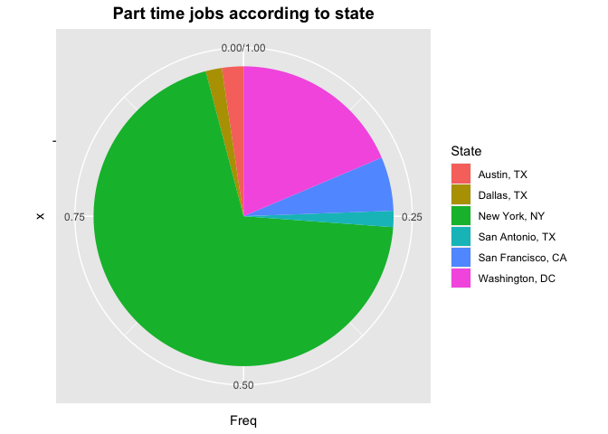

Job\_Types
================

``` r
library(tidyverse)
library(ggplot2)
```

Job types :

Viewwing the job typs from the data set :

``` r
ds_jobs <- read.csv("../Data Cleaning/ds_jobs.csv")
```

Below are the job types :

  - Contractor
  - Fulltime
  - Intern
  - Other
  - Parttime
  - Temporary

Viewing the number of job types in each state as a table for further
analysis

``` r
table(ds_jobs$metro_location, ds_jobs$job_type)
```

    ##                    
    ##                     CONTRACTOR FULL_TIME INTERN OTHER PART_TIME TEMPORARY
    ##   Austin, TX                 1       175      1     0         4         0
    ##   Dallas, TX                 3       247      3     5         3         0
    ##   Houston, TX                1       106      1     2         0         0
    ##   New York, NY               0       755      0    25       120         0
    ##   San Antonio, TX            2        51      0     1         3         0
    ##   San Francisco, CA          7       854     12     4        10         1
    ##   Washington, DC             0       855      2     1        32         0

Plotting states with types of jobs to find the distribution spread
across each state

``` r
df <- ds_jobs %>%
  filter(job_type == "FULL_TIME")

df <- data.frame(table(df$metro_location)) 
df
```

    ##                Var1 Freq
    ## 1        Austin, TX  175
    ## 2        Dallas, TX  247
    ## 3       Houston, TX  106
    ## 4      New York, NY  755
    ## 5   San Antonio, TX   51
    ## 6 San Francisco, CA  854
    ## 7    Washington, DC  855

``` r
dff <- ds_jobs %>%
  filter(job_type == "PART_TIME")

dff <- data.frame(table(dff$metro_location)) 
dff
```

    ##                Var1 Freq
    ## 1        Austin, TX    4
    ## 2        Dallas, TX    3
    ## 3      New York, NY  120
    ## 4   San Antonio, TX    3
    ## 5 San Francisco, CA   10
    ## 6    Washington, DC   32

# `{r} # ds_SF <- ds_SF %>%  mutate(percentage = round((ds_SF$Freq / sum(ds_SF$Freq)) * 100)) #  # ds_SF <- ds_SF %>% #   mutate(lab.ypos = cumsum(percentage) - 0.5*percentage) #to get position to print percentage #  # ds_SF #  #`

# Plotting full time and part time jobs according to metro location

``` r
par(mfrow = c(1, 2))
p <- ggplot(transform(transform(df, Freq=Freq/sum(Freq)), labPos=cumsum(Freq)-Freq/2), 
       aes(x="", y = Freq, fill = Var1)) +
  geom_bar(width = 1, stat = "identity")+
  scale_fill_manual(values = c("red", "yellow","blue", "green", "cyan", "grey","orange")) +
  coord_polar(theta = "y") +
  labs(title = "Full time jobs according to state")
 # geom_text(aes(y=labPos, label=scales::percent(Freq)),size=3)

p + scale_fill_discrete(name="State") + theme(
  plot.title = element_text(color="black", size=14, face="bold",hjust = 0.5)
)
```

    ## Scale for 'fill' is already present. Adding another scale for 'fill', which
    ## will replace the existing scale.

<!-- -->

``` r
q <- ggplot(transform(transform(dff, Freq=Freq/sum(Freq)), labPos=cumsum(Freq)-Freq/2), 
       aes(x="", y = Freq, fill = Var1)) +
  geom_bar(width = 1, stat = "identity")+
  scale_fill_manual(values = c("red", "yellow","purple", "green", "cyan", "grey","orange")) +
  coord_polar(theta = "y") +
  labs(title = "Part time jobs according to state")

q + scale_fill_discrete(name="State") +theme(
  plot.title = element_text(color="black", size=14, face="bold",hjust = 0.5)
)
```

    ## Scale for 'fill' is already present. Adding another scale for 'fill', which
    ## will replace the existing scale.

<!-- -->

# Relationship between states and types of jobs available

``` r
ggplot(ds_jobs, aes(x=metro_location, y=job_type))+
  geom_jitter(alpha = 0.7) + labs(title ="Relationship between states and types of jobs available",
  y = "Type Of Job", 
  x = "state")+
theme_classic()
```

<!-- -->

From the graph, we can see the distribution of the types of jobs
availbale in each state. We see that, KY, NC and TN doesn’t have more
full time jobs when compared to other states and there are only couple
of states which offer temporary positions.

Further, we can explore about the sub categories in full time jobs, by
taking data science related jobs from the other rmd
file.

# Analysing the number of jobs in every category by taking the ds\_jobs\_bucket.So, here we have five categories Data Analyst, Data Engineer, Data Scientist, Machine Learning and Statistics. Finding out how many of these fall into different industries. In our data frame, we have 23 industries for which we can map these job categories.

``` r
df <- data.frame(table(ds_jobs$industry,ds_jobs$job_category))

p <- ggplot(data=df, aes(x=Var2, y=Freq, fill=Var1)) + geom_bar(stat="identity") +
  labs(title = "Job category vs Industry",
       x = "Job Category",
       y = "Count")

p + scale_fill_discrete(name="Industry") +theme(
  plot.title = element_text(color="black", size=14, face="bold",hjust = 0.5)
)
```

<!-- -->

# Time series analysis

There are two columns Date\_Posted and Valid\_Until which denotes the
time frame until which the job applications are open and denoting the
recruitment time frame for candidates. On trying to plot the
availabiloty of new jobs while considering the date posted, we find that
it doesn’t increase exponentially neither does it hits the bottom but it
reaches it’s peak after mid May denoting the max job availability.

``` r
table_date_posted <- data.frame(table(ds_jobs$date_posted))
table_date_posted$Var1 <- as.Date(table_date_posted$Var1, format = "%Y-%m-%d") 
class(table_date_posted$Var1)
```

    ## [1] "Date"

``` r
ggplot(table_date_posted, aes(x = Var1, y = Freq)) +
  geom_line() +
  labs(title = "Job availability vs Date posted",
       x = "Date",
       y = "Number of jobs")
```

<!-- -->

# Salary by location

``` r
df <- ds_jobs %>%
             group_by(metro_location) %>%
             summarise(min = min(min_scaled_salary, na.rm = TRUE),max = max(max_scaled_salary, na.rm = TRUE))
```

    ## `summarise()` ungrouping output (override with `.groups` argument)

``` r
             #filter(ds_jobs$min_scaled_salary == min(ds_jobs$min_scaled_salary))


salary_data_loc <- df %>% pivot_longer(
                cols = c(min, max),
                names_to = "type",
                values_to = "salary",
                values_drop_na = TRUE
)


p <-ggplot(salary_data_loc, aes(metro_location, salary))
p +geom_bar(stat = "identity", aes(fill = type))+
  scale_y_continuous(
    breaks = seq(0,11000000,20000),
    labels = function(x){paste0('$', x/1000, 'K')}
  ) +
  labs(title = "Salary vs location",
       x = "Location",
       y = "Salary") 
```

<!-- -->

# Salary by job type
