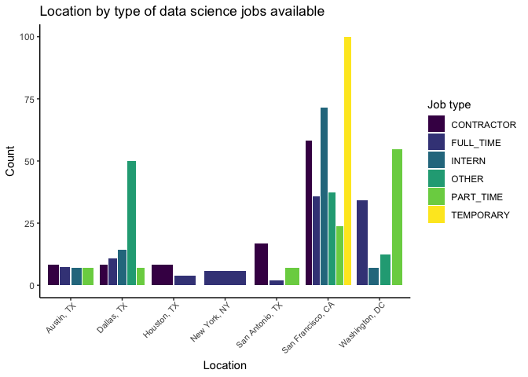
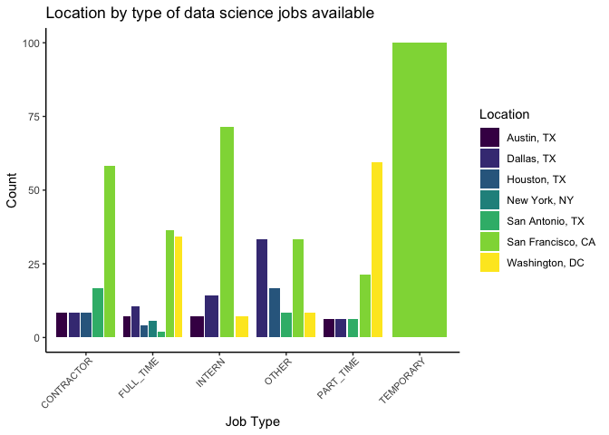
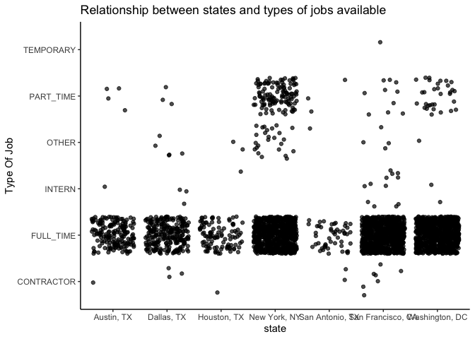
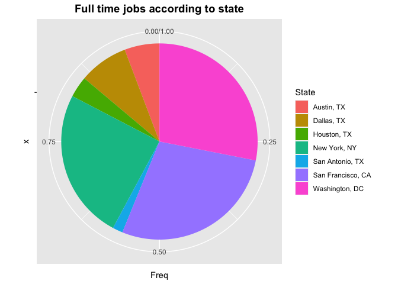
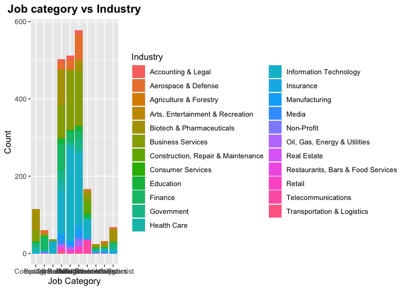
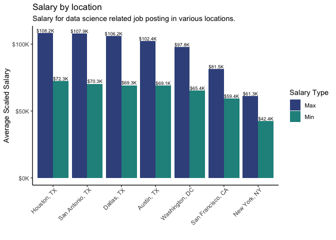
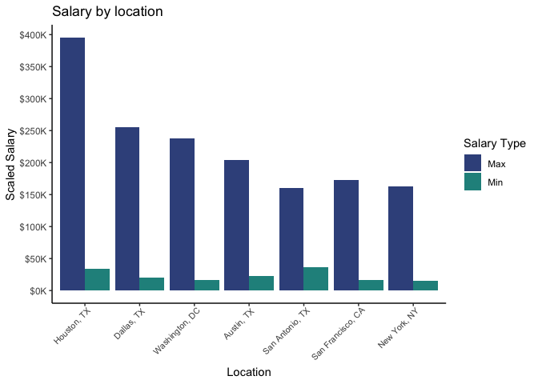

Job\_Types
================

``` r
library(tidyverse)
library(ggplot2)
library(viridis)
library(ggalluvial)
```

Job types :

Viewwing the job typs from the data set :

``` r
ds_jobs <- read.csv("../Data Cleaning/ds_jobs.csv")
```

Below are the job types :

  - Contractor
  - Fulltime
  - Intern
  - Other
  - Parttime
  - Temporary

<!-- end list -->

``` r
data_jobs <- ds_jobs %>% 
  group_by(job_category) %>% 
  summarize(count = n()) %>% 
  filter(!job_category %in% c('Biology', 'Consultant', 'Research Scientist', 'Computer Scientist', NA))
```

    ## `summarise()` ungrouping output (override with `.groups` argument)

``` r
ds_jobs %>% 
  filter(job_category %in% data_jobs$job_category) %>% 
  group_by(job_type, metro_location) %>% 
  summarize(count = n()) %>% 
  mutate(pct = count/sum(count) * 100) %>% 
  ggplot(aes(x = metro_location, y = pct)) + 
  geom_col(aes(fill = job_type), position = 'dodge2') +
  theme(axis.text.x = element_text(angle = 90)) +
  labs(title = 'Location by type of data science jobs available',
       x = 'Location',
       y = 'Count') +
  scale_fill_discrete(name = 'Location')+
  theme_classic() +
  scale_fill_viridis(discrete = TRUE, name = "Job type")+
  theme( axis.text.x = element_text(angle = 45, vjust = 1, hjust=0.95, size = 8))
```

    ## `summarise()` regrouping output by 'job_type' (override with `.groups` argument)

    ## Scale for 'fill' is already present. Adding another scale for 'fill', which
    ## will replace the existing scale.

<!-- -->

``` r
ds_jobs %>% 
  filter(job_category %in% data_jobs$job_category) %>% 
  group_by(job_type, metro_location) %>% 
  summarize(count = n()) %>% 
  mutate(pct = count/sum(count) * 100) %>% 
  ggplot(aes(x = job_type, y = pct)) + 
  geom_col(aes(fill = metro_location), position = 'dodge2') +
  theme(axis.text.x = element_text(angle = 90)) +
  labs(title = 'Location by type of data science jobs available',
       x = 'Job Type',
       y = 'Count') +
  scale_fill_discrete(name = 'Location')+
  theme_classic() +
  scale_fill_viridis(discrete = TRUE, name = "Location")+
  theme( axis.text.x = element_text(angle = 45, vjust = 1, hjust=0.95, size = 8))
```

    ## `summarise()` regrouping output by 'job_type' (override with `.groups` argument)
    ## Scale for 'fill' is already present. Adding another scale for 'fill', which
    ## will replace the existing scale.

<!-- --> Table
interpretation of above visualization plots. From the data set,
considering only the full time data science realted job availabilities,
we see that San Francisco and Washington have the maximum number of jobs
available while San Antonio has the least jobs comparitively.If we also
look at the job category by location, we find similarities. Hence, if a
person is looking for a job on data science field, then based on this
data, it is suggested to for jobs in the bay area and DC.

Viewing the number of job types in each state as a table

``` r
table(ds_jobs$metro_location, ds_jobs$job_type)
```

    ##                    
    ##                     CONTRACTOR FULL_TIME INTERN OTHER PART_TIME TEMPORARY
    ##   Austin, TX                 1       175      1     0         4         0
    ##   Dallas, TX                 3       247      3     5         3         0
    ##   Houston, TX                1       106      1     2         0         0
    ##   New York, NY               0       755      0    25       120         0
    ##   San Antonio, TX            2        51      0     1         3         0
    ##   San Francisco, CA          7       854     12     4        10         1
    ##   Washington, DC             0       855      2     1        32         0

# Location by job type

``` r
data_jobs <- ds_jobs %>% 
  group_by(job_category) %>% 
  summarize(count = n()) %>% 
  filter(!job_category %in% c('Biology', 'Consultant', 'Research Scientist', 'Computer Scientist', NA))
```

    ## `summarise()` ungrouping output (override with `.groups` argument)

``` r
ds_jobs %>% 
  filter(job_category %in% data_jobs$job_category) %>% 
  group_by(job_type, metro_location) %>% 
  summarize(count = n()) %>% 
  mutate(pct = count/sum(count) * 100) %>% 
  ggplot(aes(x = metro_location, y = pct)) + 
  geom_col(aes(fill = job_type), position = 'dodge2') +
  theme(axis.text.x = element_text(angle = 90)) +
  labs(title = 'Location by type of data science jobs available',
       x = 'Location',
       y = 'Count') +
  scale_fill_discrete(name = 'Location')+
  theme_classic() +
  scale_fill_viridis(discrete = TRUE, name = "Job type")+
  theme( axis.text.x = element_text(angle = 45, vjust = 1, hjust=0.95, size = 8))
```

    ## `summarise()` regrouping output by 'job_type' (override with `.groups` argument)

    ## Scale for 'fill' is already present. Adding another scale for 'fill', which
    ## will replace the existing scale.

<!-- -->

# Industry by job category

This alluvial plot gives us more of a visual explanation/view about the
top 5 industries from our data set and how it’s mapped to the different
data science jobs available. Where does most data scientists fit in? We
see clearly that there are data scientists in every industry and the
maximum in Business services. Since Machine learning and Statistics are
narrowed down to a particular domain, although these are present in
various industries, the numbers are pretty low compared to data engineer
or data analyst.

``` r
ds_filter <- ds_jobs %>%
  filter(!is.na(job_category)) %>%
  filter(job_category == "Data Analyst" | job_category == "Data Engineer" | job_category == "Data Scientist" | job_category == "Machine Learning" | job_category == "Statistics" | job_category == "Other Analyst")
ds_filter2 <- ds_filter %>%
  filter(!is.na(industry))
ds_filter3 <- ds_filter2 %>%
  group_by(industry) %>%
  summarise(count = n()) %>%
  arrange(desc(count)) %>%
  slice(1:5)%>%
  ungroup()
```

    ## `summarise()` ungrouping output (override with `.groups` argument)

``` r
ds_filter2 <- ds_filter2 %>%
  filter(industry == ds_filter3$industry) %>%
  filter(!is.na(job_category)) %>%
  filter(job_category == "Data Analyst" | job_category == "Data Engineer" | job_category == "Data Scientist" | job_category == "Machine Learning" | job_category == "Statistics" | job_category == "Other Analyst")
```

    ## Warning in industry == ds_filter3$industry: longer object length is not a
    ## multiple of shorter object length

``` r
df <- table(ds_filter2$job_category, ds_filter2$industry)
dff <- data.frame(df)

ggplot(data = dff,
       aes(axis1 = Var1, axis2 = Var2,
           y = Freq)) +
  scale_x_discrete(limits = c("Job Category", "Industry"), expand = c(.2, .05)) +
  ylab("Frequency") +
  geom_alluvium(aes(fill = Var1)) +
  geom_stratum() +
  geom_text(stat = "stratum", aes(label = after_stat(stratum))) +
  theme_minimal() +
  ggtitle("Job category by industry")+
  scale_fill_discrete(name = "Job category")
```

<!-- -->

# Time series analysis

This data about the job postings are listed from glassdoor scraped
during covid time. According to the glassdoor findings, there were very
few jobs posted around April end and there’s a sudden rise the upcoming
week. It’s very clear that the job market was not stable during the
pandemic.

``` r
table_date_posted <- data.frame(table(ds_jobs$date_posted))
table_date_posted$Var1 <- as.Date(table_date_posted$Var1, format = "%Y-%m-%d") 
class(table_date_posted$Var1)
```

    ## [1] "Date"

``` r
ggplot(table_date_posted, aes(x = Var1, y = Freq)) +
  geom_line() +
  labs(title = "Job availability vs Date posted",
       x = "Date",
       y = "Number of jobs")
```

<!-- -->

# Salary by location

``` r
library(viridis)
df <- ds_jobs %>%
             group_by(metro_location) %>%
             summarise(min = min(min_scaled_salary, na.rm = TRUE),max = max(max_scaled_salary, na.rm = TRUE))
```

    ## `summarise()` ungrouping output (override with `.groups` argument)

``` r
salary_data_loc <- df %>% pivot_longer(
                cols = c(min, max),
                names_to = "type",
                values_to = "salary",
                values_drop_na = TRUE
)


p <-ggplot(salary_data_loc, aes(x = reorder(metro_location, -salary), y = salary, fill = type)) 
  p + geom_bar(stat = "identity", position = 'dodge')+
    labs(title = "Salary by location",
          subtitle = "Salary for all job posting in various locations.",
       x = "Location",
       y = "Scaled Salary") +
    scale_fill_viridis(discrete = TRUE, begin = 0.25, end = 0.5, name = "Salary Type",
                     labels = c("Max", "Min")) + 
    scale_y_continuous(
    breaks = seq(0,1100000,50000),
    labels = function(x){paste0('$', x/1000, 'K')}
  ) +
    theme_classic() +
  theme( axis.text.x = element_text(angle = 45, vjust = 1, hjust=0.95, size = 8))
```

<!-- -->

``` r
ds_filter <- ds_jobs %>%
  filter(!is.na(job_category)) %>%
  filter(job_category == "Data Analyst" | job_category == "Data Engineer" | job_category == "Data Scientist" | job_category == "Machine Learning" | job_category == "Statistics" | job_category == "Other Analyst")

library(viridis)
df <- ds_filter %>%
             group_by(metro_location) %>%
             summarise(min = min(min_scaled_salary, na.rm = TRUE),max = max(max_scaled_salary, na.rm = TRUE))
```

    ## Warning in min(min_scaled_salary, na.rm = TRUE): no non-missing arguments to
    ## min; returning Inf

    ## Warning in max(max_scaled_salary, na.rm = TRUE): no non-missing arguments to
    ## max; returning -Inf

    ## `summarise()` ungrouping output (override with `.groups` argument)

``` r
salary_data_loc <- df %>% pivot_longer(
                cols = c(min, max),
                names_to = "type",
                values_to = "salary",
                values_drop_na = TRUE
)


p <-ggplot(salary_data_loc, aes(x = reorder(metro_location, -salary), y = salary, fill = type)) 
  p + geom_bar(stat = "identity", position = 'dodge')+
    labs(title = "Salary by location",
         subtitle = "Salary for data science related job posting in various locations.",
       x = "Location",
       y = "Scaled Salary") +
    scale_fill_viridis(discrete = TRUE, begin = 0.25, end = 0.5, name = "Salary Type",
                     labels = c("Max", "Min")) + 
    scale_y_continuous(
    breaks = seq(0,1100000,50000),
    labels = function(x){paste0('$', x/1000, 'K')}
  ) +
    theme_classic() +
  theme( axis.text.x = element_text(angle = 45, vjust = 1, hjust=0.95, size = 8))
```

<!-- -->

# Salary by job type - Data science related jobs

``` r
scaled_salary_data <- ds_jobs %>% select(min_scaled_salary, max_scaled_salary, job_category, industry, job_type) %>% pivot_longer(
                cols = c(min_scaled_salary, max_scaled_salary),
                names_to = "type",
                values_to = "salary",
                values_drop_na = TRUE
)

scaled_salary_data <- scaled_salary_data %>% mutate(type = case_when(
  type == "min_scaled_salary" ~ "min",
  type == "max_scaled_salary" ~ "max"
))

scaled_salary_data_jc <- scaled_salary_data %>% filter(!is.na(job_type))
ds_related <- c("Data Scientist", "Data Analyst", "Data Engineer", "Machine Learning Engineer", "Statistician", "Other Analyst")

scaled_salary_data_jc_related <- scaled_salary_data_jc %>% 
  filter(job_category %in% ds_related)

mean_salary_jc <- scaled_salary_data_jc_related %>% group_by(type, job_type) %>% 
  mutate(mean_rate = mean(salary))

scaled_salary_data_jc_related %>% ggplot(aes(x = salary, fill = type)) +
  geom_density(alpha = 0.60) +
  labs(
    title = "Salary by Job Type",
    x = "Scaled Salary",
    y = "Density") +
  scale_x_continuous(
    breaks = seq(15000,260000,75000),
    labels = function(x){paste0('$', x/1000, 'K')}
  ) +
   geom_vline(aes(xintercept=mean_salary_jc$mean_rate, col = type, group = job_type), linetype = "dashed", show.legend = FALSE) +
scale_fill_viridis(discrete = TRUE, begin = 0.25, end = 0.5, name = "Salary Type",
                     labels = c("Max", "Min")) + 
scale_color_viridis(discrete = TRUE, begin = 0.25, end = 0.5, guide = FALSE) +
  geom_text(data = mean_salary_jc, aes(x = ifelse(type == "max", mean_rate+25000, mean_rate-25000), y = 2.4e-05, label = paste0('$', round(mean_rate/1000,1), 'K'), group = job_type, col = type), size = 2) +
  facet_wrap(~job_type) + 
  theme_classic() +
  theme(strip.text = element_text(face = "bold", size = 7),
        axis.text.x = element_text(size = 6))
```

<!-- -->
