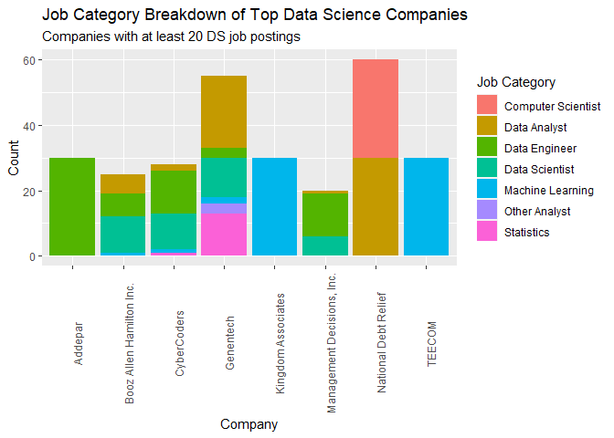
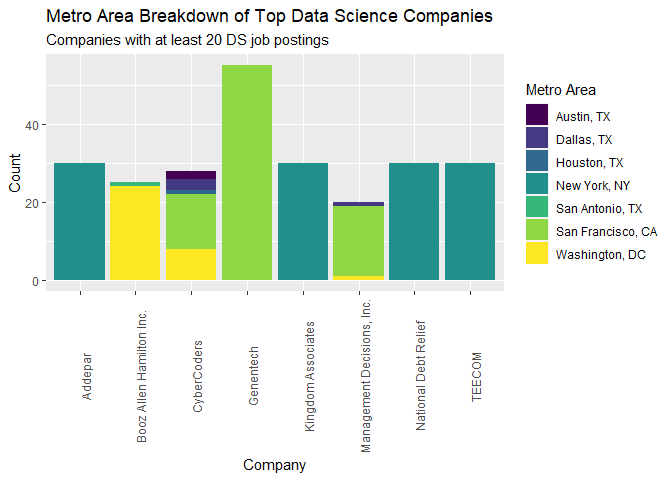
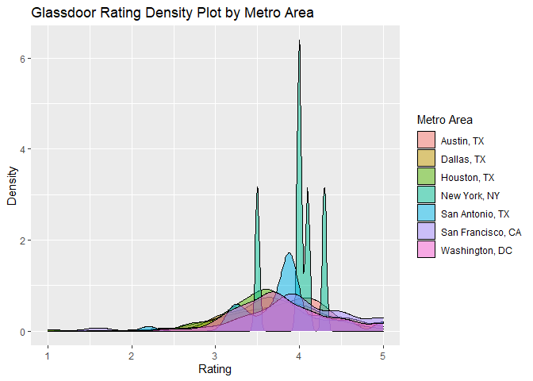
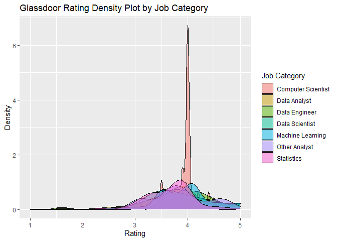
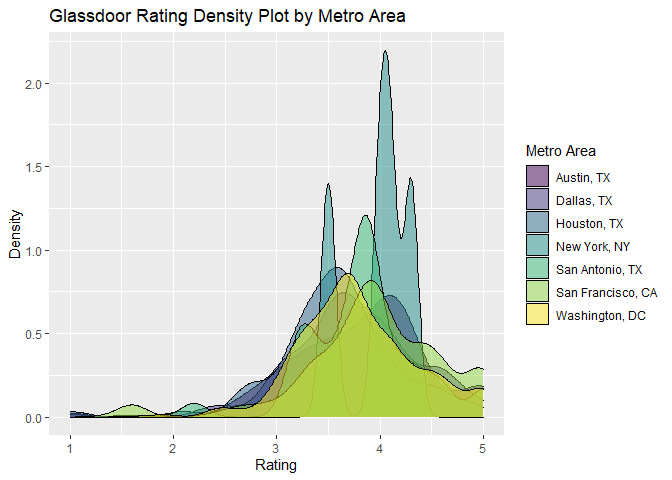
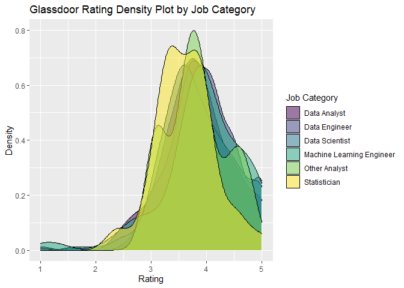
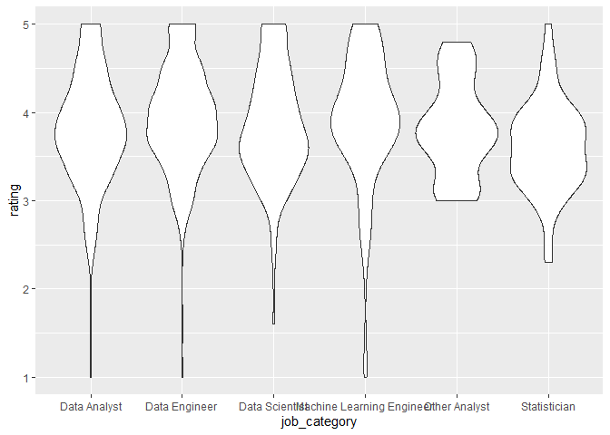
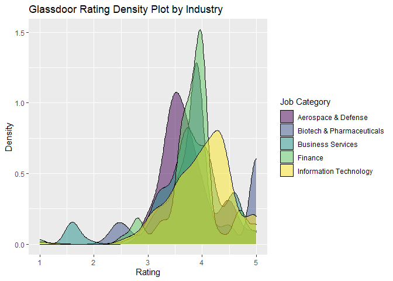
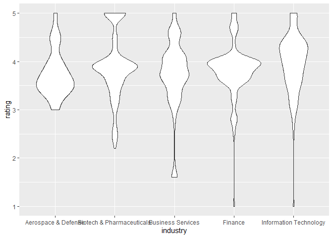
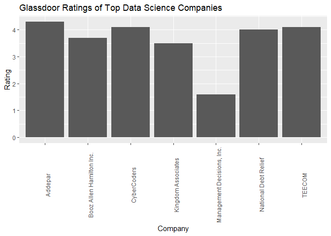

R Notebook
================

# Load Packages and Data

``` r
library(tidyverse)
```

    ## -- Attaching packages --------------------------------------- tidyverse 1.3.0 --

    ## v ggplot2 3.3.2     v purrr   0.3.4
    ## v tibble  3.0.4     v dplyr   1.0.2
    ## v tidyr   1.1.2     v stringr 1.4.0
    ## v readr   1.3.1     v forcats 0.5.0

    ## Warning: package 'tibble' was built under R version 4.0.3

    ## -- Conflicts ------------------------------------------ tidyverse_conflicts() --
    ## x dplyr::filter() masks stats::filter()
    ## x dplyr::lag()    masks stats::lag()

``` r
library(ggplot2)
library(viridis)
```

    ## Loading required package: viridisLite

``` r
setwd('C:/Users/kingl/Desktop/Projects/eda_fall20/final_project/eda20-team4-project/')
ds_jobs <- read.csv('Data Cleaning/ds_jobs.csv')
```

# Top Companies in terms of Overall Job Postings

``` r
companies <- ds_jobs %>%
  #filter out na job categories from all jobs
  filter(is.na(job_category) == F) %>% 
  #group by company
  group_by(company) %>% 
  #get the count of each company
  summarize(count = n()) %>% 
  #sort descending
  arrange(-count) %>% 
  #view the largest ones
  filter(count >= 30)
```

    ## `summarise()` ungrouping output (override with `.groups` argument)

``` r
companies
```

    ## # A tibble: 6 x 2
    ##   company              count
    ##   <chr>                <int>
    ## 1 Genentech               60
    ## 2 National Debt Relief    60
    ## 3 Addepar                 30
    ## 4 Crypsis Group           30
    ## 5 Kingdom Associates      30
    ## 6 TEECOM                  30

``` r
# filter dataset to only include the top companies and job types that are not na, plot bar chart
ds_jobs %>% 
  filter(is.na(job_category) == F,
         company %in% companies$company) %>% 
  group_by(company, job_category) %>% 
  summarize(count = n()) %>% 
  ggplot(aes(x = company, y = count)) + geom_col(aes(fill = job_category), position = 'dodge2') +
  scale_fill_viridis(discrete = TRUE)
```

    ## `summarise()` regrouping output by 'company' (override with `.groups` argument)

<!-- -->

The above plot displays the job category count of the top 6 overall
companies in terms of job postings. From here, we see that we may need
to subset our data to only include data science specific jobs.

# List Counts of Data Science Jobs

``` r
# filter by only data science relevant jobs (as discussed in team meeting), generate table of counts
data_jobs <- ds_jobs %>% 
  group_by(job_category) %>% 
  summarize(count = n()) %>% 
  filter(job_category %in% 
           c('Data Engineer', 'Data Analyst', 'Data Scientist', 
             'Machine Learning Engineer', 'Statistician', 'Other Analyst'))
```

    ## `summarise()` ungrouping output (override with `.groups` argument)

``` r
data_jobs
```

    ## # A tibble: 6 x 2
    ##   job_category              count
    ##   <chr>                     <int>
    ## 1 Data Analyst                569
    ## 2 Data Engineer               592
    ## 3 Data Scientist              660
    ## 4 Machine Learning Engineer   190
    ## 5 Other Analyst                28
    ## 6 Statistician                 80

In our dataset, we see most data science jobs listed under the data
scientist role, followed closely by data engineer and data analyst.
There are also roles of machine learning engineer, statistician and
other analyst - though to a much lesser extent.

# Companies Analysis

## Top Companies in Terms of Data Science Job Postings

``` r
# generate counts of data science jobs for each top company (also listing industry and rating)
data_companies <- ds_jobs %>%
  filter(job_category %in% data_jobs$job_category) %>% 
  group_by(company, industry, rating) %>% 
  summarize(count = n()) %>% 
  arrange(-count) %>% 
  filter(count >= 20)
```

    ## `summarise()` regrouping output by 'company', 'industry' (override with `.groups` argument)

``` r
data_companies
```

    ## # A tibble: 8 x 4
    ## # Groups:   company, industry [8]
    ##   company                    industry                           rating count
    ##   <chr>                      <chr>                               <dbl> <int>
    ## 1 Genentech                  Biotech & Pharmaceuticals             3.9    55
    ## 2 Addepar                    Information Technology                4.3    30
    ## 3 Kingdom Associates         Construction, Repair & Maintenance    3.5    30
    ## 4 National Debt Relief       Finance                               4      30
    ## 5 TEECOM                     Telecommunications                    4.1    30
    ## 6 CyberCoders                Business Services                     4.1    28
    ## 7 Booz Allen Hamilton Inc.   Business Services                     3.7    25
    ## 8 Management Decisions, Inc. Business Services                     1.6    20

This tibble displays the top companies, their ratings, and their
associated industry in terms of data science job postings. While there
are various industries represented, Business Services companies appear
three times above the 20 job cutoff.

## Job Category Breakdown of Top Data Science Companies

``` r
#filter by ds jobs and top companies
#graph the count of each job type displaying the contribution of each to the total amount of jobs posted from company

ds_jobs %>% 
  filter(job_category %in% data_jobs$job_category,
         company %in% data_companies$company) %>% 
  group_by(company, job_category) %>% 
  summarize(count = n()) %>% 
  ggplot(aes(x = company, y = count)) + 
  geom_col(aes(fill = job_category)) +
  theme(axis.text.x = element_text(angle = 90)) +
  labs(title = 'Job Category Breakdown of Top Data Science Companies',
       subtitle = 'Companies with at least 20 DS job postings',
       x = 'Company',
       y = 'Count') +
  scale_fill_viridis(discrete = TRUE, name = 'Job Category')
```

    ## `summarise()` regrouping output by 'company' (override with `.groups` argument)

<!-- -->

From this plot we see that certain companies only have postings for one
type of job: Addepar-Data Engineer, Kingdom Associates/TEECOM-Machine
Learning Engineer, National Debt Relief-Data Analyst. Genetech not only
has the most jobs available of the top companies, but they also have
every kind of data science role available. CyberCoders, Booz Allen
Hamilton Inc., and Management Decisions Inc. also have a variety of
roles available.

## Metro Area Breakdown of Top Data Science Companies

``` r
#filter by ds jobs and top companies
#graph the count of each location displaying the contribution of each to the total amount of jobs posted from company
ds_jobs %>% 
  filter(job_category %in% data_jobs$job_category,
         company %in% data_companies$company) %>% 
  group_by(company, metro_location) %>% 
  summarize(count = n()) %>% 
  ggplot(aes(x = company, y = count)) + 
  geom_col(aes(fill = metro_location)) +
  theme(axis.text.x = element_text(angle = 90)) +
  labs(title = 'Metro Area Breakdown of Top Data Science Companies',
       subtitle = 'Companies with at least 20 DS job postings',
       x = 'Company',
       y = 'Count') +
  scale_fill_viridis(discrete = TRUE, name = 'Metro Area')
```

    ## `summarise()` regrouping output by 'company' (override with `.groups` argument)

<!-- -->

When examining the location of the job postings for the top data science
companies, we see that most of the job postings for a single company are
located in one area. Addeper, Kingdom Associates, National Debt Relief,
and TEECOM are all located in NYC. Genetech is located exclusively in
San Francisco. Booz Allen and Management Decisions are primarily located
in one area, though they have a single digit number of postings in other
locations. CyberCoders has job postings located in a variety of Metro
Areas, matching their data science role versatility with their location
versatility.

# Industry Analysis

## Most Popular Industries in terms of Data Science Job Postings

``` r
# find the counts of data science job postings within each industry
data_industries <- ds_jobs %>%
  filter(job_category %in% data_jobs$job_category) %>% 
  group_by(industry) %>% 
  summarize(count = n()) %>% 
  filter(!is.na(industry)) %>% 
  arrange(-count) %>% 
  filter(count >= 100)
```

    ## `summarise()` ungrouping output (override with `.groups` argument)

``` r
data_industries
```

    ## # A tibble: 5 x 2
    ##   industry                  count
    ##   <chr>                     <int>
    ## 1 Information Technology      576
    ## 2 Business Services           401
    ## 3 Biotech & Pharmaceuticals   171
    ## 4 Finance                     129
    ## 5 Aerospace & Defense         121

The top industries in terms of data science job postings are listed
above. Information technology and business services are far ahead of the
rest of the top 5: Biotech/Pharmaceuticals, Finance, Aerospace/Defense.

# Job Category Analysis

## Metro Area Breakdown of Job Categories

``` r
# find the counts of data science job postings within each metro area
ds_jobs %>% 
  filter(job_category %in% data_jobs$job_category) %>% 
  group_by(metro_location) %>% 
  summarize(count = n())
```

    ## `summarise()` ungrouping output (override with `.groups` argument)

    ## # A tibble: 7 x 2
    ##   metro_location    count
    ##   <chr>             <int>
    ## 1 Austin, TX          156
    ## 2 Dallas, TX          233
    ## 3 Houston, TX          81
    ## 4 New York, NY        120
    ## 5 San Antonio, TX      44
    ## 6 San Francisco, CA   760
    ## 7 Washington, DC      725

``` r
#plot the each job category as the proportion of the total amount of jobs in each city (only focusing on ds jobs)
ds_jobs %>% 
  filter(job_category %in% data_jobs$job_category) %>% 
  group_by(metro_location, job_category) %>% 
  summarize(count = n()) %>% 
  mutate(pct = count/sum(count) * 100) %>% 
  ggplot(aes(x = metro_location, y = pct)) + 
  geom_col(aes(fill = job_category), position = 'dodge2') +
  theme(axis.text.x = element_text(angle = 90)) +
  labs(title = 'Metro Area Breakdown of Data Science Job Categories',
       x = 'Metro Area',
       y = 'Percent of Jobs') +
  scale_fill_viridis(discrete = TRUE, name = 'Job Category')
```

    ## `summarise()` regrouping output by 'metro_location' (override with `.groups` argument)

<!-- -->

``` r
# 
ds_jobs %>% 
  filter(job_category %in% data_jobs$job_category) %>% 
  group_by(metro_location, job_category) %>% 
  summarize(count = n()) %>% 
  mutate(pct = count/sum(count) * 100) %>% 
  ggplot(aes(x = metro_location, y = count)) + 
  geom_col(aes(fill = job_category)) +
  theme(axis.text.x = element_text(angle = 90)) +
  labs(title = 'Metro Area Breakdown of Data Science Job Categories',
       x = 'Metro Area',
       y = 'Count') +
  scale_fill_viridis(discrete = TRUE, name = 'Job Category')
```

    ## `summarise()` regrouping output by 'metro_location' (override with `.groups` argument)

<!-- -->

The above two plots display the same information, just in different
ways. San Francisco and Washington DC clearly have the highest amount of
DS job postings. Dallas and Austin surprisingly have a higher amount of
job postings than New York. Data analyst is the most popular DS job in
Austin and San Francisco. Data Engineer is the most popular job posting
in Dallas. Data Scientist is the most popular job posting in both San
Antonio and DC. Machine Learning Engineer makes up exactly half of the
postings in New York, but in terms of DS roles the city offers the least
versatility - only offering Analyst, Engineer, and ML Engineer positions
(perhaps mention people leaving area during covid). Statistician is in
the minority of available jobs at each location aside from New York.

# Rating Analysis

## Rating by Metro Location

``` r
ds_jobs %>% 
  filter(job_category %in% data_jobs$job_category) %>% 
  select(company, metro_location, industry, rating) %>% 
  unique() %>% 
  ggplot(aes(x = metro_location, y = rating)) + 
  geom_violin() +
  labs(title = 'Glassdoor Rating Violin Plot by Metro Area',
       x = 'Metro Area',
       y = 'Rating') +
  theme(axis.text.x = element_text(size = 8.5))
```

    ## Warning: Removed 152 rows containing non-finite values (stat_ydensity).

<!-- -->

The above violin plot shows the distribution of company ratings across
metro area. While most areas look the same, New York has all ratings
concentrated between 3.5 and \~4.25. This may signal that applicants can
be pretty certain about what life at the company is like in New York as
opposed to other metro areas with greater variability in company
ratings.

``` r
ds_jobs %>% 
  filter(job_category %in% data_jobs$job_category) %>% 
  select(company, metro_location, industry, rating) %>% 
  unique() %>% 
  ggplot(aes(x = rating)) + 
  geom_density(aes(fill = metro_location), alpha = .5) +
  labs(title = 'Glassdoor Rating Density Plot by Metro Area',
       x = 'Rating',
       y = 'Density') +
  scale_fill_viridis(discrete = TRUE, name = 'Metro Area')
```

    ## Warning: Removed 152 rows containing non-finite values (stat_density).

<!-- -->

This density plot presents the same information as the above violin
plot. We see a high concentration just above 4 for New York.

## Rating by Job Category

``` r
ds_jobs %>% 
  filter(job_category %in% data_jobs$job_category) %>% 
  select(company, metro_location, industry, job_category, rating) %>% 
  unique() %>% 
  ggplot(aes(x = rating)) + 
  geom_density(aes(fill = job_category), alpha = .5) +
  labs(title = 'Glassdoor Rating Density Plot by Job Category',
       x = 'Rating',
       y = 'Density') +
  scale_fill_viridis(discrete = TRUE, name = 'Job Category')
```

    ## Warning: Removed 173 rows containing non-finite values (stat_density).

<!-- -->

``` r
ds_jobs %>% 
  filter(job_category %in% data_jobs$job_category) %>% 
  select(company, metro_location, industry, job_category, rating) %>% 
  unique() %>% 
  ggplot(aes(x = job_category, y = rating)) + 
  geom_violin()
```

    ## Warning: Removed 173 rows containing non-finite values (stat_ydensity).

<!-- -->

The above density and violin plots display the ratings of each company
across job category. There does not seem to be much difference in
ratings across job categories, however we do see an absence of negative
outliers for the other analyst and statistician positions. This may not
be a reliable approach because companies can appear across various roles
and rating is specific to company.

## Rating by Industry

``` r
ds_jobs %>% 
  filter(job_category %in% data_jobs$job_category,
         industry %in% data_industries$industry) %>% 
  select(company, metro_location, industry, rating) %>% 
  unique() %>% 
  ggplot(aes(x = rating)) + 
  geom_density(aes(fill = industry), alpha = .5) +
  labs(title = 'Glassdoor Rating Density Plot of Top Data Science Industries',
       x = 'Rating',
       y = 'Density') +
  scale_fill_viridis(discrete = TRUE, name = 'Industry')
```

    ## Warning: Removed 17 rows containing non-finite values (stat_density).

<!-- -->

``` r
ds_jobs %>% 
  filter(job_category %in% data_jobs$job_category,
         industry %in% data_industries$industry) %>% 
  select(company, metro_location, industry, rating) %>% 
  unique() %>% 
  ggplot(aes(x = industry, y = rating)) + 
  geom_violin()
```

    ## Warning: Removed 17 rows containing non-finite values (stat_ydensity).

<!-- -->

The above density and violin plots show the rating of each company
across industry. The distributions all appear pretty similar with the
exception of a high concentration just above 3.5 for Aerospace and
Defense. Information Technology has the highest rating peak among the
five largest industries, while Biotech and Pharmaceuticals has the
highest number of 5 rated companies.

``` r
ds_jobs %>% 
  filter(job_category %in% data_jobs$job_category,
         company %in% c('Addepar', 'Booz Allen Hamilton Inc.', 'CyberCoders', 'Genetech', 'Kingdom Associates',
                        'Management Decisions, Inc.', 'National Debt Relief', 'TEECOM')) %>% 
  select(company, industry, rating) %>% 
  unique() %>% 
  arrange(company) %>% 
  ggplot(aes(x = company, y = rating)) + 
  geom_col() +
  theme(axis.text.x = element_text(angle = 90)) +
  labs(title = 'Glassdoor Ratings of Top Data Science Companies',
       x = 'Company',
       y = 'Rating')
```

<!-- -->

``` r
ds_jobs %>% 
  filter(job_category %in% data_jobs$job_category,
         !is.na(industry),
         !is.na(rating)) %>% 
  select(company, industry, rating) %>% 
  unique() %>% 
  group_by(industry) %>% 
  summarize(avg_rating = mean(rating),
            count = n()) %>% 
  arrange(-avg_rating)
```

    ## `summarise()` ungrouping output (override with `.groups` argument)

    ## # A tibble: 23 x 3
    ##    industry                         avg_rating count
    ##    <chr>                                 <dbl> <int>
    ##  1 Agriculture & Forestry                 5        1
    ##  2 Real Estate                            4.2      4
    ##  3 Education                              4.06    26
    ##  4 Arts, Entertainment & Recreation       3.95     2
    ##  5 Information Technology                 3.94   340
    ##  6 Consumer Services                      3.94     5
    ##  7 Telecommunications                     3.84     5
    ##  8 Aerospace & Defense                    3.84    44
    ##  9 Business Services                      3.81   165
    ## 10 Government                             3.80    41
    ## # ... with 13 more rows
