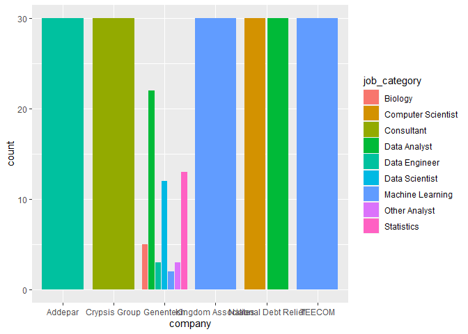
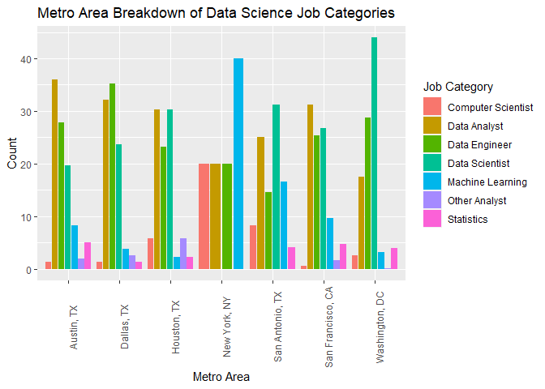
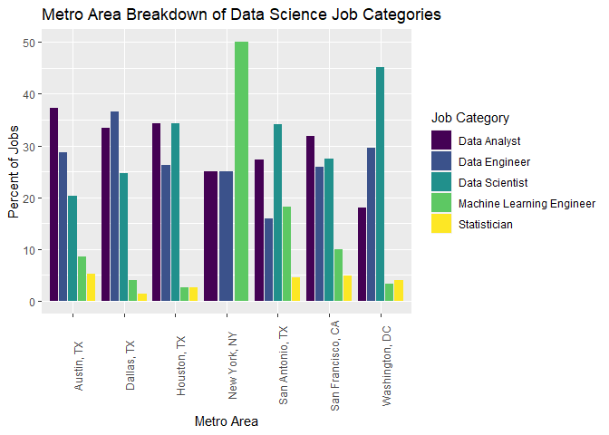

R Notebook
================

``` r
library(tidyverse)
```

    ## -- Attaching packages --------------------------------------- tidyverse 1.3.0 --

    ## v ggplot2 3.3.2     v purrr   0.3.4
    ## v tibble  3.0.4     v dplyr   1.0.2
    ## v tidyr   1.1.2     v stringr 1.4.0
    ## v readr   1.3.1     v forcats 0.5.0

    ## Warning: package 'tibble' was built under R version 4.0.3

    ## -- Conflicts ------------------------------------------ tidyverse_conflicts() --
    ## x dplyr::filter() masks stats::filter()
    ## x dplyr::lag()    masks stats::lag()

``` r
library(ggplot2)
```

``` r
setwd('C:/Users/kingl/Desktop/Projects/eda_fall20/final_project/eda20-team4-project/')
ds_jobs <- read.csv('Data Cleaning/ds_jobs.csv')
```

``` r
data_jobs <- ds_jobs %>% 
  group_by(job_category) %>% 
  summarize(count = n()) %>% 
  filter(!job_category %in% c('Biology', 'Consultant', 'Research Scientist', NA))
```

    ## `summarise()` ungrouping output (override with `.groups` argument)

``` r
companies <- ds_jobs %>%
  filter(is.na(job_category) == F) %>% 
  group_by(company) %>% 
  summarize(count = n()) %>% 
  arrange(-count) %>% 
  filter(count >= 30)
```

    ## `summarise()` ungrouping output (override with `.groups` argument)

``` r
ds_jobs %>% 
  filter(is.na(job_category) == F,
         company %in% companies$company) %>% 
  group_by(company, job_category) %>% 
  summarize(count = n()) %>% 
  ggplot(aes(x = company, y = count)) + geom_col(aes(fill = job_category), position = 'dodge2') 
```

    ## `summarise()` regrouping output by 'company' (override with `.groups` argument)

<!-- -->

``` r
data_companies <- ds_jobs %>%
  filter(job_category %in% data_jobs$job_category) %>% 
  group_by(company) %>% 
  summarize(count = n()) %>% 
  arrange(-count) %>% 
  filter(count >= 20)
```

    ## `summarise()` ungrouping output (override with `.groups` argument)

``` r
ds_jobs %>% 
  filter(job_category %in% data_jobs$job_category,
         company %in% data_companies$company) %>% 
  group_by(company, job_category) %>% 
  summarize(count = n()) %>% 
  ggplot(aes(x = company, y = count)) + 
  geom_col(aes(fill = job_category)) +
  theme(axis.text.x = element_text(angle = 90)) +
  labs(title = 'Job Category Breakdown of Top Data Science Companies',
       subtitle = 'Companies with at least 20 DS job postings',
       x = 'Company',
       y = 'Count') +
  scale_fill_discrete(name = 'Job Category')
```

    ## `summarise()` regrouping output by 'company' (override with `.groups` argument)

<!-- -->

``` r
ds_jobs %>% 
  filter(job_category %in% data_jobs$job_category,
         company %in% data_companies$company) %>% 
  group_by(company, metro_location) %>% 
  summarize(count = n()) %>% 
  ggplot(aes(x = company, y = count)) + 
  geom_col(aes(fill = metro_location)) +
  theme(axis.text.x = element_text(angle = 90)) +
  labs(title = 'Metro Area Breakdown of Top Data Science Companies',
       subtitle = 'Companies with at least 20 DS job postings',
       x = 'Company',
       y = 'Count') +
  scale_fill_discrete(name = 'Metro Area')
```

    ## `summarise()` regrouping output by 'company' (override with `.groups` argument)

<!-- -->

``` r
ds_jobs %>% 
  filter(job_category %in% data_jobs$job_category) %>% 
  group_by(metro_location, job_category) %>% 
  summarize(count = n()) %>% 
  mutate(pct = count/sum(count) * 100) %>% 
  ggplot(aes(x = metro_location, y = pct)) + 
  geom_col(aes(fill = job_category), position = 'dodge2') +
  theme(axis.text.x = element_text(angle = 90)) +
  labs(title = 'Metro Area Breakdown of Data Science Job Categories',
       x = 'Metro Area',
       y = 'Count') +
  scale_fill_discrete(name = 'Job Category')
```

    ## `summarise()` regrouping output by 'metro_location' (override with `.groups` argument)

<!-- -->

``` r
ds_jobs %>% 
  filter(job_category %in% data_jobs$job_category) %>% 
  ggplot(aes(x = metro_location, y = rating)) + 
  geom_boxplot()
```

    ## Warning: Removed 204 rows containing non-finite values (stat_boxplot).

<!-- -->

``` r
ds_jobs %>% 
  filter(job_category %in% data_jobs$job_category) %>% 
  ggplot(aes(x = rating)) + 
  geom_density(aes(fill = metro_location), alpha = .5) +
  labs(title = 'Glassdoor Rating Density Plot by Metro Area',
       x = 'Rating',
       y = 'Density') +
  scale_fill_discrete(name = 'Metro Area')
```

    ## Warning: Removed 204 rows containing non-finite values (stat_density).

<!-- -->

``` r
ds_jobs %>% 
  filter(job_category %in% data_jobs$job_category) %>% 
  ggplot(aes(x = rating)) + 
  geom_density(aes(fill = job_category), alpha = .5) +
  labs(title = 'Glassdoor Rating Density Plot by Job Category',
       x = 'Rating',
       y = 'Density') +
  scale_fill_discrete(name = 'Job Category')  
```

    ## Warning: Removed 204 rows containing non-finite values (stat_density).

<!-- -->
