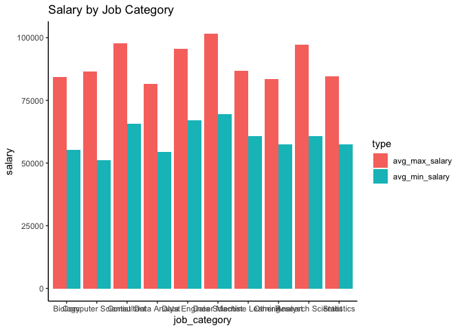

Salary Based on Job Category and Industry
================

``` r
#wrangling the data to fit both salaries on the same graph
scaled_salary_data <- ds_jobs %>% select(min_scaled_salary, max_scaled_salary, job_category, industry) %>% pivot_longer(
                cols = c(min_scaled_salary, max_scaled_salary),
                names_to = "type",
                values_to = "salary",
                values_drop_na = TRUE
)

scaled_salary_data <- scaled_salary_data %>% mutate(type = case_when(
  type == "min_scaled_salary" ~ "min",
  type == "max_scaled_salary" ~ "max"
))
```

# Job Category

``` r
#remove NAs from job_category
scaled_salary_data_jc <- scaled_salary_data %>% filter(!is.na(job_category))

scaled_salary_data_jc %>% ggplot(aes(x = salary, col = type, fill = type)) +
  geom_density(alpha = 0.25) +
  labs(
    title = "Salary by Job Category",
    x = "Scaled Salary",
    y = "Density") +
  facet_wrap(~job_category) + 
  theme_classic()
```

<!-- -->

``` r
scaled_salary_data_jc %>% ggplot(aes(y = salary, x = job_category, col = type, fill = type)) +
  geom_boxplot(alpha = 0.25) +
  labs(
    title = "Salary by Job Category") +
  theme_classic() +
   coord_flip()
```

<!-- -->

``` r
jc_avg_salary <- ds_jobs %>% filter(!is.na(job_category) & !is.na(min_scaled_salary) & !is.na(max_scaled_salary)) %>% 
  group_by(job_category) %>% 
  summarise(avg_max_salary = mean(max_scaled_salary), avg_min_salary = mean(min_scaled_salary))
```

    ## `summarise()` ungrouping output (override with `.groups` argument)

``` r
jc_avg_salary_long <- jc_avg_salary %>% pivot_longer(cols = c(avg_max_salary, avg_min_salary),
                names_to = "type",
                values_to = "salary",
                values_drop_na = TRUE)
```

``` r
jc_avg_salary_long %>% ggplot(aes(x = job_category, y = salary ,fill = type)) +
  geom_bar(stat = "identity", position = 'dodge') +
  labs(
    title = "Salary by Job Category") +
  theme_classic()
```

<!-- -->

# Job Industry
