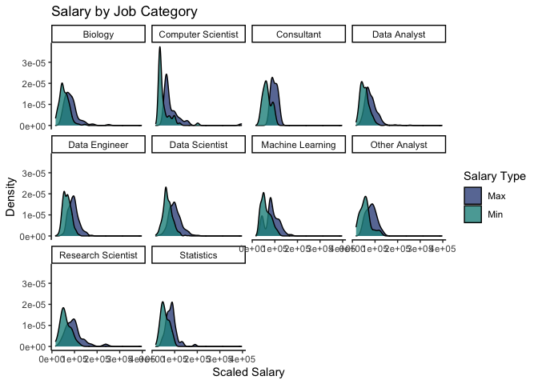
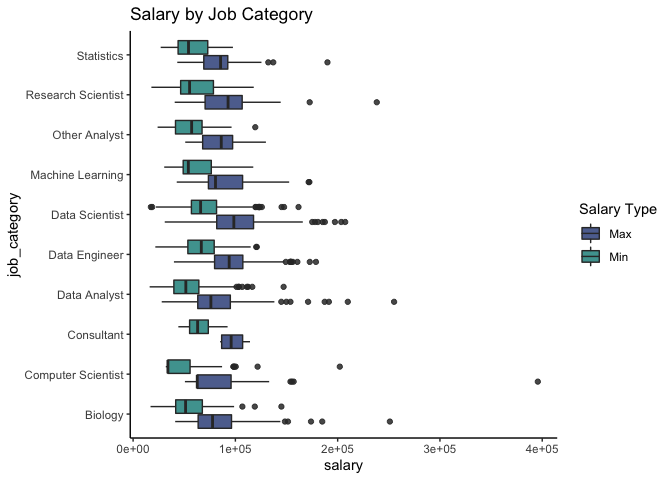
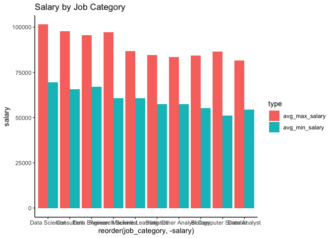
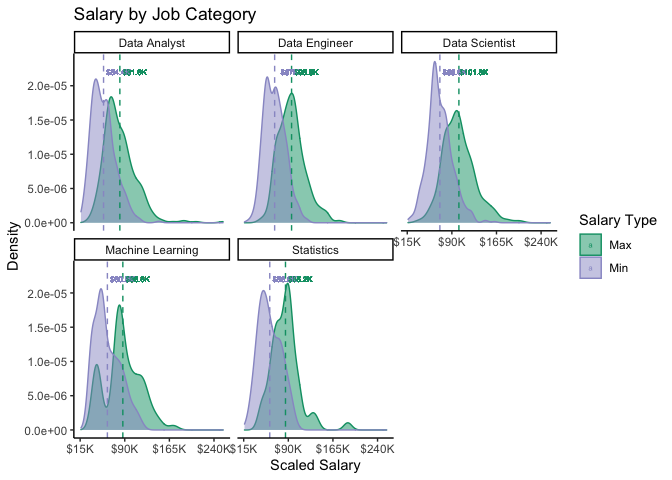
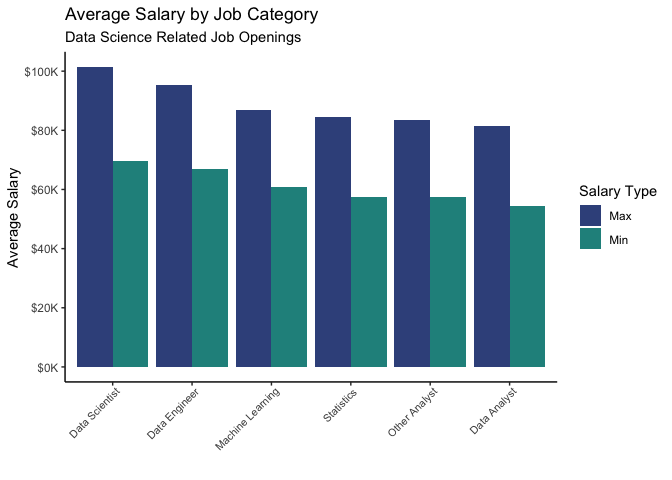
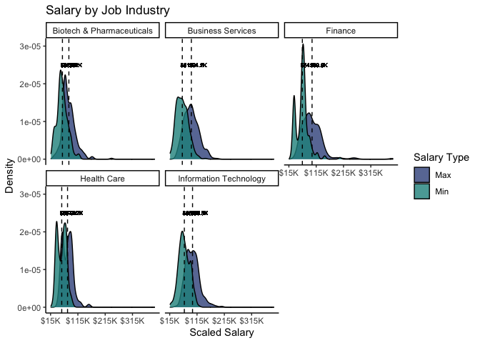
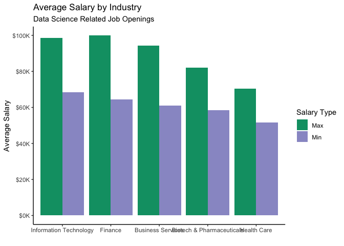

Salary Based on Job Category and Industry
================

``` r
#wrangling the data to fit both salaries on the same graph
scaled_salary_data <- ds_jobs %>% select(min_scaled_salary, max_scaled_salary, job_category, industry, job_type) %>% pivot_longer(
                cols = c(min_scaled_salary, max_scaled_salary),
                names_to = "type",
                values_to = "salary",
                values_drop_na = TRUE
)

scaled_salary_data <- scaled_salary_data %>% mutate(type = case_when(
  type == "min_scaled_salary" ~ "min",
  type == "max_scaled_salary" ~ "max"
))
```

# Job Category

Is there a difference in salary between the different types of roles
within data science?

``` r
#remove NAs from job_category
scaled_salary_data_jc <- scaled_salary_data %>% filter(!is.na(job_category))

scaled_salary_data_jc %>% ggplot(aes(x = salary, col = type, fill = type)) +
  geom_density(alpha = 0.25) +
  labs(
    title = "Salary by Job Category",
    x = "Scaled Salary",
    y = "Density") +
  facet_wrap(~job_category) + 
  theme_classic()
```

<!-- -->

``` r
scaled_salary_data_jc %>% ggplot(aes(y = salary, x = job_category, col = type, fill = type)) +
  geom_boxplot(alpha = 0.25) +
  labs(
    title = "Salary by Job Category") +
  theme_classic() +
   coord_flip()
```

<!-- -->
It does not make sense to compare the salary ranges of certain job types
such as full time versus part time so we will look at only jobs that are
typically a full 40 hours a week.

``` r
scaled_salary_data_jc <- scaled_salary_data_jc %>% filter(job_type != "PART_TIME")
```

Calculating average minimum and maximum salary based on job roles.

``` r
jc_avg_salary <- ds_jobs %>% filter(!is.na(job_category) & !is.na(min_scaled_salary) & !is.na(max_scaled_salary)) %>% 
  group_by(job_category) %>% 
  summarise(avg_max_salary = mean(max_scaled_salary), 
            avg_min_salary = mean(min_scaled_salary)) %>% ungroup()
```

    ## `summarise()` ungrouping output (override with `.groups` argument)

``` r
jc_avg_salary_long <- jc_avg_salary %>% pivot_longer(cols = c(avg_max_salary, avg_min_salary),
                names_to = "type",
                values_to = "salary",
                values_drop_na = TRUE)
```

``` r
jc_avg_salary_long %>% ggplot(aes(x = reorder(job_category, -salary), y = salary ,fill = type)) +
  geom_bar(stat = "identity", position = 'dodge') +
  labs(
    title = "Salary by Job Category") +
  theme_classic()
```

<!-- -->

## Most Related to Data Science

``` r
#closely related to data science
ds_related <- c("Data Scientist", "Data Analyst", "Data Engineer", "Machine Learning", "Statistics")

scaled_salary_data_jc_top5 <- scaled_salary_data_jc %>% 
  filter(job_category %in% ds_related)

mean_salary_jc <- scaled_salary_data_jc_top5 %>% group_by(type, job_category) %>% 
  mutate(mean_rate = mean(salary))

scaled_salary_data_jc_top5 %>% ggplot(aes(x = salary, col = type, fill = type)) +
  geom_density(alpha = 0.50) +
  labs(
    title = "Salary by Job Category",
    x = "Scaled Salary",
    y = "Density") +
  scale_x_continuous(
    breaks = seq(15000,260000,75000),
    labels = function(x){paste0('$', x/1000, 'K')}
  ) +
  scale_color_manual(values = c("#009E73","#9999CC"),
                     name = "Salary Type",
                    labels = c("Max", "Min")) +
  scale_fill_manual(values = c("#009E73","#9999CC"), 
                    name = "Salary Type",
                    labels = c("Max", "Min")) +
   geom_vline(aes(xintercept=mean_salary_jc$mean_rate, color = type, group = job_category), linetype = "dashed", show.legend = FALSE) +
#  annotate("text",y = 12e-06, x = 65000, label = mean_salary_jc$mean_rate, size = 3, color = "#868686FF", group = job_category) +
#  annotate("text",y = 12e-06, x = 140000, label = , size = 3, color = "#868686FF") +
  geom_text(data = mean_salary_jc, aes(x = mean_rate+25000, y = 2.2e-05, label = paste0('$', round(mean_rate/1000,1), 'K'), group = job_category), size = 2) +
  facet_wrap(~job_category) + 
  theme_classic()
```

<!-- -->

``` r
jc_avg_salary_top5 <- jc_avg_salary_long %>% 
  filter(job_category %in% ds_related)

jc_avg_salary_top5 %>% ggplot(aes(x = reorder(job_category, -salary), y = salary ,fill = type)) +
  geom_bar(stat = "identity", position = 'dodge') +
  labs(
    title = "Average Salary by Job Category",
    subtitle = "Data Science Related Job Openings",
    x = "",
    y = "Average Salary") +
  scale_color_manual(values = c("#009E73","#9999CC"),
                     name = "Salary Type",
                    labels = c("Max", "Min")) +
  scale_fill_manual(values = c("#009E73","#9999CC"), 
                    name = "Salary Type",
                    labels = c("Max", "Min")) +
  scale_y_continuous(
    breaks = seq(0,110000,20000),
    labels = function(x){paste0('$', x/1000, 'K')}
  ) +
  theme_classic()
```

<!-- -->

# Job Industry

Is there a salary difference based on the industry the data science job
is in?

We will look at the top 5 industries and compare their salary ranges.

``` r
#remove NAs from industry
scaled_salary_data_ji <- scaled_salary_data %>% filter(!is.na(industry))

scaled_salary_data_ji <- scaled_salary_data_ji %>% filter(job_type != "PART_TIME")

scaled_salary_data_ji_top5 <- scaled_salary_data_ji %>% 
  group_by(industry) %>% 
  summarise(count = n()) %>%
  arrange(desc(count)) %>%
  slice(1:5) %>%
  select(industry) %>% 
  ungroup()
```

    ## `summarise()` ungrouping output (override with `.groups` argument)

``` r
scaled_salary_data_ji <- scaled_salary_data_ji %>% 
  filter(industry %in% scaled_salary_data_ji_top5$industry)

mean_salary_ji <- scaled_salary_data_ji %>% group_by(type, industry) %>% 
  mutate(mean_rate = mean(salary))

scaled_salary_data_ji %>% ggplot(aes(x = salary, col = type, fill = type)) +
  geom_density(alpha = 0.25) +
  labs(
    title = "Salary by Job Industry",
    x = "Scaled Salary",
    y = "Density") +
  scale_x_continuous(
    breaks = seq(15000,400000,100000),
    labels = function(x){paste0('$', x/1000, 'K')}
  ) +
  geom_vline(aes(xintercept=mean_salary_ji$mean_rate, color = type, group = industry), linetype = "dashed", show.legend = FALSE) +
  scale_color_manual(values = c("#009E73","#9999CC"),
                     name = "Salary Type",
                    labels = c("Max", "Min")) +
  scale_fill_manual(values = c("#009E73","#9999CC"), 
                    name = "Salary Type",
                    labels = c("Max", "Min")) +
  geom_text(data = mean_salary_ji, aes(x = mean_rate+25000, y = 2.5e-05, label = paste0('$', round(mean_rate/1000,1), 'K'), group = industry), size = 2) +
  facet_wrap(~industry) + 
  theme_classic()
```

<!-- -->

``` r
ji_avg_salary <- ds_jobs %>% filter(!is.na(industry) & !is.na(min_scaled_salary & job_type != "PART_TIME") & !is.na(max_scaled_salary)) %>% 
  group_by(industry) %>% 
  summarise(avg_max_salary = mean(max_scaled_salary), 
            avg_min_salary = mean(min_scaled_salary)) %>% ungroup()
```

    ## `summarise()` ungrouping output (override with `.groups` argument)

``` r
ji_avg_salary_long <- ji_avg_salary %>% pivot_longer(cols = c(avg_max_salary, avg_min_salary),
                names_to = "type",
                values_to = "salary",
                values_drop_na = TRUE)

ji_avg_salary_long_top5 <- ji_avg_salary_long %>% 
  filter(industry %in% scaled_salary_data_ji_top5$industry)

ji_avg_salary_long_top5 %>% ggplot(aes(x = reorder(industry, -salary), y = salary ,fill = type)) +
  geom_bar(stat = "identity", position = 'dodge') +
  labs(
    title = "Average Salary by Industry",
    subtitle = "Data Science Related Job Openings",
    x = "",
    y = "Average Salary") +
  scale_color_manual(values = c("#009E73","#9999CC"),
                     name = "Salary Type",
                    labels = c("Max", "Min")) +
  scale_fill_manual(values = c("#009E73","#9999CC"), 
                    name = "Salary Type",
                    labels = c("Max", "Min")) +
  scale_y_continuous(
    breaks = seq(0,100000,20000),
    labels = function(x){paste0('$', x/1000, 'K')}
  ) +
  theme_classic()
```

<!-- -->
