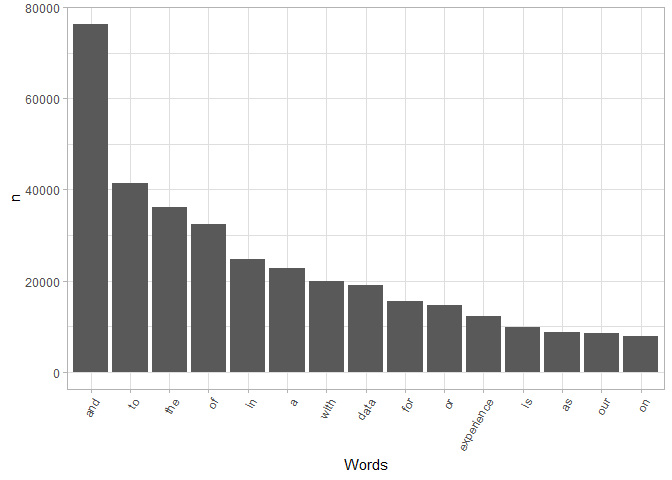
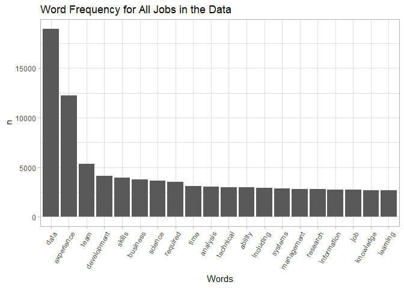
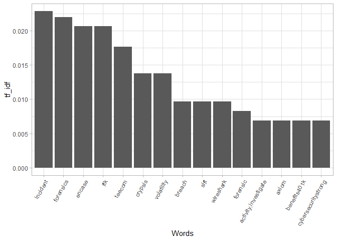
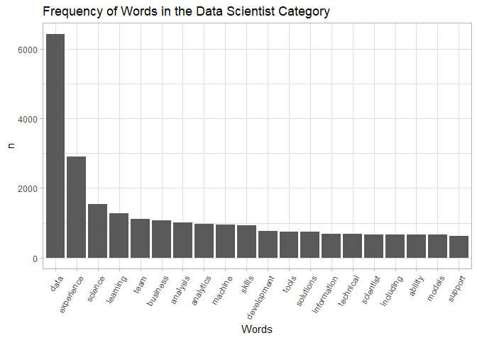
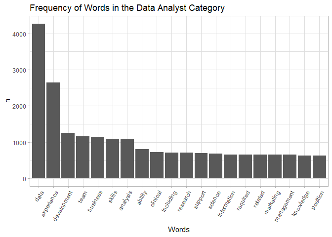
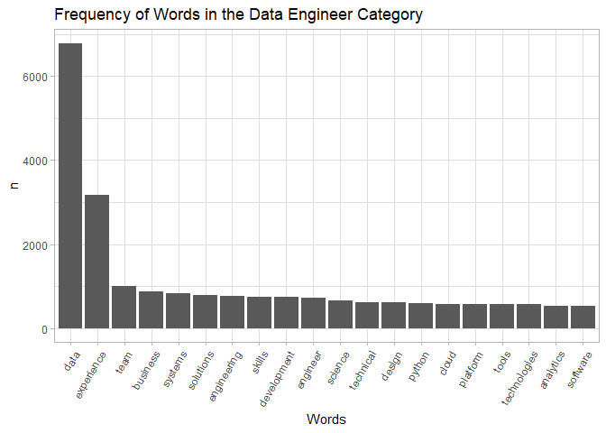
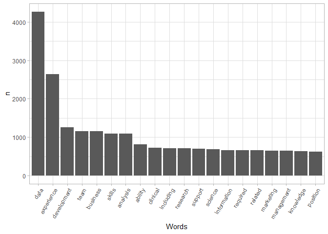
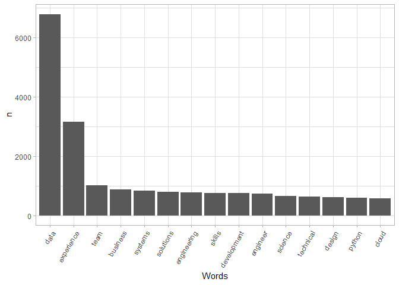
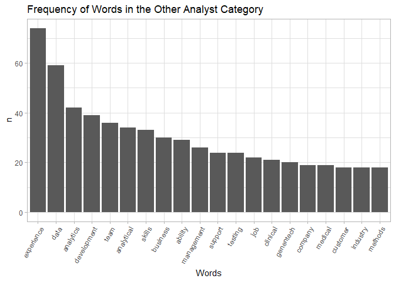
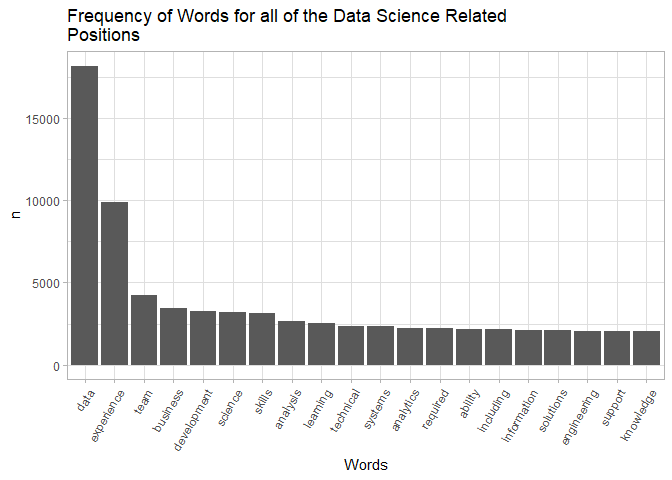

Job Description Text Analysis
================

<details>

<summary>Click to expand\!</summary> \# Libraries

``` r
loadPkg = function(toLoad){
  for(lib in toLoad){
    if(! lib %in% installed.packages()[,1])
    { install.packages(lib, repos='http://cran.rstudio.com/') }
    suppressMessages( library(lib, character.only=TRUE) ) }
}
packs=c('tidyverse', 'tidytext', 'textdata')
loadPkg(packs)
```

    ## Warning: package 'tidytext' was built under R version 4.0.3

    ## Warning: package 'textdata' was built under R version 4.0.3

``` r
library(readr)
setwd("C:/Users/Matt Flaherty/Documents/Projects/eda20-team4-project")
ds_jobs <- read_csv("Data Cleaning/ds_jobs.csv")
```

    ## Parsed with column specification:
    ## cols(
    ##   .default = col_double(),
    ##   state = col_character(),
    ##   city = col_character(),
    ##   job_title = col_character(),
    ##   company = col_character(),
    ##   job_desc = col_character(),
    ##   industry = col_character(),
    ##   date_posted = col_date(format = ""),
    ##   valid_until = col_date(format = ""),
    ##   job_type = col_character(),
    ##   location = col_character(),
    ##   metro_location = col_character(),
    ##   job_category = col_character()
    ## )

    ## See spec(...) for full column specifications.

</details>

## Word count

I want to use text analysis on the job description to see if there is a
skill that is repeated throughout. This would be an important skill if
it were repeated that applicants should attempt to improve if they are
interested in the jobs.

<details>

<summary>Click to expand\!</summary>

1.  Tokenize your corpus and generate a word
count.

<!-- end list -->

``` r
job_words <- ds_jobs %>% select(job_category,job_desc) %>% unnest_tokens(word, job_desc)
head(job_words)
```

    ## # A tibble: 6 x 2
    ##   job_category word   
    ##   <chr>        <chr>  
    ## 1 Data Analyst who    
    ## 2 Data Analyst we're  
    ## 3 Data Analyst looking
    ## 4 Data Analyst for    
    ## 5 Data Analyst the    
    ## 6 Data Analyst chief

``` r
job_words %>% count(word, sort = T) %>% slice(1:15) %>% 
  ggplot(aes(x = reorder(word, n, function(n) -n), y = n)) + 
  geom_bar(stat = "identity") + 
  theme_light() +
  theme(axis.text.x = element_text(angle = 60, hjust = 1)) + 
  xlab("Words")
```

<!-- -->

2.  Using the `TidyText` package, remove stop words and generate a new
    word count.

<!-- end list -->

``` r
better_line_words <- job_words %>% anti_join(stop_words)
```

    ## Joining, by = "word"

3.  Create a visualization of the word count distribution and interpret
    your results.

</details>

``` r
better_line_words %>% count(word, sort = T) %>% slice(1:20) %>% 
  ggplot(aes(x = reorder(word, n, function(n) -n), y = n)) + 
  geom_bar(stat = "identity") + 
  theme_light() +
  theme(axis.text.x = element_text(angle = 60, hjust = 1)) + 
  labs(
    x = "Words",
    title = "Word Frequency for All Jobs in the Data")
```

<!-- -->

## Interpretation

No skills were mentioned frequently so I will use TF-IDF just to see
what the results yield. Keep in mind that this is for all of the jobs in
the data set. I will filter by DS jobs later in the report.

## Usage

This text analysis should not be included in our final report because we
have been emphasizing looking at 6 DS categories and this incorporates
all job categories.

<details>

<summary>Click to expand</summary> \# TF-IDF

1.  Generate a tf-idf measure of words in your dataset.

<!-- end list -->

``` r
idf_words <- ds_jobs %>% select(job_category, job_desc) %>% 
  unnest_tokens(word,job_desc) %>% count(job_category, word, sort = T)

better_idf_words <- idf_words %>% anti_join(stop_words)
```

    ## Joining, by = "word"

``` r
description_length <- better_idf_words %>% group_by(job_category) %>% summarize(total = sum(n()))
```

    ## `summarise()` ungrouping output (override with `.groups` argument)

``` r
better_idf_words <- left_join(better_idf_words, description_length)
```

    ## Joining, by = "job_category"

``` r
tfidf_words <- better_idf_words %>% bind_tf_idf(word, job_category, n)
```

    ## Warning: A value for tf_idf is negative:
    ##  Input should have exactly one row per document-term combination.

``` r
tfidf_words <- tfidf_words %>% arrange(desc(tf_idf)) %>% slice(1:15)

tfidf_words %>% arrange(desc(tf_idf)) %>% head()
```

    ## # A tibble: 6 x 7
    ##   job_category              word          n total      tf   idf tf_idf
    ##   <chr>                     <chr>     <int> <int>   <dbl> <dbl>  <dbl>
    ## 1 Consultant                incident    330   881 0.0330  0.693 0.0229
    ## 2 Consultant                forensics   240   881 0.0240  0.916 0.0220
    ## 3 Consultant                encase       90   881 0.00900 2.30  0.0207
    ## 4 Consultant                ftk          90   881 0.00900 2.30  0.0207
    ## 5 Machine Learning Engineer teecom      510  5951 0.00767 2.30  0.0177
    ## 6 Consultant                crypsis      60   881 0.00600 2.30  0.0138

2.  Create a visualization of the tf-idf measure and interpret your
    results.

<!-- end list -->

``` r
tfidf_words$word <- factor(tfidf_words$word, levels = tfidf_words$word[order(desc(tfidf_words$tf_idf))])
```

``` r
ggplot(tfidf_words, aes(x = word, y = tf_idf))+
  geom_bar(stat = "identity") + 
  theme_light() +
  theme(axis.text.x = element_text(angle = 60, hjust = 1)) + 
  xlab("Words")
```

<!-- -->

</details>

# Word Frequency by Job Category

Word count for every job category would not be beneficial to the final
report so I will begin to do text analysis on each job category and then
on all of the categories combined. I am doing this to see if there are
any skills that applicants should have experience with before applying.
This could help them become more successful applicants.

## Data Scientist

<details>

<summary>Click to expand</summary> 1. Tokenize your corpus and generate
a word count.

``` r
ds_words <- ds_jobs%>%
  filter(job_category == "Data Scientist")

job_words <- ds_words %>% select(job_category,job_desc) %>% unnest_tokens(word, job_desc)
head(job_words)
```

    ## # A tibble: 6 x 2
    ##   job_category   word    
    ##   <chr>          <chr>   
    ## 1 Data Scientist faire   
    ## 2 Data Scientist is      
    ## 3 Data Scientist using   
    ## 4 Data Scientist machine 
    ## 5 Data Scientist learning
    ## 6 Data Scientist to

2.  Using the `TidyText` package, remove stop words and generate a new
    word count.

<!-- end list -->

``` r
better_line_words <- job_words %>% anti_join(stop_words)
```

    ## Joining, by = "word"

3.  Create a visualization of the word count distribution and interpret
    your results.

</details>

``` r
better_line_words %>% count(word, sort = T) %>% slice(1:20) %>% 
  ggplot(aes(x = reorder(word, n, function(n) -n), y = n)) + 
  geom_bar(stat = "identity") + 
  theme_light() +
  theme(axis.text.x = element_text(angle = 60, hjust = 1)) + 
  labs(
    x = "Words",
    title = "Frequency of Words in the Data Scientist Category")
```

<!-- -->

### Interpretation

After filtering by “Data Scientist,” it looks like employees should have
some kind of analytical skills as well as machine learning skills.
“Models” is also in the top 15 so this could augment the machine
learning skill that data scientists need.

## Data Analyst

Now I’ll check to see if there are any skills for data analyst

<details>

<summary>Click to expand\!</summary> 1. Tokenize your corpus and
generate a word count.

``` r
analyst_words <- ds_jobs%>%
  filter(job_category == "Data Analyst")

job_words <- analyst_words %>% select(job_category,job_desc) %>% unnest_tokens(word, job_desc)
head(job_words)
```

    ## # A tibble: 6 x 2
    ##   job_category word   
    ##   <chr>        <chr>  
    ## 1 Data Analyst who    
    ## 2 Data Analyst we're  
    ## 3 Data Analyst looking
    ## 4 Data Analyst for    
    ## 5 Data Analyst the    
    ## 6 Data Analyst chief

2.  Using the `TidyText` package, remove stop words and generate a new
    word count.

<!-- end list -->

``` r
better_line_words <- job_words %>% anti_join(stop_words)
```

    ## Joining, by = "word"

3.  Create a visualization of the word count distribution and interpret
    your results.

</details>

``` r
better_line_words %>% count(word, sort = T) %>% slice(1:20) %>% 
  ggplot(aes(x = reorder(word, n, function(n) -n), y = n)) + 
  geom_bar(stat = "identity") + 
  theme_light() +
  theme(axis.text.x = element_text(angle = 60, hjust = 1)) + 
  labs(
    x = "Words",
    title = "Frequency of Words in the Data Analyst Category")
```

<!-- -->

### Interpretation

We don’t learn as much from this graph as we did for the data scientist
graph. However, we see soft skills such as “team”, “analysis”,
“research” so the employee should be equipped with the ability to
work with others and look at previous data to draw conclusions.

## Data Engineer

<details>

<summary>Click to expand\!</summary> 1. Tokenize your corpus and
generate a word count.

``` r
engineer_words <- ds_jobs%>%
  filter(job_category == "Data Engineer")

job_words <- engineer_words %>% select(job_category,job_desc) %>% unnest_tokens(word, job_desc)
head(job_words)
```

    ## # A tibble: 6 x 2
    ##   job_category  word     
    ##   <chr>         <chr>    
    ## 1 Data Engineer addepar  
    ## 2 Data Engineer has      
    ## 3 Data Engineer the      
    ## 4 Data Engineer potential
    ## 5 Data Engineer to       
    ## 6 Data Engineer make

2.  Using the `TidyText` package, remove stop words and generate a new
    word count.

<!-- end list -->

``` r
better_line_words <- job_words %>% anti_join(stop_words)
```

    ## Joining, by = "word"

3.  Create a visualization of the word count distribution and interpret
    your results.

</details>

``` r
better_line_words %>% count(word, sort = T) %>% slice(1:20) %>% 
  ggplot(aes(x = reorder(word, n, function(n) -n), y = n)) + 
  geom_bar(stat = "identity") + 
  theme_light() +
  theme(axis.text.x = element_text(angle = 60, hjust = 1)) + 
  labs(
    x = "Words",
    title = "Frequency of Words in the Data Engineer Category")
```

<!-- -->

### Interpretation

Python is listed as a commonly used word for data engineering so a data
engineer ought to learn Python if they wish to be a successful
applicant. Cloud is also a commonly used word so I assume this would be
some type of google storage.

## Machine Learning

<details>

<summary>Click to expand\!</summary> 1. Tokenize your corpus and
generate a word count.

``` r
ml_words <- ds_jobs%>%
  filter(job_category == "Machine Learning Engineer")

job_words <- ml_words %>% select(job_category,job_desc) %>% unnest_tokens(word, job_desc)
head(job_words)
```

    ## # A tibble: 6 x 2
    ##   job_category              word      
    ##   <chr>                     <chr>     
    ## 1 Machine Learning Engineer excavation
    ## 2 Machine Learning Engineer contractor
    ## 3 Machine Learning Engineer looking   
    ## 4 Machine Learning Engineer for       
    ## 5 Machine Learning Engineer a         
    ## 6 Machine Learning Engineer self

2.  Using the `TidyText` package, remove stop words and generate a new
    word count.

<!-- end list -->

``` r
better_line_words <- job_words %>% anti_join(stop_words)
```

    ## Joining, by = "word"

3.  Create a visualization of the word count distribution and interpret
    your results.

</details>

``` r
better_line_words %>% count(word, sort = T) %>% slice(1:20) %>% 
  ggplot(aes(x = reorder(word, n, function(n) -n), y = n)) + 
  geom_bar(stat = "identity") + 
  theme_light() +
  theme(axis.text.x = element_text(angle = 60, hjust = 1)) + 
  labs(
    x = "Words",
    title = "Frequency of Words in the Machine Learning Engineer\nCategory")
```

<!-- -->

### Interpretation

No hard skills are commonly used in the descriptions. Commonly used
words such as “team” and “decisions” could suggest that a machine
learning engineer must work with other to make decisions. This makes
sense because the machine learning engineer will be making the
predictive models for the company.

## Statistics

<details>

<summary>Click to expand\!</summary> 1. Tokenize your corpus and
generate a word count.

``` r
stats_words <- ds_jobs%>%
  filter(job_category == "Statistician")

job_words <- stats_words %>% select(job_category,job_desc) %>% unnest_tokens(word, job_desc)
head(job_words)
```

    ## # A tibble: 6 x 2
    ##   job_category word     
    ##   <chr>        <chr>    
    ## 1 Statistician sr       
    ## 2 Statistician scientist
    ## 3 Statistician ii       
    ## 4 Statistician location 
    ## 5 Statistician san      
    ## 6 Statistician francisco

2.  Using the `TidyText` package, remove stop words and generate a new
    word count.

<!-- end list -->

``` r
better_line_words <- job_words %>% anti_join(stop_words)
```

    ## Joining, by = "word"

3.  Create a visualization of the word count distribution and interpret
    your results.

</details>

``` r
better_line_words %>% count(word, sort = T) %>% slice(1:20) %>% 
  ggplot(aes(x = reorder(word, n, function(n) -n), y = n)) + 
  geom_bar(stat = "identity") + 
  theme_light() +
  theme(axis.text.x = element_text(angle = 60, hjust = 1)) + 
  labs(
    x = "Words",
    title = "Frequency of Words in the Statistician Category")
```

<!-- -->

### Interpretation

No hard skills in the job descriptions. It would be difficult to
determine much from commonly used words in the job description.

## Other Analyst

<details>

<summary>Click to expand\!</summary> 1. Tokenize your corpus and
generate a word count.

``` r
other_analyst_words <- ds_jobs%>%
  filter(job_category == "Other Analyst")

job_words <- other_analyst_words %>% select(job_category,job_desc) %>% unnest_tokens(word, job_desc)
head(job_words)
```

    ## # A tibble: 6 x 2
    ##   job_category  word       
    ##   <chr>         <chr>      
    ## 1 Other Analyst the        
    ## 2 Other Analyst positionwe 
    ## 3 Other Analyst are        
    ## 4 Other Analyst seeking    
    ## 5 Other Analyst an         
    ## 6 Other Analyst experienced

2.  Using the `TidyText` package, remove stop words and generate a new
    word count.

<!-- end list -->

``` r
better_line_words <- job_words %>% anti_join(stop_words)
```

    ## Joining, by = "word"

3.  Create a visualization of the word count distribution and interpret
    your results.

</details>

``` r
better_line_words %>% count(word, sort = T) %>% slice(1:20) %>% 
  ggplot(aes(x = reorder(word, n, function(n) -n), y = n)) + 
  geom_bar(stat = "identity") + 
  theme_light() +
  theme(axis.text.x = element_text(angle = 60, hjust = 1)) + 
  labs(
    x = "Words",
    title = "Frequency of Words in the Other Analyst Category")
```

<!-- -->

### Interpretation

Nothing to learn from. Only 28 jobs in this category so not much to
choose from. There are soft skills that were seen in other data science
positions such as analytical skills.

# All DS jobs

<details>

<summary>Click to expand\!</summary>

``` r
ds_filter <- ds_jobs %>%
  filter(!is.na(job_category)) %>%
  filter(job_category == "Data Analyst" | job_category == "Data Engineer" | job_category == "Data Scientist" | job_category == "Machine Learning Engineer" | job_category == "Other Analyst" | job_category == "Statistician")

job_words <- ds_filter %>% select(job_category,job_desc) %>% unnest_tokens(word, job_desc)
```

``` r
better_line_words <- job_words %>% anti_join(stop_words)
```

    ## Joining, by = "word"

</details>

``` r
better_line_words %>% count(word, sort = T) %>% slice(1:20) %>% 
  ggplot(aes(x = reorder(word, n, function(n) -n), y = n)) + 
  geom_bar(stat = "identity") + 
  theme_light() +
  theme(axis.text.x = element_text(angle = 60, hjust = 1)) + 
  labs(
    x = "Words",
    title = "Frequency of Words for all of the Data Science Related\nPositions")
```

<!-- -->

## Interpretation

This graph is all inclusive for the data science related positions. It
shows that applicants who are interested in a data science related
position should have an analytical mindset. They also should be able to
work well in teams.

# Conclusions

Going into this exploration, I was interested in finding out if there
was a common word among job descriptions such as a hard skill that
applicants would need to learn (R, Python) that would help them get a
data science related job. I found that this was not case. There were
soft skills that applicants should look to hone before applying such as
analytical skills and getting experience working in teams.

# Text Analysis Graphs for final report

I am indifferent on including all of the individual job category graphs.
I think it would be beneficial to show our thought process through the
text analysis. However, That would be 6 separate graphs and the all
inclusive graph on top of our graphs for other analyses. A lot. We can
still talk about our thought process through all 6 graphs even if we
don’t include them.
