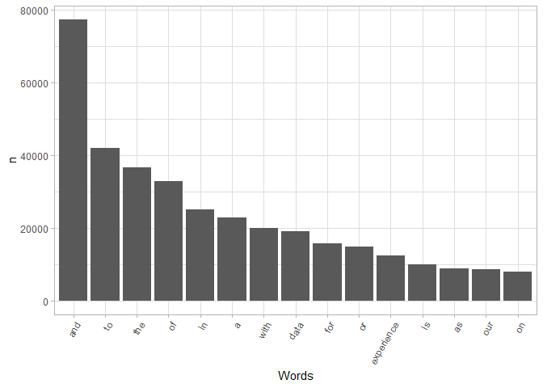
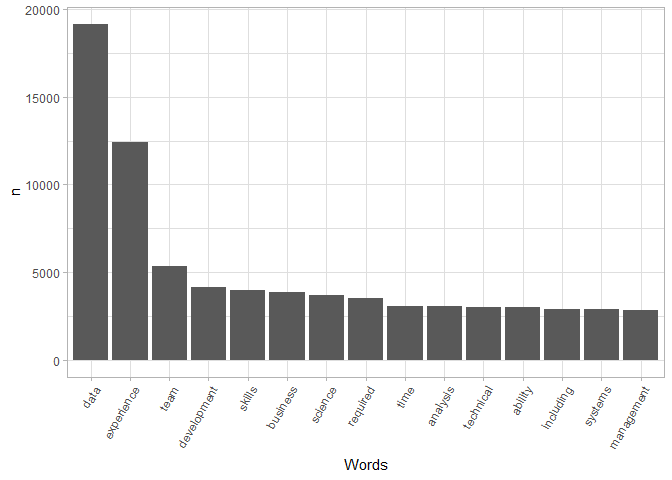
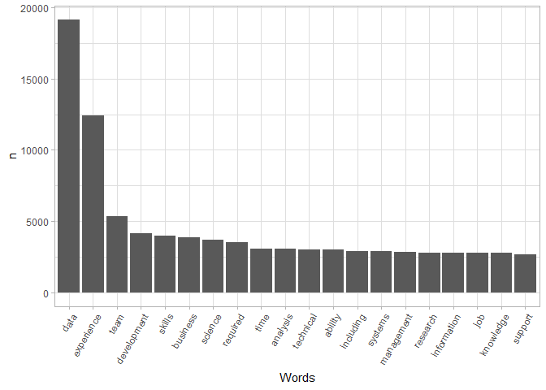
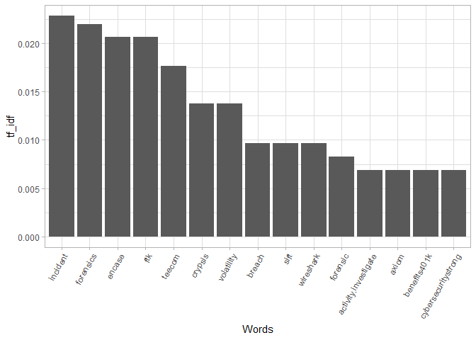
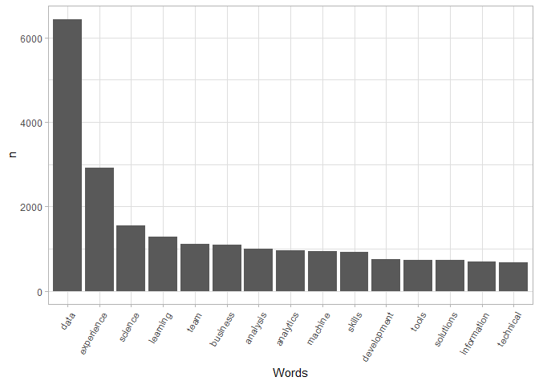
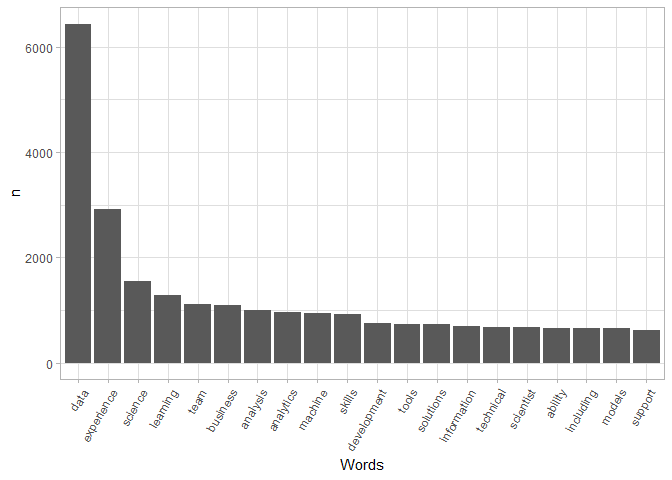
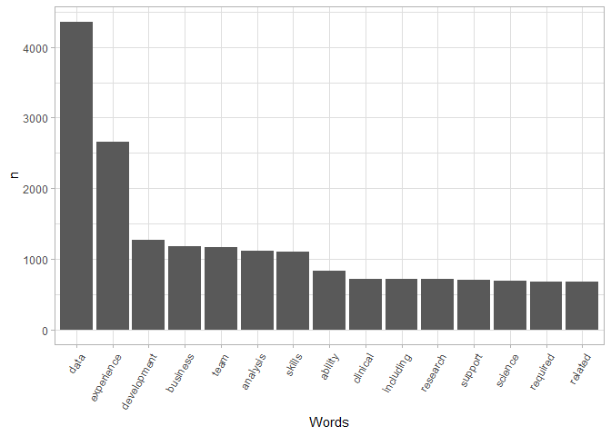
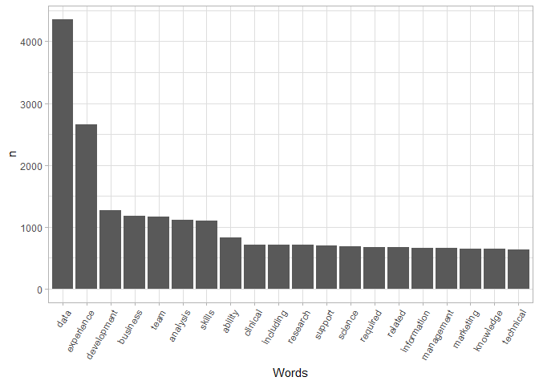

Job Description Text Analysis
================

<details>

<summary>Click to expand\!</summary> \# Libraries

``` r
loadPkg = function(toLoad){
  for(lib in toLoad){
    if(! lib %in% installed.packages()[,1])
    { install.packages(lib, repos='http://cran.rstudio.com/') }
    suppressMessages( library(lib, character.only=TRUE) ) }
}
packs=c('tidyverse', 'tidytext', 'textdata')
loadPkg(packs)
```

    ## Warning: package 'tidytext' was built under R version 4.0.3

    ## Warning: package 'textdata' was built under R version 4.0.3

``` r
library(readr)
ds_jobs_bucket <- read_csv("ds_jobs_bucket.csv")
```

    ## Warning: Missing column names filled in: 'X1' [1]

    ## Parsed with column specification:
    ## cols(
    ##   X1 = col_double(),
    ##   Job_title = col_character(),
    ##   Company = col_character(),
    ##   State = col_character(),
    ##   City = col_character(),
    ##   Min_Salary = col_double(),
    ##   Max_Salary = col_double(),
    ##   Job_Desc = col_character(),
    ##   Industry = col_character(),
    ##   Rating = col_double(),
    ##   Date_Posted = col_date(format = ""),
    ##   Valid_until = col_date(format = ""),
    ##   Job_Type = col_character(),
    ##   Region = col_character(),
    ##   job_category = col_character()
    ## )

</details>

## Word count

I want to use text analysis on the job description to see if there is a
skill that is repeated throughout. This would be an important skill if
it were repeated.

<details>

<summary>Click to expand\!</summary> 1. Tokenize your corpus and
generate a word
count.

``` r
job_words <- ds_jobs_bucket %>% select(job_category,Job_Desc) %>% unnest_tokens(word, Job_Desc)
head(job_words)
```

    ## # A tibble: 6 x 2
    ##   job_category word   
    ##   <chr>        <chr>  
    ## 1 Data Analyst who    
    ## 2 Data Analyst we're  
    ## 3 Data Analyst looking
    ## 4 Data Analyst for    
    ## 5 Data Analyst the    
    ## 6 Data Analyst chief

``` r
job_words %>% count(word, sort = T) %>% slice(1:15) %>% 
  ggplot(aes(x = reorder(word, n, function(n) -n), y = n)) + 
  geom_bar(stat = "identity") + 
  theme_light() +
  theme(axis.text.x = element_text(angle = 60, hjust = 1)) + 
  xlab("Words")
```

<!-- -->

2.  Using the `TidyText` package, remove stop words and generate a new
    word count.

<!-- end list -->

``` r
better_line_words <- job_words %>% anti_join(stop_words)
```

    ## Joining, by = "word"

3.  Create a visualization of the word count distribution and interpret
    your results.

<!-- end list -->

``` r
better_line_words %>% count(word, sort = T) %>% slice(1:15) %>% 
  ggplot(aes(x = reorder(word, n, function(n) -n), y = n)) + 
  geom_bar(stat = "identity") + 
  theme_light() +
  theme(axis.text.x = element_text(angle = 60, hjust = 1)) + 
  xlab("Words")
```

<!-- -->

``` r
personal_stop_words <- stop_words %>% select(-lexicon) %>% 
  bind_rows(data.frame(word = c("â")))

better_line_words <- job_words %>% anti_join(personal_stop_words)
```

    ## Joining, by = "word"

</details>

``` r
better_line_words %>% count(word, sort = T) %>% slice(1:20) %>% 
  ggplot(aes(x = reorder(word, n, function(n) -n), y = n)) + 
  geom_bar(stat = "identity") + 
  theme_light() +
  theme(axis.text.x = element_text(angle = 60, hjust = 1)) + 
  xlab("Words")
```

<!-- -->

No skills were mentioned frequently so I will use TF-IDF just to see
what the results yield.

# TF-IDF

<details>

<summary>Click to expand</summary> 1. Generate a tf-idf measure of words
in your dataset.

``` r
idf_words <- ds_jobs_bucket %>% select(job_category, Job_Desc) %>% 
  unnest_tokens(word,Job_Desc) %>% count(job_category, word, sort = T)

better_idf_words <- idf_words %>% anti_join(personal_stop_words)
```

    ## Joining, by = "word"

``` r
description_length <- better_idf_words %>% group_by(job_category) %>% summarize(total = sum(n()))
```

    ## `summarise()` ungrouping output (override with `.groups` argument)

``` r
better_idf_words <- left_join(better_idf_words, description_length)
```

    ## Joining, by = "job_category"

``` r
tfidf_words <- better_idf_words %>% bind_tf_idf(word, job_category, n)
```

    ## Warning: A value for tf_idf is negative:
    ##  Input should have exactly one row per document-term combination.

``` r
tfidf_words <- tfidf_words %>% arrange(desc(tf_idf)) %>% slice(1:15)

tfidf_words %>% arrange(desc(tf_idf)) %>% head()
```

    ## # A tibble: 6 x 7
    ##   job_category     word          n total      tf   idf tf_idf
    ##   <chr>            <chr>     <int> <int>   <dbl> <dbl>  <dbl>
    ## 1 Consultant       incident    330   881 0.0330  0.693 0.0229
    ## 2 Consultant       forensics   240   881 0.0240  0.916 0.0220
    ## 3 Consultant       encase       90   881 0.00900 2.30  0.0207
    ## 4 Consultant       ftk          90   881 0.00900 2.30  0.0207
    ## 5 Machine Learning teecom      510  5951 0.00767 2.30  0.0177
    ## 6 Consultant       crypsis      60   881 0.00600 2.30  0.0138

2.  Create a visualization of the tf-idf measure and interpret your
    results.

<!-- end list -->

``` r
tfidf_words$word <- factor(tfidf_words$word, levels = tfidf_words$word[order(desc(tfidf_words$tf_idf))])
```

</details>

``` r
ggplot(tfidf_words, aes(x = word, y = tf_idf))+
  geom_bar(stat = "identity") + 
  theme_light() +
  theme(axis.text.x = element_text(angle = 60, hjust = 1)) + 
  xlab("Words")
```

<!-- -->

# Word Frequency by Job Category

## Data Scientist

<details>

<summary>Click to expand</summary> 1. Tokenize your corpus and generate
a word count.

``` r
ds_words <- ds_jobs_bucket%>%
  filter(job_category == "Data Scientist")

job_words <- ds_words %>% select(job_category,Job_Desc) %>% unnest_tokens(word, Job_Desc)
head(job_words)
```

    ## # A tibble: 6 x 2
    ##   job_category   word    
    ##   <chr>          <chr>   
    ## 1 Data Scientist faire   
    ## 2 Data Scientist is      
    ## 3 Data Scientist using   
    ## 4 Data Scientist machine 
    ## 5 Data Scientist learning
    ## 6 Data Scientist to

2.  Using the `TidyText` package, remove stop words and generate a new
    word count.

<!-- end list -->

``` r
better_line_words <- job_words %>% anti_join(stop_words)
```

    ## Joining, by = "word"

3.  Create a visualization of the word count distribution and interpret
    your results.

<!-- end list -->

``` r
better_line_words %>% count(word, sort = T) %>% slice(1:15) %>% 
  ggplot(aes(x = reorder(word, n, function(n) -n), y = n)) + 
  geom_bar(stat = "identity") + 
  theme_light() +
  theme(axis.text.x = element_text(angle = 60, hjust = 1)) + 
  xlab("Words")
```

<!-- -->

``` r
personal_stop_words <- stop_words %>% select(-lexicon) %>% 
  bind_rows(data.frame(word = c("â")))

better_line_words <- job_words %>% anti_join(personal_stop_words)
```

    ## Joining, by = "word"

</details>

``` r
better_line_words %>% count(word, sort = T) %>% slice(1:20) %>% 
  ggplot(aes(x = reorder(word, n, function(n) -n), y = n)) + 
  geom_bar(stat = "identity") + 
  theme_light() +
  theme(axis.text.x = element_text(angle = 60, hjust = 1)) + 
  xlab("Words")
```

<!-- -->

## Data Analyst

<details>

<summary>Click to expand\!</summary> 1. Tokenize your corpus and
generate a word count.

``` r
analyst_words <- ds_jobs_bucket%>%
  filter(job_category == "Data Analyst")

job_words <- analyst_words %>% select(job_category,Job_Desc) %>% unnest_tokens(word, Job_Desc)
head(job_words)
```

    ## # A tibble: 6 x 2
    ##   job_category word   
    ##   <chr>        <chr>  
    ## 1 Data Analyst who    
    ## 2 Data Analyst we're  
    ## 3 Data Analyst looking
    ## 4 Data Analyst for    
    ## 5 Data Analyst the    
    ## 6 Data Analyst chief

2.  Using the `TidyText` package, remove stop words and generate a new
    word count.

<!-- end list -->

``` r
better_line_words <- job_words %>% anti_join(stop_words)
```

    ## Joining, by = "word"

3.  Create a visualization of the word count distribution and interpret
    your results.

<!-- end list -->

``` r
better_line_words %>% count(word, sort = T) %>% slice(1:15) %>% 
  ggplot(aes(x = reorder(word, n, function(n) -n), y = n)) + 
  geom_bar(stat = "identity") + 
  theme_light() +
  theme(axis.text.x = element_text(angle = 60, hjust = 1)) + 
  xlab("Words")
```

<!-- -->

``` r
personal_stop_words <- stop_words %>% select(-lexicon) %>% 
  bind_rows(data.frame(word = c("â")))

better_line_words <- job_words %>% anti_join(personal_stop_words)
```

    ## Joining, by = "word"

</details>

``` r
better_line_words %>% count(word, sort = T) %>% slice(1:20) %>% 
  ggplot(aes(x = reorder(word, n, function(n) -n), y = n)) + 
  geom_bar(stat = "identity") + 
  theme_light() +
  theme(axis.text.x = element_text(angle = 60, hjust = 1)) + 
  xlab("Words")
```

<!-- -->
